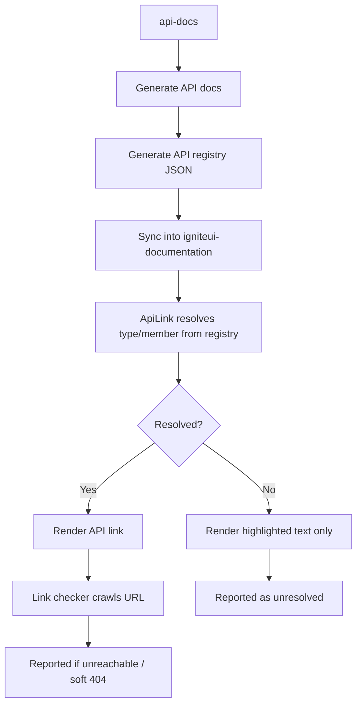
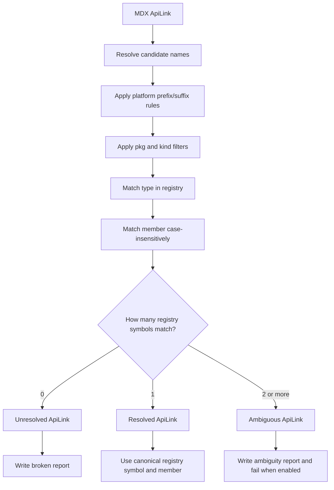

## In this topic
 ### 1. [Repository overview](#repository-overview)
 ### 2. [Writing an article](#writing-an-article)
 ### 3. [Topic structure](#topic-structure)
 ### 4. [LLM metadata](#llm-metadata)
 ### 5. [Writing a Styling section for article](#styling-section)
 ### 6. [Workflow](#workflow)
 ### 7. [Environment variables and template tokens](#environment-variables)
 ### 8. [Sample / Code View Configuration](#code-view-configuration)
 ### 9. [PlatformBlock usage](#platform-block)
 ### 10. [ApiLink usage](#api-link)
 ### 11. [Checking MDX API Links](#checking-api-links)
 ### 12. [ApiLink registry workflow](#api-link-registry-workflow)
 ### 13. [Creating shared help topics](#creating-shared-help-topics)
 ### 14. [Updating of Data Visualization related topics](#updating-of-data-visualization-related-topics)
 ### 15. [Adding of images](#adding-of-images-in-the-topic)

# <a name='#repository-overview'>Repository overview</a>

This repository (`igniteui-documentation`) is the **Astro-based documentation site** for Ignite UI. It consumes reusable MDX components from a separate package:

## igniteui-astro-components

[`igniteui-astro-components`](https://github.com/IgniteUI/igniteui-astro-components) is the shared component library used by all MDX topic files in this repo. It provides the JSX/Astro components that are imported at the top of every MDX file.

Key components and their import paths:

| Component | Import path | Purpose |
|---|---|---|
| `<Sample>` | `igniteui-astro-components/components/mdx/Sample.astro` | Embeds a live interactive sample iframe |
| `<ApiLink>` | `igniteui-astro-components/components/mdx/ApiLink.astro` | Platform-aware link to API documentation |
| `<PlatformBlock>` | `igniteui-astro-components/components/mdx/PlatformBlock.astro` | Gates content to specific platforms |
| `<Badge>` | `igniteui-astro-components/components/mdx/Badge.astro` | Inline badge (e.g. `preview`, `beta`) |

# <a name='#writing-an-article'>Writing an article</a>

When writing an article about a specific component, it is important to have a plan that you stick to. This will improve the overall cohesion of the text, making it more structured and clear for the reader.

There are a few questions one can ask, when charting such plan.

### 1. What is this article about (objective)?

    a. List required previous knowledge to better understand the concept of the topic. For instance, if the article is about a directive feature, put references to the ng directives in the beginning of the article.

    b. Identify common use cases. Where would said component/directive be used in most often. Try to outline samples around said use cases.

### 2. What are the prerequisites to using said component/directive?\*\* Does it depend on other components, or can it be used on its own?

### 3. How does one get started with using said component/directive?

### 4. Identify the most important feature(s) of a component/directive.

    Why was a feature implemented? What problem does it solve? How important is that feature for the overall weight of the component? Can this component exist without the feature and still be perceived useful? Rank features by importance and write about the most important ones.

### 5. What are some common gotchas about a component/directive’s feature?

    Does the feature require any previous knowledge? If yes, then refer the user to it.

### 6. Can we identify some problems that may occur when using said component/directive?

    If yes, we can anticipate questions and have a troubleshooting section where we outline such issues and how to solve them.

### 7. Do we have a summary of the article and component APIs?

    The MDX topics use the `<ApiLink>` JSX component in place of plain markdown links to API docs. Any component class, interface, or member mentioned in the article should be linked using `<ApiLink>`. At the end of the article, list the primary types via `<ApiLink>` under an `## API References` heading.

    Example frontmatter:
```yaml
mentionedTypes: ["Grid", "Column", "GridToolbar"]
```

    Example inline API links in prose:
```mdx
The <ApiLink pkg="grids" type="Grid" /> supports row virtualization by default.

Set the <ApiLink pkg="grids" type="Column" member="sortable" /> property to `true` to enable sorting.
```

    Example `## API References` section at the end of the article:
```mdx
## API References
<ApiLink pkg="grids" type="Grid" />
<ApiLink pkg="grids" type="Column" />
<ApiLink pkg="grids" type="GridToolbar" />
```

    See the [ApiLink usage](#api-link) section for the full syntax reference.

### 8. Where does one find further help related to the topic of the article?

# <a name='#topic-structure'>Topic structure</a>

The purpose of this section is to present what the structure of the topic should be and the arrangement of the main elements in it.

### 1. The first title of the page should be with `<h1>` tag (`#` Page Title) and it won't appear on the submenu on the right.

### 2. Every main title should be with `<h2>` tag (`##` Main Title).

### 3. Using nested titles.
Minor titles related to the main titles can be used with `<h3>`(`###`) or `<h4>` (`####`).
Note: when `<h4>` (`####`) is used the title won't appear on the submenu on the right.

# <a name='#llm-metadata'>LLM metadata</a>

Every English and Japanese topic frontmatter block must include an `llms.description`. The build uses this value for the page entry in `llms.txt`, where a model must decide which page to open without reading the full topic.

```yaml
description: Learn how to configure sorting in the Angular Grid.
keywords: angular grid, sorting, multi-column sorting
llms:
  description: Configure single- and multi-column Grid sorting, sorting expressions, custom strategies, and runtime sort state in Ignite UI for Angular.
```

Keep `description` and `keywords` focused on reader-facing SEO. Write `llms.description` as a compact content summary that names the component or feature and the concrete tasks, concepts, or APIs covered by the page.

- Use one meaningful sentence, between 40 and 300 characters for English or 20 and 300 characters for Japanese.
- Describe the page's distinguishing content. Do not merely restate its title.
- Prefer specific capabilities such as configuration, events, methods, data operations, styling, or troubleshooting.
- Do not use calls to action such as "Try it now" or "Check out examples and demos".
- Do not include HTML, Markdown links, or generic openings such as "This topic" and "In this example".
- Shared xplat descriptions may use build tokens such as `{Platform}`, `{ProductName}`, and `{ComponentTitle}`.
- When a file contains multiple conditional frontmatter blocks, add the metadata to every block.

Run the read-only metadata validator before opening a pull request:

```bash
npm run check:llms-metadata
```

The validator checks English and Japanese author-owned sources for missing or empty values, length, mojibake, language mismatch, marketing boilerplate, markup, and common malformed text. It does not generate descriptions or replace editorial review for semantic accuracy.

# <a name='#styling-section'>Writing a Styling section for article</a>

The main purpose of the Styling section is to provide simple examples on how to style most common parts of the UI (let's say styling for alternate rows in the grid), copy/paste the code in any sample and see it working. In order to write content that fulfills the purpose, follow the steps below:

### 1.	Give the content an `<h3>` Section header, so that it appears on the submenu on the right.
### 2.	Start the content with the example of adding the theming index file.
### 3.	Provide the simplest styling example, which is to extend the default theme for the corresponding feature/component. For example, when styling the paginator UI, the `igx-grid-paginator-theme` needs to be extended:

```scss
$dark-grid-paginator: grid-paginator-theme(
    $text-color: #F4D45C,
    $background-color: #575757,
    $border-color: #292826
);
```

### 4.	If other elements in the feature UI are styled by another theme, add example for that theme too. For example - the buttons in the paginator UI require that a new theme for buttons is created.
### 5.	If a theme provides a ton of parameters for styling, choose those that you decide would be the most common. You may state in one sentence what each property controls, and provide a link to the theme under the SASS API.
### 6.	Provide the last step, which is to include the component mixin, along with two notes – the first one for scoping any mixin if needed, and the second note about penetrating the `ViewEncapsulation`, along with example on how to overcome the encapsulation.
### 7.	Add an iframe with an example, along with a Stackblitz button
### 8.	Examples on styling with `igx-color`, `palettes` and `schemas` are not necessary, but you may add a link to Theming engine topics as they are quite detailed.
### 9. When adding a section for a certain grid feature, add it for the `igxHierarchicalGrid` and `igxTreeGrid` as well.


# <a name='#workflow'>Workflow</a>

When working on an issue for the Ignite UI Documentation, you need to be aware of and to follow a correct status workflow. We have created a number of status labels in order to communicate well what the current status of a single issue/pull request is. The statuses are as follows:

## Development - applicable to issues and pull requests
1. `status: in-review` this is the initial status of an issue. If the label is not placed, go ahead and place it.
2. `status: in-development` this is the status once you start working on an issue. Assign the issue to yourself if it hasn't been assigned already and remove the previous status and assign it an in development status.
3. `status: by-design` this is the status of an issue that has been reviewed and has been determined that the current design of the feature is such that the issue describes the correct behavior as incorrect. Remove other statuses and place this status if you've reviewed the issue.
4. `status: third-party-issue` this is the status of an issue that has been reviewed, has been determined to be an issue, but the root case is not in the Ignite UI for Angular code. Example would be browser specific bugs caused by the particular browser's rendering or JavaScript engines, or an issue with the Angular framework. Remove other statuses and place only this one if you're the one performing the investigation.
5. `status: not-to-fix` this is the status of issues that derive from our code, but have been decided to leave as is. This is done when fixes require general design and/or architecture changes and are very risky.
6. `status: already-fixed` this status indicates that the issue is already fixed in the source code. When setting this status assign the person that logged the issue so that he can verify the issue is fixed in the respective development branch. Remove other statuses and place this status if you've reviewed the issue.
7. `status: cannot-reproduce` this status indicates that you cannot reproduce the issue in the source code. A reason may be because the issue is already fixed. When setting this status assign the person that logged the issue so that he can respond with more details on how to reproduce it.
8. `status: not a bug` this is the status of an issue that you reviewed and concluded that it's not a bug. You should comment explaining the reasons why you think the issue is not a bug.
9. `status: resolved` this is the status of an issue that has been fixed and there are active pull requests related to it.

Example status workflows:

`status: in-review` => `status: in-development` => `status: resolved` (PR is created)

`status: in-review` => `status: by-design` (Issue can be closed)

`status: in-review` => `status: third-party-issue` (Issue can be closed)

`status: in-review` => `status: not-to-fix` (Issue can be closed)

> Note: In most cases the development will be related to new topics creation or updating of existing one. Keep in mind that **for each newly added topic a corresponding entry must be added to the platform sidebar configuration** so it appears in the navigation. It is recommended an `Additional references` section to be added at the end of each topic.

## Testing - applicable to pull requests
1. `status: awaiting-test` this is the initial status of pull requests. If you're performing the pull request, please place this status on it. Pull requests are accepted if and only if all status checks pass, review is performed, and the pull request has been tested and contains `status: verified`.
2. `status: in-test` place this status once you pick up the pull request for testing.
3. `status: verified` place this status once you've tested the pull request, have verified that the issue is fixed, and have included all necessary automated tests for the issue.
4. `status: not-fixed` place this status once you've tested the pull request and you are still able to reproduce the issue it's attempting to fix. Then assign the developer back on the pull request.

Example status workflows:

`status: awaiting-test` => `status: in-test` => `status: verified` (PR can be merged if all prerequisites are met)

`status: awaiting-test` => `status: in-test` => `status: not-fixed` => `status: in-development` => `status: awaiting-test`

> Note: When you are assigned to test a PR related to new topic creation or updating an existing one:
1. Check the build result.
2. Be sure that `Writing an article` guidance is respected.
3. Check whether the embed sample is working.
4. Code views are working as well
5. Each hyperlink is working properly.
6. Table of content is correct.
7. `npm run check:llms-metadata` passes and the `llms.description` accurately distinguishes the topic.

> Note: Testing a PR from Angular Samples (when new sample is added) with combination of PR related to topic update (or when new topic is added).
Open both repositories and perform `npm start`. This will start both projects and you will see the embed sample in your topic under `localhost`.

## Localization - applicable to pull requests

Localization is handled by an agentic workflow (AW) that triggers automatically after a PR is merged. A follow-up localization PR is opened and must be reviewed by native speakers or localization specialists. The original PR author is responsible for monitoring that PR and responding to any questions or requests for clarification from the localization reviewer.


## Fixing a bug  

1.  Depending on where the bug/change/feature was found/is planned `the current version` or the `ongoing release version`, checkout a development branches from `vnext` or/and `master` branch. `vnext` is the version that is going to be used upon release (next version), and `master` is the branch with the current state (current version available on production). If the change/fix is applicable only to the ongoing release branch (`vnext`) there is no need to cherry-pick to `master` branch as the change/fix/feature will be pushed to `master` branch upon release.
2. Run lint
3. Pull request your changes and reference the issue. Use the enforced commit message format with applicable type, scope, etc.
4. Don't forget to make the necessary status updates, as described in the workflow section.

> Note: Cherry-pick to `master` branch only bug fixes with **high or critical severity**. There is no need to cherry-pick into `master` every bug fix/change from `vnext`. A regular mass merge PRs are going to be made from `vnext` into `master`.

**Example workflow for a bug with high or critical severity**
The process will look like this:

1.	Checkout new branch from `vnext`. For code example purposes let's say the new branch is called `fixing-bug-5423-vnext`.
2.	Commit your changes to your `fixing-bug-5423-vnext` branch.
3.	Push and PR to the `vnext` branch.
4.	Switch to the `master` branch.
5.  Create a new branch from `master`.  For code example purposes let's say the new branch is called `fixing-bug-5423-master`.
6.  Cherry pick your commit from the `fixing-bug-5423-vnext` branch: `git cherry-pick fixing-bug-5423-master`
7.  Push to your `fixing-bug-5423-master` branch and PR to the `master` branch.

# <a name='#environment-variables'>Environment variables and template tokens</a>

MDX topics use curly-brace template tokens that are resolved per-platform at build time. The token values are defined in `docs/xplat/docConfig.json` under each platform key (`Angular`, `React`, `WebComponents`, `Blazor`).

Common tokens used in MDX files:

| Token | Example resolved value (Angular) |
|---|---|
| `{Platform}` | `Angular` |
| `{ProductName}` | `Ignite UI for Angular` |
| `{IgPrefix}` | `Igx` |
| `{PackageCore}` | `igniteui-angular-core` |
| `{PackageGrids}` | `igniteui-angular` |
| `{PackageCharts}` | `igniteui-angular-charts` |
| `{PackageGauges}` | `igniteui-angular-gauges` |
| `{PackageDockManager}` | `igniteui-dockmanager` |
| `{ComponentName}` | Replaced with the per-platform component name in shared templates |

Use these tokens in MDX prose and code blocks so that a single source file produces correct output for all four platforms:

```mdx
## {Platform} Grid Example

Install the required packages:

```cmd
npm install {PackageGrids}
npm install {PackageCore}
```
```

To add or modify token values, edit `docs/xplat/docConfig.json`.

# <a name='#code-view-configuration'>Sample / Code View Configuration</a>

To embed a live sample in an MDX topic, use the `<Sample>` component from `igniteui-astro-components`. It renders an interactive iframe with optional StackBlitz/CodeSandbox launch buttons.

Import it at the top of the MDX file alongside other imports:

```mdx
import Sample from 'igniteui-astro-components/components/mdx/Sample.astro';
```

Usage:

```mdx
<Sample src="/grids/grid/overview" height={600} alt="{Platform} Grid Overview Example" />
```

| Attribute | Required | Default | Notes |
|---|---|---|---|
| `src` | yes | — | Path to the sample, relative to the resolved base URL. DV paths (`charts/`, `gauges/`, `maps/`, `excel/`) automatically use `dvDemosBaseUrl`. |
| `height` | no | `400` | Height of the sample widget in pixels (numeric JSX expression, e.g. `{600}`). |
| `alt` | no | `""` | Accessible label for the iframe. Use the `{Platform}` token so it resolves per-platform. |
| `lob` | no | `false` | Use `lobDemosBaseUrl` as the base URL (for LOB / grid-dynamic demos). |
| `dv` | no | `false` | Force `dvDemosBaseUrl` for samples whose path does not start with a recognized DV prefix. |
| `crm` | no | `false` | Use `crmDemoBaseUrl` (for CRM demo samples). |
| `iframeOnly` | no | `false` | Render only the iframe — hides the navbar, code tabs, and live-edit footer. |
| `fullscreenBtn` | no | `false` | When used together with `iframeOnly={true}`, adds an "Open in full screen" button below the iframe. |

> Note: `height` defaults to `400px` when omitted. Always set it explicitly so the sample area is properly sized for the content.

Example within a topic:

```mdx
## {Platform} Grid Example

<Sample src="/grids/grid/overview" height={600} alt="{Platform} Grid Overview Example" />
```

# <a name='#platform-block'>PlatformBlock usage</a>

MDX topics in `docs/xplat/src/content/` are shared across all four platforms. Use `<PlatformBlock>` to gate content that should only appear on specific platforms.

Import at the top of the MDX file:

```mdx
import PlatformBlock from 'igniteui-astro-components/components/mdx/PlatformBlock.astro';
```

Syntax:

```mdx
<PlatformBlock for="Angular">
```ts
// Angular-specific code
import { IgxGridModule } from 'igniteui-angular';
```
</PlatformBlock>
```

Multiple platforms in one block:

```mdx
<PlatformBlock for="Angular, WebComponents">
content visible on Angular and WebComponents only
</PlatformBlock>
```

Valid platform names (exact casing): `Angular`, `React`, `WebComponents`, `Blazor`.

> Note: Content that is identical across all platforms should be left unwrapped. Only platform-specific code snippets, notes, or prose must be wrapped.

# <a name='#api-link'>ApiLink usage</a>

Use `<ApiLink>` to link inline text and the API References section to platform-specific API documentation. A single `<ApiLink>` tag resolves to the correct URL for each platform at build time.

Import at the top of the MDX file:

```mdx
import ApiLink from 'igniteui-astro-components/components/mdx/ApiLink.astro';
```

Basic syntax:

```mdx
<ApiLink type="Grid" />
<ApiLink type="Column" member="sortable" />
<ApiLink pkg="gauges" type="BulletGraph" label="Bullet Graph" />
```

Key attributes:

| Attribute | Required | Notes |
|---|---|---|
| `pkg` | no | Package key such as `"core"`, `"grids"`, `"charts"`, `"inputs"`, `"excel"`, or `"geo-core"`. Add it only when the registry has multiple valid matches and the package must be explicit. |
| `type` | yes | Short type name **without** platform prefix — e.g. `"Grid"`, not `"IgrGrid"`. |
| `kind` | for non-classes | API kind. Omit for classes. Use `"enum"`, `"interface"`, `"type"`, `"function"`, or `"variable"` when the registry symbol is not a class. |
| `member` | no | Property or method name for anchor links. |
| `prefixed` | no | Default `true` (adds `Igr`/`Igx`/`Igc`/`Igb`). Set `{false}` for excel types and when `type` already contains `{ComponentName}`. |
| `suffix` | no | Default `true` for component-style symbols. Set `{false}` for utility classes, strategy classes, and excel types that do not have an Angular `Component` suffix. |
| `label` | no | Override the display text. |

`ApiLink` resolves through the generated API symbol registry. Keep links minimal when the registry can resolve a single target:

```mdx
<ApiLink type="Calendar" />
<ApiLink type="Grid" member="filter" />
```

Add `pkg` only when the same symbol exists in more than one package:

```mdx
<ApiLink pkg="core" type="Calendar" />
<ApiLink pkg="inputs" type="CheckboxChangeEventArgs" />
<ApiLink pkg="geo-core" type="NumberFormatSpecifier" />
```

Add `kind` only when the intended symbol is not a class, or when the same name exists as multiple API kinds:

```mdx
<ApiLink kind="enum" type="TransactionType" />
```

If one `ApiLink` cannot be correct for all platforms, split the content with `PlatformBlock` instead of forcing one set of props to mean different targets.

Member lookup is case-insensitive, but after a member is found the registry is the source of truth for the rendered member name and anchor.

Also declare the types in the frontmatter so the auto-generated API reference grid works:

```yaml
mentionedTypes: ["Grid", "Column"]
```

For a complete editing reference see [AI-AGENT-API-LINKS.md](../docs/xplat/AI-AGENT-API-LINKS.md). For the registry and checker flow, see [API-LINK-WORKFLOW.md](../API-LINK-WORKFLOW.md).

# <a name='#checking-api-links'>Checking MDX API Links</a>

Use the root `check-mdx-links` scripts to validate `ApiLink` references:

| Scope | Command |
|---|---|
| All MDX sources | `npm run check-mdx-links` |
| Angular docs | `npm run check-mdx-links:angular` |
| React xplat docs | `npm run check-mdx-links:react` |
| Web Components xplat docs | `npm run check-mdx-links:wc` |
| Blazor xplat docs | `npm run check-mdx-links:blazor` |
| Markdown reports | `npm run check-mdx-links:report:<platform>` |
| Resolve-only broken-link reports | `npm run check-mdx-links:broken:<platform>` |

These scripts also check for ambiguous `ApiLink` references. If a symbol exists in more than one registry package and the link does not specify enough information to choose safely, the script prints an **Ambiguous ApiLinks** section, writes a `reports/api-link-ambiguity-report*.md` file, and exits with a failure.

Fix ambiguous links by adding a specific `pkg` or `kind` prop. If the correct target differs by platform, wrap platform-specific links in `PlatformBlock`.

Angular checks run the same generated-content sync used by Angular builds before scanning `docs/angular/src/content`. React, Web Components, and Blazor checks generate the selected platform output first, then scan raw xplat MDX files filtered through each language `toc.json` platform exclusions. This keeps report paths pointed at raw xplat source files while avoiding topics excluded from that platform.

Reports are written under `reports/`:

| Report | Meaning |
|---|---|
| `api-link-ambiguity-report*.md` | Registry duplicate keys and currently referenced ambiguous `ApiLink`s. |
| `mdx-broken-links*.md` | Resolve-only broken or unresolved `ApiLink`s. |
| `mdx-link-report*.md` | Full URL check output when the non-broken report scripts are used. |

Referenced ambiguities should be fixed before merging. Registry duplicate keys can remain in the report when no current MDX link references them.

# <a name='#api-link-registry-workflow'>ApiLink registry workflow</a>

The API registry flow is:



The checker also detects duplicate registry matches:



Registry snapshots live under `src/data/api-link-index/<platform>/staging-latest.json`. The runtime `ApiLink` component and the checker both use these registries to choose the final URL.

Only referenced ambiguities are blocking. Duplicate registry keys listed in the report are informational until an MDX file references them without enough props to choose the intended symbol.

For the full workflow, package mappings, generated-content behavior, and practical fix loop, see [API-LINK-WORKFLOW.md](../API-LINK-WORKFLOW.md).

# <a name='#creating-shared-help-topics'>Creating shared help topics</a>

The xplat documentation uses a single MDX source file shared across all four platforms (Angular, React, WebComponents, Blazor). Platform-specific content is gated with `<PlatformBlock>` and platform-specific tokens (`{Platform}`, `{ComponentName}`, `{IgPrefix}`, etc.) are resolved at build time from `docConfig.json`.

When creating a shared topic that covers multiple grid types (e.g. Grid, TreeGrid, HierarchicalGrid), use the `{ComponentName}` token in prose and code examples so the same file can be referenced from each grid's navigation entry with a different `{ComponentName}` value injected. Each generated output file gets its own resolved content without duplicating the MDX source.

### Grid template files (`_shared/`)

Files under `docs/xplat/src/content/*/components/grids/_shared/` are template sources expanded by `docs/xplat/scripts/generate.mjs` into per-grid-type output under `docs/xplat/generated/`. They are **excluded** from the direct relative-link check; their links are validated via the generated output after the generate step runs.

Cross-references from a `_shared/` file to grid-specific topics must use relative paths that resolve from the **generated** location, e.g. `../grid/groupby.mdx` (not `./groupby.mdx`, which would resolve from the `_shared/` directory itself).

### Relative link convention

All cross-page links must carry the `.mdx` extension. Both explicit (`./page.mdx`, `../dir/page.mdx`) and bare (`page.mdx`) forms are accepted by the checker and by the `remarkMdLinks` build plugin. Run `npm run check-relative-links:ci` to validate all links after making changes.

# <a name='#updating-of-data-visualization-related-topics'>Updating of Data Visualization related topics</a>

The cross-platform (xplat) documentation MDX source files live in this repository under `docs/xplat/src/content/`. Edit them directly here. The generated per-platform output is produced by the build scripts under `docs/xplat/scripts/`.

If content originates from or must be synced with the upstream [`igniteui-xplat-docs`](https://github.com/IgniteUI/igniteui-xplat-docs) repository, use the merge scripts in `scripts/` (e.g. `merge-vnext-updates.mjs`, `migrate-vnext-new-files.mjs`) to pull in updates rather than editing generated files directly.

# <a name='#adding-images'>Adding of images in the topic</a>

Images in MDX topics use the Astro `<Image>` component for automatic optimization and lazy loading. Images must be placed in the `docs/xplat/public/images/` or `docs/angular/public/images` folder (depending on the platform) and imported at the top of the MDX file.

Import pattern:

```mdx
import { Image } from 'astro:assets';
import myImage from '@xplat-images/general/my-image.png';
```

Usage:

```mdx
<Image src={myImage} alt="Description of the image" />
```

- Use the `@xplat-images` alias which resolves to `docs/xplat/public/images/`.
- Always provide a meaningful `alt` attribute.
- Use `{Platform}` in the `alt` text when the image is platform-generic (e.g. `alt="{Platform} Grid Overview"`).
- Responsive sizing and lazy loading are handled automatically by Astro — no extra classes or `data-srcset` attributes are needed.
