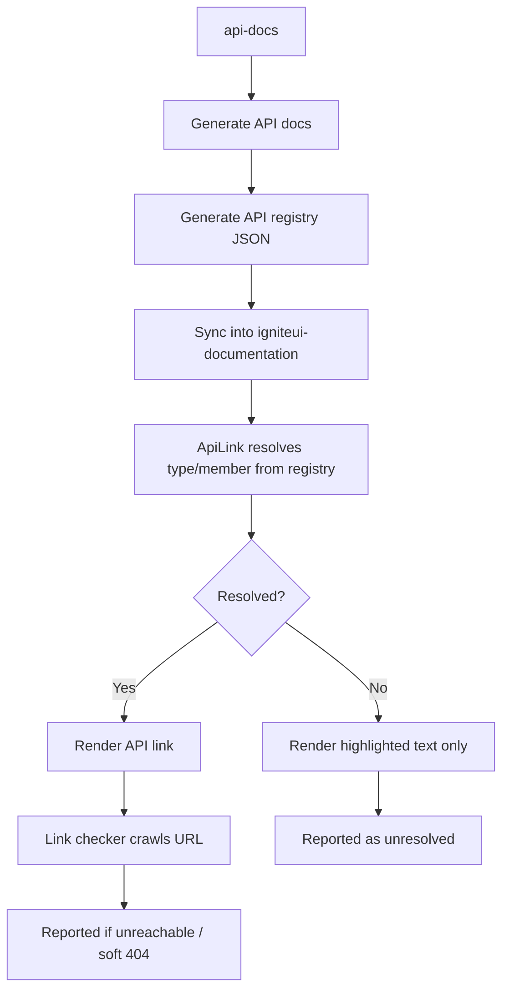
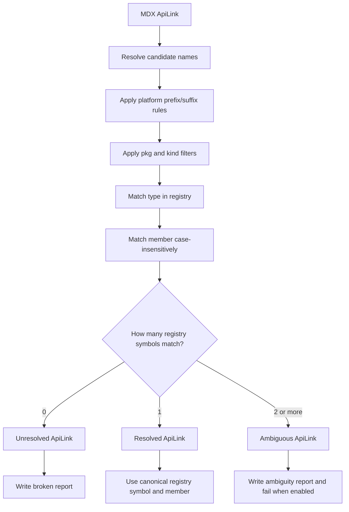

# ApiLink Registry Workflow

This document explains the current `ApiLink` flow from API documentation generation to MDX validation. The short version: the API registry is the source of truth for symbol URLs, member casing, package selection, and ambiguity detection.

## End-to-End Flow



The checker adds one more branch for duplicate registry matches:



## Source Repositories

`api-docs` owns the API documentation generation. It produces the API docs and the registry JSON snapshots.

`igniteui-documentation` stores registry snapshots under:

```text
src/data/api-link-index/
  angular/staging-latest.json
  react/staging-latest.json
  webcomponents/staging-latest.json
  blazor/staging-latest.json
  manifest.json
```

`igniteui-astro-components` owns the runtime `ApiLink` component and registry lookup code used by MDX rendering.

## Registry Contract

Each registry entry describes a symbol:

| Field | Meaning |
|---|---|
| `p` | Package id, such as `igniteui-react-inputs` or `IgniteUI.Blazor`. |
| `k` | API kind, such as `class`, `interface`, `enum`, or `type`. |
| `u` | URL path for the symbol. |
| `m` | Member map for anchors. |

The registry can contain duplicate symbol keys when more than one package or kind has the same public name. This is expected. It becomes a docs problem only when an MDX `ApiLink` references the duplicate name without enough props to choose one symbol.

## ApiLink Resolution Rules

Resolution is platform-aware:

- Angular tries Angular naming conventions first, such as `Calendar` -> `IgxCalendarComponent`.
- React, Web Components, and Blazor apply their platform prefixes and package mappings.
- Member matching is case-insensitive, but the resolved member name and anchor come from the registry.
- `pkg` filters the candidate symbols by package id.
- `kind` filters the candidate symbols by API kind.

The registry is the source of truth after a symbol is found. For example, if MDX uses a member with different casing, the rendered link uses the canonical registry member and anchor.

## When to Add Props

Keep links minimal when the registry resolves one symbol:

```mdx
<ApiLink type="Calendar" />
<ApiLink type="Grid" member="filter" />
```

Add `pkg` when the same symbol exists in more than one package and the package changes the target:

```mdx
<ApiLink pkg="core" type="Calendar" />
<ApiLink pkg="inputs" type="CheckboxChangeEventArgs" />
<ApiLink pkg="geo-core" type="NumberFormatSpecifier" />
```

Add `kind` when the same symbol name exists as a non-class type, or when the intended symbol is not a class:

```mdx
<ApiLink kind="enum" type="TransactionType" />
```

Use `PlatformBlock` when the correct package or symbol differs by platform:

```mdx
<PlatformBlock for="React">
<ApiLink pkg="inputs" type="CheckboxChangeEventArgs" />
</PlatformBlock>

<PlatformBlock for="Blazor">
<ApiLink pkg="core" type="CheckboxChangeEventArgs" />
</PlatformBlock>
```

## Checker Commands

The root `check-mdx-links` scripts include ambiguity reporting:

| Command | What it checks |
|---|---|
| `npm run check-mdx-links:angular` | Angular content after xplat Angular sync. |
| `npm run check-mdx-links:react` | Raw xplat content for React, filtered by TOC exclusions. |
| `npm run check-mdx-links:wc` | Raw xplat content for Web Components, filtered by TOC exclusions. |
| `npm run check-mdx-links:blazor` | Raw xplat content for Blazor, filtered by TOC exclusions. |
| `npm run check-mdx-links:broken:<platform>` | Resolve-only report for broken, unresolved, and ambiguous `ApiLink`s. |
| `npm run check-mdx-links:report:<platform>` | Markdown report for URL checks plus ambiguity report. |

The package scripts pass these flags to `scripts/check-mdx-links.mjs`:

```text
--list-ambiguities
--ambiguity-md=reports/api-link-ambiguity-report-<platform>.md
--fail-on-ambiguity
```

Use `--no-sync` only for a quick local resolver check when generated content is already current.

## Platform Generation Before Checking

Angular:

```text
npm run sync:generated-from-xplat --prefix docs/angular
npm run sync:generated-from-xplat:jp --prefix docs/angular
scan docs/angular/src/content
```

React, Web Components, and Blazor:

```text
npm run generate:<platform> --prefix docs/xplat
npm run generate:<platform>:jp --prefix docs/xplat
scan docs/xplat/src/content with toc.json exclusions
```

This keeps reported file paths on the raw xplat MDX files while still respecting platform-specific excluded topics.

## Reports

Ambiguity reports are written to:

```text
reports/api-link-ambiguity-report.md
reports/api-link-ambiguity-report-angular.md
reports/api-link-ambiguity-report-react.md
reports/api-link-ambiguity-report-wc.md
reports/api-link-ambiguity-report-blazor.md
```

The report has two useful sections:

- Referenced ambiguous `ApiLink`s: current MDX links that must be fixed.
- All registry duplicate symbol keys: duplicate registry names that may or may not be referenced.

Only referenced ambiguities are blockers. Duplicate registry keys are informational until MDX links to them without enough props.

## Practical Fix Loop

1. Run the platform check.
2. Open the ambiguity report.
3. For each referenced ambiguity, compare the candidate packages and kinds.
4. Add the smallest correct disambiguation: usually `pkg`, sometimes `kind`.
5. Use `PlatformBlock` only when one MDX line cannot be correct for all platforms.
6. Re-run the same check until `Ambiguous ApiLinks` says `None`.

For Angular `Calendar`, no `pkg` is needed in normal Angular docs because `Calendar` resolves through Angular naming conventions to `IgxCalendarComponent` before considering the duplicate raw `Calendar` registry key.
