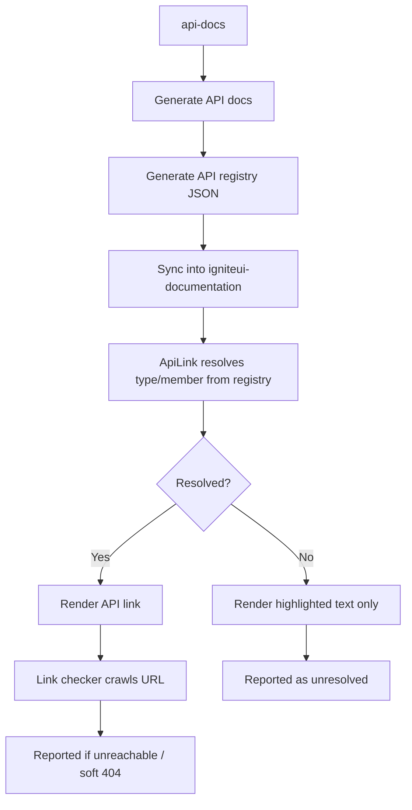
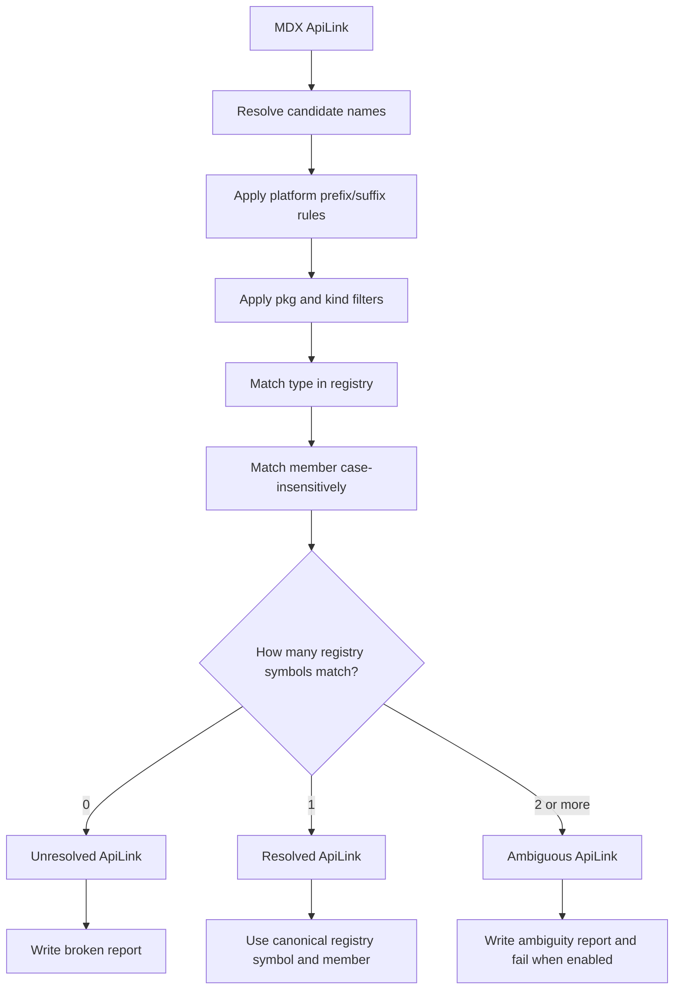

# ApiLink Registry Workflow

This document explains the current `ApiLink` flow from API documentation generation to MDX validation. The short version: the API registry is the source of truth for symbol URLs, member casing, package selection, and ambiguity detection.

For authoring rules, use the [ApiLink skill](.github/skills/xplat-docs-api-links/SKILL.md) and the [PlatformBlock skill](.github/skills/xplat-docs-platform-block/SKILL.md).

## End-to-End Flow


```mermaid
flowchart TD
    A[api-docs] --> B[Generate API docs]
    B --> C[Generate API registry JSON]
    C --> D[Sync into igniteui-documentation]
    D --> E[ApiLink resolves type/member from registry]
    E --> F{Resolved?}

    F -->|Yes| G[Render API link]
    G --> H[Link checker crawls URL]
    H --> I[Reported if unreachable / soft 404]

    F -->|No| J[Render highlighted text only]
    J --> K[Reported as unresolved]
```

The checker adds one more branch for duplicate registry matches:


```mermaid
flowchart TD
    A[MDX ApiLink] --> B[Resolve candidate names]
    B --> C[Apply platform prefix/suffix rules]
    C --> D[Apply pkg and kind filters]
    D --> E[Match type in registry]
    E --> F[Match member case-insensitively]
    F --> G{How many registry symbols match?}

    G -->|0| H[Unresolved ApiLink]
    G -->|1| I[Resolved ApiLink]
    G -->|2 or more| J[Ambiguous ApiLink]

    H --> K[Write broken report]
    I --> L[Use canonical registry symbol and member]
    J --> M[Write ambiguity report and fail when enabled]
```

## Source Repositories

`api-docs` owns the API documentation generation. It produces the API docs and the registry JSON snapshots.

`igniteui-documentation` stores registry snapshots under:

```text
src/data/api-link-index/
  angular/{staging-latest,prod-latest}.json
  react/{staging-latest,prod-latest}.json
  webcomponents/{staging-latest,prod-latest}.json
  blazor/{staging-latest,prod-latest}.json
  manifest.json
```

`igniteui-astro-components` owns the runtime `ApiLink` component and registry lookup code used by MDX rendering.

Package aliases, platform prefixes, and suffix candidates live in [src/lib/api-platform-config.ts](src/lib/api-platform-config.ts). [src/lib/platform-context.ts](src/lib/platform-context.ts) selects the registry snapshot and API documentation origin for the build environment.

## Registry Contract

Each registry entry describes a symbol:

| Field | Meaning |
|---|---|
| `p` | Package id, such as `igniteui-react-inputs` or `IgniteUI.Blazor`. |
| `k` | API kind, such as `class`, `interface`, `enum`, or `type`. |
| `u` | URL path for the symbol. |
| `m` | Member map for anchors. |

The registry can contain duplicate symbol keys when more than one package or kind has the same public name. This is expected. It becomes a docs problem only when an MDX `ApiLink` references the duplicate name without enough props to choose one symbol.

## Registry Resolution

Resolution is platform-aware:

- Angular tries Angular naming conventions first, such as `Calendar` -> `IgxCalendarComponent`.
- React, Web Components, and Blazor apply their platform prefixes and package mappings.
- Member matching is case-insensitive, but the resolved member name and anchor come from the registry.
- `pkg` filters the candidate symbols by package id.
- `kind` filters the candidate symbols by API kind.

The registry is the source of truth after a symbol is found. For example, if MDX uses a member with different casing, the rendered link uses the canonical registry member and anchor.

### Packages and Member Ownership

The registry records the package and URL for each symbol rather than constructing every URL from the platform's main package. Excel utility symbols such as `Workbook` and `WorksheetTable` have no platform prefix or component suffix:

| Platform | Excel package |
|---|---|
| Angular | `igniteui-angular-excel` |
| React | `igniteui-react-excel` |
| Web Components | `igniteui-webcomponents-excel` |
| Blazor | `IgniteUI.Blazor.Documents.Excel` |

The Blazor Excel package is separate from `IgniteUI.Blazor`. The registry's `u` field contains the symbol's current URL; older version-specific URLs are not the lookup contract.

Member anchors belong to the owning symbol's `m` map. A column property does not necessarily exist on the grid symbol, and an options property may belong to an interface rather than the component using those options. The registry and the upstream TypeDoc data identify the owner.

## Checker Commands

The root `check-mdx-links` scripts include ambiguity reporting:

| Command | What it checks |
|---|---|
| `npm run check-mdx-links:angular` | Angular content after xplat Angular sync. |
| `npm run check-mdx-links:react` | Raw xplat content for React, filtered by TOC exclusions. |
| `npm run check-mdx-links:wc` | Raw xplat content for Web Components, filtered by TOC exclusions. |
| `npm run check-mdx-links:blazor` | Raw xplat content for Blazor, filtered by TOC exclusions. |
| `npm run check-mdx-links:broken:<platform>` | Resolve-only report for broken, unresolved, and ambiguous `ApiLink`s. |
| `npm run check-mdx-links:report:<platform>` | Markdown report for URL checks plus ambiguity report. |

The package scripts pass these flags to `scripts/check-mdx-links.mjs`:

```text
--list-ambiguities
--ambiguity-md=reports/api-link-ambiguity-report-<platform>.md
--fail-on-ambiguity
```

Use `--no-sync` only for a quick local resolver check when generated content is already current.

## Platform Generation Before Checking

Angular:

```text
npm run sync:generated-from-xplat --prefix docs/angular
npm run sync:generated-from-xplat:jp --prefix docs/angular
scan docs/angular/src/content
```

React, Web Components, and Blazor:

```text
npm run generate:<platform> --prefix docs/xplat
npm run generate:<platform>:jp --prefix docs/xplat
scan docs/xplat/src/content with toc.json exclusions
```

This keeps reported file paths on the raw xplat MDX files while still respecting platform-specific excluded topics.

## Reports

Ambiguity reports are written to:

```text
reports/api-link-ambiguity-report.md
reports/api-link-ambiguity-report-angular.md
reports/api-link-ambiguity-report-react.md
reports/api-link-ambiguity-report-wc.md
reports/api-link-ambiguity-report-blazor.md
```

The report has two useful sections:

- Referenced ambiguous `ApiLink`s: current MDX links that must be fixed.
- All registry duplicate symbol keys: duplicate registry names that may or may not be referenced.

Only referenced ambiguities are blockers. Duplicate registry keys are informational until MDX links to them without enough props.

For resolution statuses and authoring fixes, follow the [canonical ApiLink skill](.github/skills/xplat-docs-api-links/SKILL.md#validation). The checker reports whether a reference is missing, has a missing member, or is ambiguous; these are distinct from a resolved URL that fails the subsequent reachability check.
