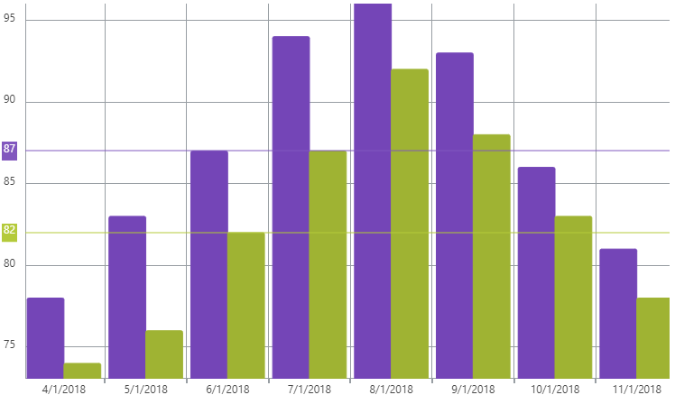

<!--
|metadata|
{
    "fileName": "igcategorychart-crosshairs-layer",
    "controlName": "igCategoryChart",
    "tags": ["API", "CategoryChart"]
}
|metadata|
-->

# 十字線レイヤー

十字線レイヤーは、ポインターがデータポイントと交差する場所に垂直と水平 (またはそのいずれか) の線を描画します。

## オプション

以下のオプション一覧は、コールアウト レイヤーの設定時に使用してください。

オプション名|値型|説明
---|---|---
`crosshairsDisplayMode`      | enumeration | チャートで表示する十字線のタイプを決定します。<br>値: "default", "none", "horizontal", "vertical", "both"
`crosshairsSnapToData`       | boolean     | 十字線がデータポイント間を補完するかどうかを決定します。
`crosshairsAnnotationEnabled`| boolean     | 十字線値が軸注釈に描画されるかどうかを決定します。

## 十字線レイヤーの有効化

十字線レイヤーは `crosshairsDisplayMode` オプションを "horizontal"、"vertical"、"both" に設定して有効にできます。

以下のコード スニペットは、`igCategoryChart` で十字線を有効にする方法を示します。

*In HTML:*

```html
$(function () {
     $("chart1").igCategoryChart({
	     crosshairsDisplayMode: "both"
     });
});
```

## 十字線レイヤーの設定

### データへスナップ

`crosshairsSnapToData` オプションを true に設定して十字線を `igCategoryChart` のデーターポイントにスナップします。false に設定した場合、十字線はポインターのホバー時にデータ ポイント間を補完します。

以下のコードスニペットは、データ ポイントにスナップする十字線を有効にする方法を示します。

*In HTML:*

```html
$(function () {
     $("chart1").igCategoryChart({
	     crosshairsSnapToData: true
     });
});
```

### 軸注釈の有効化

十字線レイヤーの軸注釈は、軸の注釈ラベルで十字線の値を描画します。

以下のコード スニペットは、十字線レイヤーの軸注釈を有効にする方法を示します。

*In HTML:*

```html
$(function () {
     $("chart1").igCategoryChart({
	     crosshairsAnnotationEnabled: true
     });
});
```

以下のスクリーンショットは、軸注釈を含む水平十字線を使用した igCategoryChart コントロールを示します。




## <a id="relatedtopics"/>関連トピック:

- [最終値レイヤー](igcategorychart-final-value-layer.html)
