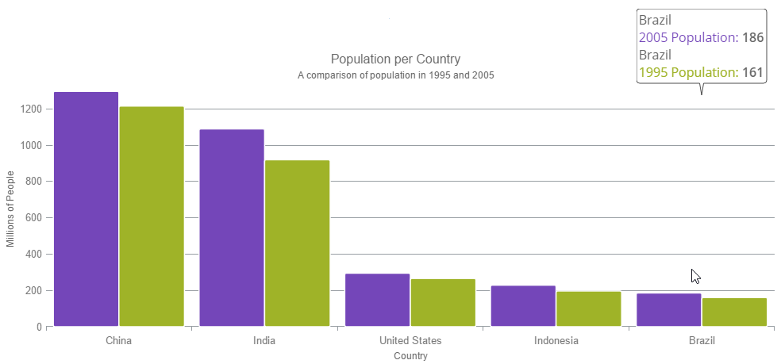

<!--
|metadata|
{
    "fileName": "hoverinteractions-category-tooltip-layer",
    "controlName": "",
    "tags": []
}
|metadata|
-->

# カテゴリ ツールチップ レイヤーの構成 (igDataChart)

## トピックの概要

### 目的

このトピックは、ホバー操作に使用されるカテゴリ ツールチップ レイヤーについての情報を提供します。カテゴリ ツールチップ レイヤーのプロパティについて説明し、実装例を提供します。

### 前提条件

このトピックを理解するために、以下のトピックを参照することをお勧めします。

- [igDataChart の追加](igDataChart-Adding.html): このトピックでは、`igDataChart`™ コントロールをページに追加し、データにバインドする方法を紹介します。

- [igDataChart をデータにバインド](igDataChart-DataBinding.html): このトピックでは、`igDataChart`™ コントロールを各種データ ソース (JavaScript 配列、`IQueryable<T>`、Web サービス) にバインドする方法について説明します。

### このトピックの内容

このトピックは、以下のセクションで構成されます。

-   [概要](#overview)
	-   [プレビュー](#preview)
-   [プロパティ](#properties)
-   [例](#example)
-   [関連コンテンツ](#related-content)
    -   [トピック](#topics)
    -   [サンプル](#samples)

##  概要

#### カテゴリ ヒント レイヤーの概要

`categoryTooltipLayer` は、カテゴリ軸を使用する `igDataChart` コントロールのシリーズ用にグループ化されたヒントを表示します。

特殊な軸を対象とするヒントを構成できます。そのためには、`targetAxis` プロパティを設定します。このプロパティの詳細は、以下の[プロパティ](#properties) セクションを参照してください。

デフォルトで、グループ化されたツールチップは `igDataChart` コントロールの一番上に表示されます。ただし、このデフォルト値は `toolTipPosition` プロパティを設定することでオーバーライドできます。プロパティの詳細は、以下の `categoryTooltipLayer` セクションを参照してください。

####  プレビュー

以下の画像は、追加の `categoryTooltipLayer` で描画される `igDataChart `コントロールのプレビューです。

##  プロパティ

#### カテゴリ ヒント レイヤーの要点

以下の表で、categoryTooltipLayer レイヤーのプロパティを簡単に説明します。

プロパティ名|プロパティ タイプ|説明
---|---|---
targetAxis|axis|このプロパティは、どの軸に有効なカテゴリ ヒント レイヤーを設定するかを指定します。
useInterpolation|bool|このプロパティは、ツールチップの x 位置がグリッド ラインや中央スペースにスナップするのでなく補間されるべきであるかどうかを指定します。
toolTipPosition|categoryTooltipLayerPosition|このプロパティは、ツールチップの位置を指定します。以下に設定できます。<ul><li>Auto - 位置は自動的に選択されます</li><li>OutsideStart - 軸の外側の始まり部分に表示します。</li><li>InsideStart - 軸の内側の始まり部分に表示します。</li><li>InsideEnd - 軸の内側の終わり部分に表示します。</li><li>OutsideEnd - 軸の外側の終わり部分に表示します。</li></ul>

##  例

このサンプルは、カテゴリ軸を使用してグループ化されたツールチップを表示するカテゴリ ツール チップ レイヤーを紹介します。
このサンプル オプション ペインでは、ツールチップの位置の変更など、レイヤーのプロパティを編集できます。
  

   [カテゴリ ツールチップ レイヤー](%%SamplesEmbedUrl%%/data-chart/category-tooltip-layer)
   

## 関連コンテンツ

### トピック

- [ホバー操作の概要 (igDataChart)](HoverInteractions-Hover-Interactions-Overview.html): このトピックは、利用可能な異なる型のホバー操作レイヤーなど、`igDataChart` コントロール上で利用できるホバー操作について概念的な情報を提供します。

- [ホバー操作プロパティ参照 (igDataChart)](HoverInteractions-Common-Properties.html): このトピックは、ホバー操作機能が、series クラスから継承したツールチップの相互作用を強調表示、ホバリングおよび相互作用するために使用するプロパティおよびメソッドについての情報を提供します。

- [カテゴリ ハイライト レイヤーの構成 (igDataChart)](HoverInteractions-Category-Highlight-Layer.html): このトピックは、ホバー操作に使用されるカテゴリ ハイライト レイヤーについての情報を提供します。カテゴリ ハイライト レイヤーのプロパティについて説明し、実装例を示します。

- [カテゴリ項目ハイライト レイヤーの構成 (igDataChart)](HoverInteractions-Category-Item-Highlight-Layer.html): このトピックは、ホバー操作に使用されるカテゴリ項目ハイライト レイヤーについての情報を提供します。カテゴリ項目ハイライト レイヤーのプロパティについて説明し、実装例を示します。

- [項目ツールチップ レイヤーの構成 (igDataChart)](HoverInteractions-Item-Tooltip-Layer.html): このトピックは、ホバー操作に使用される項目ツールチップ レイヤーについての情報を提供します。項目ツールチップ レイヤーのプロパティについて説明し、実装例も提供します。

- [十字線レイヤーの構成 (igDataChart)](HoverInteractions-Crosshair-Layer.html): このトピックは、ホバー操作に使用される十字線レイヤーについての情報を提供します。十字線のプロパティについて説明し、実装例を示します。

### サンプル

このトピックについては、以下のサンプルも参照してください。

- [ホバー操作 - カテゴリ ハイライト レイヤー](HoverInteractions-Category-Highlight-Layer.html#example): このサンプルは、`igDataChart`™ コントロールで 1 つまたはすべてのカテゴリ軸を対象としたカテゴリ ハイライト レイヤーを紹介します。このサンプル オプション ペインでは、カテゴリ ハイライト レイヤーのプロパティを変更できます。強調表示の色、アウトライン、太さなどの変更が可能です。

- [ホバー操作 - カテゴリ項目ハイライト レイヤー](HoverInteractions-Category-Item-Highlight-Layer.html#example): このサンプルは、カテゴリ軸を使用するシリーズの項目を強調表示するカテゴリ項目ハイライト レイヤーを紹介します。その位置にバンド図形、またはマーカーを描画して、項目を強調表示します。このサンプル オプション ペインでは、カテゴリ ハイライト レイヤーのプロパティを変更できます。強調表示の色、アウトライン、太さなどの変更が可能です。

- [ホバー操作 - 項目ツールチップ レイヤー](HoverInteractions-Item-Tooltip-Layer.html#example): このサンプルは、各ターゲット シリーズにツールチップを表示する項目ツールチップ レイヤーを紹介します。このサンプル オプション ペインでは、トランジション期間の変更など、レイヤー プロパティを編集できます。

- [ホバー操作 - 十字線レイヤー](HoverInteractions-Crosshair-Layer.html#example): このサンプルは、ターゲットとする各シリーズの実際の値で交差する、十字線を提供する十字線レイヤーを紹介します。このサンプル オプション ペインでは、十字線の太さの変更など、レイヤー プロパティを編集できます。

- [ホバー操作 - 複数レイヤー](%%SamplesUrl%%/data-chart/multiple-layers): このサンプルは、`igDataChart` コントロール内での複数レイヤーの相互作用を紹介します。このサンプルでは、項目ツールチップ レイヤー、十字線レイヤー、およびカテゴリ ハイライト レイヤーを表示します。

 

 

