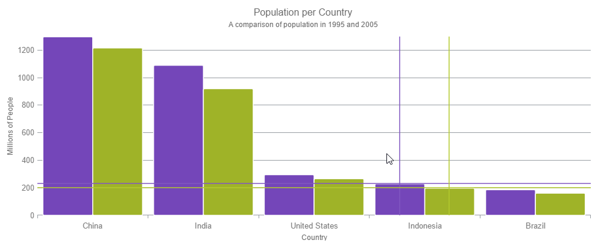

<!--
|metadata|
{
    "fileName": "hoverinteractions-crosshair-layer",
    "controlName": "",
    "tags": []
}
|metadata|
-->

# 十字線レイヤーの構成 (igDataChart)

## トピックの概要

### 目的

このトピックは、ホバー操作に使用される十字線レイヤーについての情報を提供します。十字線のプロパティについて説明し、実装例を示します。

### 前提条件

このトピックを理解するために、以下のトピックを参照することをお勧めします。

- [igDataChart の追加](igDataChart-Adding.html): このトピックでは、`igDataChart`™ コントロールをページに追加し、データにバインドする方法を紹介します。

- [igDataChart をデータにバインド](igDataChart-DataBinding.html): このトピックでは、`igDataChart`™ コントロールを各種データ ソース (JavaScript 配列、`IQueryable<T>`、Web サービス) にバインドする方法について説明します。

### このトピックの内容

このトピックは、以下のセクションで構成されます。

-   [概要](#overview)
	-   [プレビュー](#preview)
-   [プロパティ](#properties)
-   [例](#example)
-   [関連コンテンツ](#related-content)
    -   [トピック](#topics)
    -   [サンプル](#samples)

##  概要

#### 十字線レイヤーの概要

`crosshairLayer` は、対象にするために構成される各シリーズの実際値で、異なるセットの線を描画する各シリーズと交差する十字線として描画されます。

`crosshairLayer` を構成し、デフォルトで `igDataChart` コントロールのすべてのシリーズを対象とする場合に、レイヤーに 1 つの特別なシリーズのみを表示するようにします。これを実行するには、`targetSeries` プロパティを設定します。このプロパティの詳細は、以下の[プロパティ](#properties) セクションを参照してください。

デフォルトでは、十字線の色は交差するシリーズよりも軽い色になります。しかし、このデフォルト値は、十字線に使用される色を選択できるようにオーバーライドできます。これを実行するには、`brush` プロパティを設定します。このプロパティの詳細は、[ホバー操作プロパティ参照 (igDataChart)](HoverInteractions-Common-Properties.html) のトピックを参照してください。

####  プレビュー

以下の画像は、追加の `crosshairLayer` で描画される `igDataChart` コントロールのプレビューです。

##  プロパティ

#### 十字線レイヤーのプロパティ

以下の表で、十字線レイヤーのプロパティを簡単に説明します。

プロパティ名|プロパティ タイプ|説明
---|---|---
horizontalLineVisibility|visibility|このプロパティは、十字線レイヤーの水平線を表示するかかどうかを指定します。`Collapsed` に設定されている場合は、垂直線のみが表示されます。
verticalLineVisibilty |visibility|このプロパティは、十字線レイヤーの垂直線を表示するかかどうかを指定します。`Collapsed` に設定されている場合は、水平線のみが表示されます。
targetSeries|series|このプロパティは、どのシリーズに有効な十字線レイヤーを設定するかを指定します。各シリーズごとに別々に十字線レイヤーを作成して個別に構成できます。
useInterpolation|bool|このプロパティは、垂直の十字線がデータ ポイント間の補間位置でシリーズと交差すべきかどうかを指定します。通常、十字線レイヤーはシリーズ内に最も近い点を見つけ、十字線がその点に一致するようにしますが、点がまばらである場合はこのプロパティを有効にします。
isAxisAnnotationEnabled | bool | このプロパティは、十字線の値を Axes の注釈ラベルに表示するかどうかを指定します。

## 軸の注釈

十字線レイヤーは、関連する軸上に十字線の値を表示できます。つまり、水平十字線の値は Y 軸に表示され、垂直十字線の値は X 軸に表示されます。これは、`isAxisAnnotationEnabled` プロパティを true に設定することで有効にできます。

#### 注釈のスタイル設定

軸の注釈は、次のプロパティでスタイル設定できます。

プロパティ名 | プロパティ タイプ | 説明
---|---|---
xAxisAnnotationBackground yAxisAnnotationBackground | string | 注釈の背景色。
xAxisAnnotationTextColor yAxisAnnotationTextColor | string | 注釈のテキストの色。
xAxisAnnotationOutline yAxisAnnotationOutline | string | 注釈のアウトラインの色
xAxisAnnotationStrokeThickness yAxisAnnotationStrokeThickness | number | 注釈のアウトラインの太さ。

##  例

このサンプルは、ターゲットとする実際の値に一致する十字線を提供する十字線レイヤーを紹介します。
このサンプル オプション ペインでは、十字線の太さの変更など、レイヤー プロパティを編集できます。

   [十字線レイヤー](%%SamplesEmbedUrl%%/data-chart/crosshair-layer)
   

## 関連コンテンツ

### トピック

- [ホバー操作の概要 (igDataChart)](HoverInteractions-Hover-Interactions-Overview.html): このトピックは、利用可能な異なる型のホバー操作レイヤーなど、`igDataChart` コントロール上で利用できるホバー操作について概念的な情報を提供します。

- [ホバー操作プロパティ参照 (igDataChart)](HoverInteractions-Common-Properties.html): このトピックは、ホバー操作機能が、`series` クラスから継承したツールチップの相互作用を強調表示、ホバリングおよび相互作用するために使用するプロパティおよびメソッドについての情報を提供します。

- [カテゴリ ハイライト レイヤーの構成 (igDataChart)](HoverInteractions-Category-Highlight-Layer.html): このトピックは、ホバー操作に使用されるカテゴリ ハイライト レイヤーについての情報を提供します。カテゴリ ハイライト レイヤーのプロパティについて説明し、実装例を示します。

- [カテゴリ項目ハイライト レイヤーの構成 (igDataChart)](HoverInteractions-Category-Item-Highlight-Layer.html): このトピックは、ホバー操作に使用されるカテゴリ項目ハイライト レイヤーについての情報を提供します。カテゴリ項目ハイライト レイヤーのプロパティについて説明し、実装例を示します。

- [カテゴリ ツールチップ レイヤーの構成 (igDataChart)](HoverInteractions-Category-Tooltip-Layer.html): このトピックは、ホバー操作に使用されるカテゴリ ツールチップ レイヤーについての情報を提供します。カテゴリ ツールチップ レイヤーのプロパティについて説明し、実装例を提供します。

- [項目ツールチップ レイヤーの構成 (igDataChart)](HoverInteractions-Item-Tooltip-Layer.html): このトピックは、ホバー操作に使用される項目ツールチップ レイヤーについての情報を提供します。項目ツールチップ レイヤーのプロパティについて説明し、実装例も提供します。

### サンプル

このトピックについては、以下のサンプルも参照してください。

- [ホバー操作 - カテゴリ ハイライト レイヤー](HoverInteractions-Category-Highlight-Layer.html#example): このサンプルは、`igDataChart`™ コントロールで 1 つまたはすべてのカテゴリ軸を対象としたカテゴリ ハイライト レイヤーを紹介します。このサンプル オプション ペインでは、カテゴリ ハイライト レイヤーのプロパティを変更できます。強調表示の色、アウトライン、太さなどの変更が可能です。

- [ホバー操作 - カテゴリ項目ハイライト レイヤー](HoverInteractions-Category-Item-Highlight-Layer.html#example): このサンプルは、カテゴリ軸を使用するシリーズの項目を強調表示するカテゴリ項目ハイライト レイヤーを紹介します。その位置にバンド図形、またはマーカーを描画して、項目を強調表示します。このサンプル オプション ペインでは、カテゴリ ハイライト レイヤーのプロパティを変更できます。強調表示の色、アウトライン、太さなどの変更が可能です。

- [ホバー操作 - カテゴリ ツールチップ レイヤー](HoverInteractions-Category-Tooltip-Layer.html#example): このサンプルでは、カテゴリ軸を使用するシリーズのグループ化されたツールチップを表示するカテゴリ ツールチップ レイヤを紹介します。このサンプル オプション ペインでは、ツールチップの位置の変更など、レイヤーのプロパティを編集できます。

- [ホバー操作 - 項目ツールチップ レイヤー](HoverInteractions-Item-Tooltip-Layer.html#example): このサンプルは、各ターゲット シリーズにツールチップを表示する項目ツールチップ レイヤーを紹介します。このサンプル オプション ペインでは、トランジション期間の変更など、レイヤー プロパティを編集できます。

- [ホバー操作 - 複数レイヤー](%%SamplesUrl%%/data-chart/multiple-layers): このサンプルは、`igDataChart` コントロール内での複数レイヤーの相互作用を紹介します。このサンプルでは、項目ツールチップ レイヤー、十字線レイヤー、およびカテゴリ ハイライト レイヤーを表示します。

 

 

