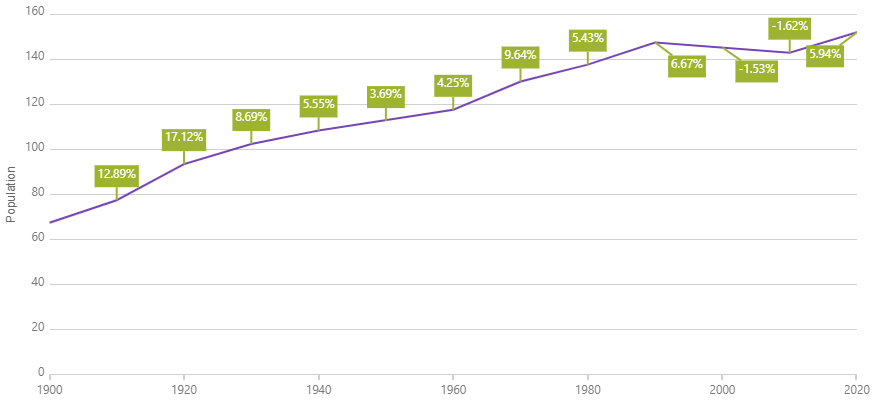

<!--
|metadata|
{
    "fileName": "hoverinteractions-callout-layer",
    "controlName": "",
    "tags": []
}
|metadata|
-->

# コールアウト レイヤーの構成 (igDataChart)


## トピックの概要

### 目的


このトピックは、コールアウト レイヤーについての情報を提供します。コールアウト レイヤーのプロパティについて説明し、実装例を提供します。

### 前提条件

本トピックの理解を深めるために、以下のトピックを参照することをお勧めします。

- [Adding igDataChart](igDataChart-Adding.html): igDataChart の追加:このトピックでは、igDataChart コントロールをページに追加し、データにバインドする方法を紹介します。

- [igDataChart をデータへバインド](igDataChart-DataBinding.html): このトピックでは、[igDataChart](igDataChart-DataBinding.html)™ コントロールを各種データ ソース (JavaScript 配列、IQueryable<T>、Web サービス) にバインドする方法について説明します。


### このトピックの内容

このトピックは、以下のセクションで構成されます。

-   [概要](#overview)
	-   [プレビュー](#preview)
-   [プロパティ](#properties)
-   [例](#example)
-   [関連コンテンツ](#related-content)
    -   [トピック](#topics)
    -   [サンプル](#samples)


## <a id="overview"></a> 概要

#### コールアウト レイヤーの概要

`calloutLayer` はチャート既存または新しいデータの注釈を表示します。

### <a id="preview"></a> プレビュー

以下の画像は、`calloutLayer` を使用して描画した `igDataChart` コントロールのプレビューです。




## <a id="properties"></a> プロパティ

#### コールアウト レイヤーのまとめ

以下の表は `calloutLayer` レイヤーのプロパティの概要です。

プロパティ名 | プロパティ型 | 説明
---|---|---
dataSource | `Array`| コールアウト情報で使用されるデータ。
labelMemberPath | `String`| 注釈ラベルとして使用されるデータのパス。
xMemberPath | `String`| 注釈の x 位置として使用されるデータのパス。
yMemberPath | `String`| 注釈の y 位置として使用されるデータのパス。
isCalloutOffsettingEnabled | `Boolean`| コールアウト位置が競合解決で調整されます。


## <a id="example"></a> 例

以下のコードスニペットは、2 つのコールアウト レイヤーを設定する方法を示します。

*HTML:*

```html
$(function () {
    $("#chart1").igDataChart({
        series: [
            {
                name: "calloutSeriesUsa",
                type: "calloutLayer",
                dataSource: usaCallouts,
                xMemberPath: "Index",
                yMemberPath: "Value",
                labelMemberPath: "Label"
            },
            {
                name: "calloutSeriesRus",
                type: "calloutLayer",
                dataSource: rusCallouts,
                xMemberPath: "Index",
                yMemberPath: "Value",
                labelMemberPath: "Label"
            }
        ]
    });
});
```

## <a id="related-content"></a>関連コンテンツ

### <a id="topics"></a>トピック

- [ホバー インタラクションの概要 (igDataChart)](HoverInteractions-Hover-Interactions-Overview.html): このトピックは、利用可能な異なる型のホバー操作レイヤーなど、`igDataChart` コントロールで使用できるホバー操作について概念的な情報を提供します。


### <a id="samples"></a>サンプル

以下のサンプルでは、このトピックに関連する追加情報を提供します。

- [コールアウト レイヤー](%%SamplesUrl%%/data-chart/callout-layer): このサンプルは、`igDataChart` でコールアウト注釈レイヤーを使用しています。
