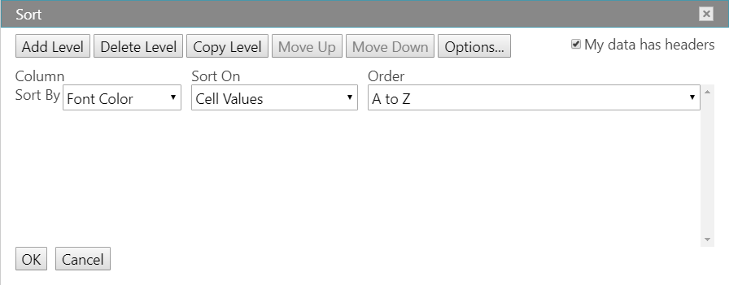
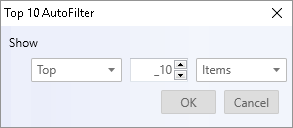
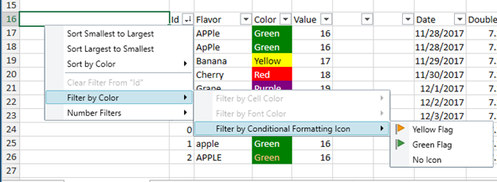
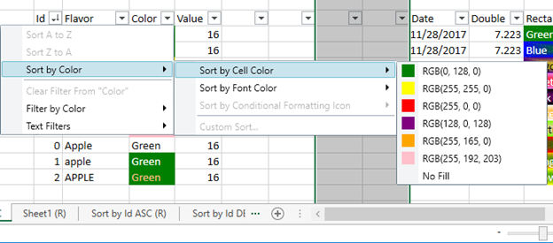
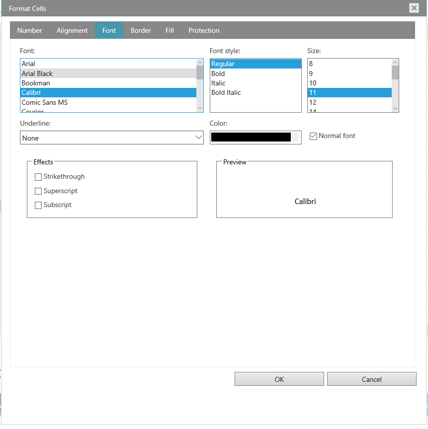
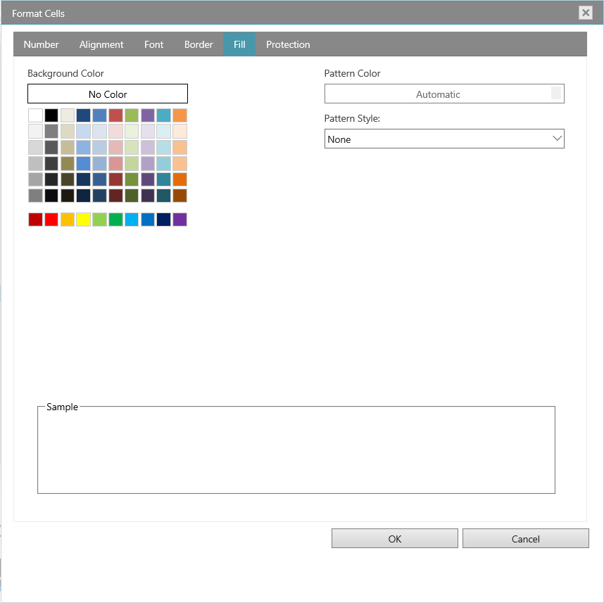
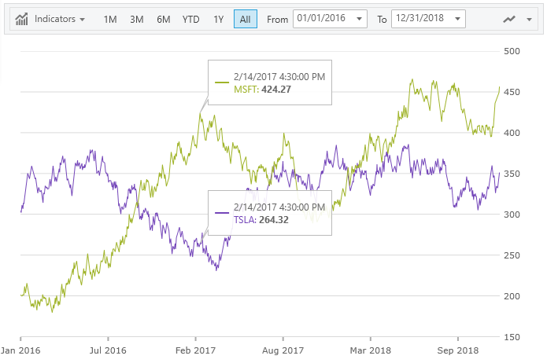
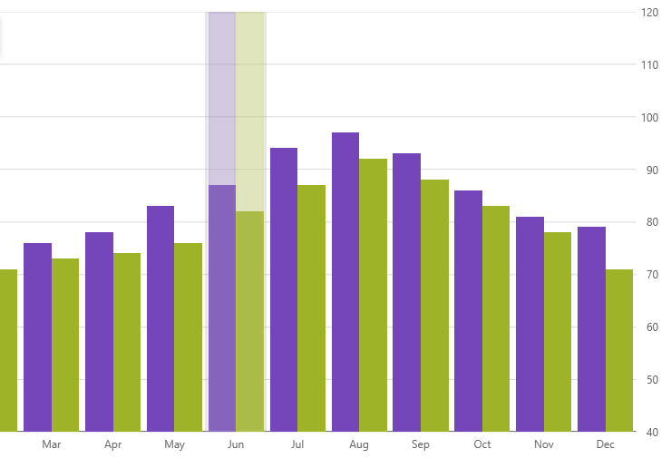
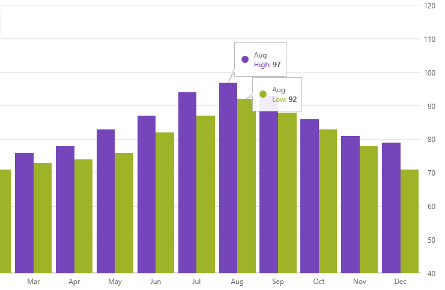
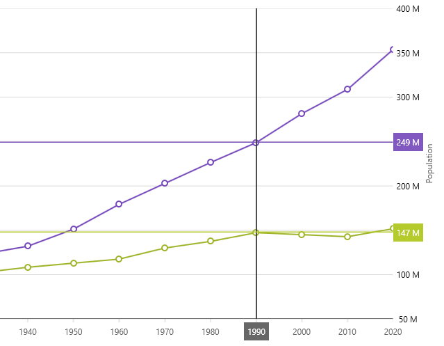

<!--
|metadata|
{
    "fileName": "whats-new-in-2018-volume2",
    "controlName": [],
    "tags": []
}
|metadata|
-->

# 2018 Volume 2 の新機能

このトピックでは、%%ProductFamilyName%%™ 2018 Volume 2 リリースのコントロールと新機能および拡張機能を紹介します。

### 概要

以下の表は、2018 Volume 2 リリースの新機能の概要です。機能の詳細については表の下をご覧ください。

### Infragistics JavaScript Excel ライブラリ
機能|説明
---|---
[チャート サポート](#ChartSupport) |70 チャート タイプ
[スパークライン サポート](#SparklineSupport) |異なる 3 タイプ

### igGrid
機能|説明
---|---
[Time Column](#TimeColumn) |igGrid の時刻列
[フィルター セルのカスタム エディター プロバイダー](#FilteringCustomProvider)|igGrid のフィルター セルでカスタム エディター プロバイダーの実装が可能

### igSpreadsheet
機能|説明
---|---
[カスタム並べ替えダイアログ](#SortDialog)|並べ替え条件を表、ワークシート、フィルター領域に追加します。
[トップ 10 フィルター ダイアログ](#Top10Dialog)|数字の一覧を上位パーセンテージでフィルターします。  
[フィルタリングと並べ替えの改善](#FilteringandSortingImprovements)|オートフィルター ドロップダウン 
[フィルタリング メニュー](#FilteringMenu)|フィルター コンテキスト メニュー
[並べ替えメニュー](#SortingMenu)|並べ替えコンテキスト メニュー
[選択の解除](#Deselect)|セル範囲の選択を解除します。
[FormatCells ダイアログ](#FormatCellsDialog)|スプレッドシートの FormatCells ダイアログ

### igFinancialChart
機能|説明
---|---
[凡例](#NewLegend)|凡例は、ツールバーとプロット領域間に表示されます。
[X-軸スケール区切り](#ScaleBreaks)|データのカスタム範囲を除外します。
[コールアウト注釈](#CalloutsAnnotationFinancial)|重要なデータ ポイントを注釈します。
[十字線レイヤー](#CrosshairsLayerFinancial)|マウス カーソルの場所でプロット領域に沿って水平線または垂直線を表示します。
[最終値の注釈](#FinalValueAnnotationFinancial)|データソースで最後のデータポイントを注釈します。
[ツールチップ タイプ](#TooltipTypesFinancial)|カテゴリ ツールチップと項目ツールチップ

### igCategoryChart
機能|説明
---|---
[注釈のハイライト](#HighlightAnnotationCategory)|カテゴリ ハイライト レイヤーと項目ハイライト レイヤー
[コールアウト注釈](#CalloutsAnnotationCategory)|重要なデータ ポイントを注釈します。
[十字線レイヤー](#CrosshairsLayerCategory)|マウス カーソルの場所でプロット領域に沿って水平線または垂直線を表示します。
[最終値の注釈](#FinalValueAnnotationCategory)|データソースで最後のデータポイントを注釈します。
[ツールチップ タイプ](#TooltipTypesCategory)|カテゴリ ツールチップと項目ツールチップ

### igDataChart
機能|説明
---|---
[コールアウト注釈](#CalloutsAnnotationDataChart)|重要なデータ ポイントを注釈します。
[十字線レイヤー](#CrosshairsLayersDataChart)|マウス カーソルの場所でプロット領域に沿って水平線または垂直線を表示します。
[最終値の注釈](#FinalValueAnnotationDataChart)|データソースで最後のデータポイントを注釈します。

## Infragistics JavaScript Excel ライブラリ

### 

Excel ライブラリにチャーティング サポートが追加されました。70 タイプを超えるチャートは、ダッシュボード レポートでデータを簡単に可視化します。Excel チャーティング API は、凡例、タイトル、軸タイトル、その他グリッドライン、目盛線、色などのスタイル設定オプションを多数含むチャートの描画を完全に制御できます。簡単に　Excel チャート機能を再現できます。MS Excel をインストール必要はありません。

Excel ドキュメントにチャートを追加Infragistics Excel ライブラリは、Worksheet オブジェクトのインスタンスを取得し、Shapes コレクションで AddChart メソッドを呼び出します。作成するチャートのタイプ (70 タイプ)、チャートのサイズと位置、チャートに適用する書式設定を提供します。 

#### 関連トピック
-   [ワークシートにチャートを追加](javascript-excel-library-worksheet-charts.html)

###  スパークライン サポート

スパークラインは、ワークシート セル内に小さなチャートを表示します。スパークラインは、時期的な増加や減少、景気循環、最大値や最小値のハイライトなど値シリーズでトレンドを表示するために使用します。ワークシート データでトレンドを表示、共有できます。

Infragistics Worksheet のインスタンスは、SparklineGroups コレクションで Add メソッドを呼び出します。作成するスパークラインのタイプ (Column、Line、Stacked) 、スパークラインを挿入するセル、スパークラインを使用してデータを表示するセル範囲を提供します。

スパークラインを作成後、Infragistics Excel Library の直感的な API でスパークラインをビジュアル要件に合わせてスタイル設定できます。 API は、ポイントの高/低、マイナス ポイント、最初のポイント、最終ポイントの色を制御できます。

#### 関連トピック
-   [スパークラインの使用](javascript-excel-library-adding-a-sparkline-to-an-excel-worksheet.html)

## igGrid

###  時刻列

時刻列の新しい列型を igGrid コントロールに追加しました。列 `dataType` を `time` に設定します。定義済みのタイムピッカー エディターを使用して時刻データをフィルターして更新できます。

###  フィルター セルのカスタム エディター プロバイダー

フィルター セルのためにカスタム エディター プロバイダーを作成できます。つまり、igGrid コンテンツをフィルターするために igEditorProvider クラスを拡張してカスタム エディターを設定できます。詳細については、以下のサンプルを参照してください。

### サンプル
[Excel スタイル フィルタリング](%%SamplesUrl%%/grid/filtering-combo-editor-provider)

## igSpreadsheet

###  カスタム並べ替えダイアログ

Excel ドキュメントで並べ替えは重要な機能ですが、ユーザー設定の並べ替えダイアログでは Excel データのカスタムな並べ替えが可能です。たとえば、Department 列と Employee 列がある場合に Department (すべての従業員を同じ部署でグループ化) で並べ替えてから名前 (各部署内でアルファベット順) で並べ替えるなどの設定が可能です。 

igSpreadsheet の並べ替えダイアログの詳細については、『並べ替えダイアログのインタラクション』トピックを参照してください。 

#### 関連トピック
-   [カスタム並べ替えダイアログ](igspreadsheet-sort-dialog)

###  トップ 10 フィルター ダイアログ

トップ 10 機能を使用してリストをフィルター時に上位 10 項目または 10 パーセントのみが表示されます。また、数値またはパーセンテージが下位のレコードを表示することも可能です。たとえば、企業のトップ給与を示す場合、Salary 列をフィルターしてトップ 10 の給与のレコードのみ表示できます。トップ 10 パーセントの給与所得者をフィルターした場合は、合計の 10 % の収入を得た人のみが含まれます。 

トップ 10 は、任意のパーセンテージでフィルターできます。 

###  フィルタリングと並べ替えの改善

18.1 でオートフィルター ドロップダウンを追加しました。ドロップダウンは昇順/降順に並べ替えるメニュー項目が含まれ、列に適用されたフィルターをクリアして数値/日付/テキスト フィルターを適用できます。ただし、前景色、塗りつぶし、アイコンにもどついて並べ替えやフィルターする機能はサポートされませんでした。18.2 では、ドロップダウンの項目を前景、塗りつぶし、列内のセル アイコンに基づいてフィルタリング、並べ替えできます。  

###  フィルタリング メニュー 

###  並べ替えメニュー

###  選択の解除

Excel で複数のセルまたは範囲の選択時に必要のないセルを選択した場合、選択解除機能で選択範囲内のセルの選択を解除できます。Ctrl キーを押しならがらクリック、あるいはクリックアンドドラッグで選択したセルまたは範囲の選択を解除できます。セルを再度選択する場合は、Ctrl キーを押しながらセルをクリックして選択します。 

###  FormatCellsDialog

igSpreadsheet を使用してセル データの表示方法を変更できます。たとえば、小数点の右にある桁数を指定、あるいはセルにパターンおよび境界線を追加できます。この設定を「セルの書式設定」ダイアログ ボックスでアクセスして変更できます。

- 表示形式タブ

デフォルトですべてのワークシート セルが一般的な数値形式で書式設定されます。一般的な形式では、セルに入力された値はそのまま使用されます。たとえば、セルに 36526 と入力して Enter を押した場合、セル コンテンツは 36526 と表示されます。セルで一般的な数値形式が使用されるためです。ただし、最初にセルを通貨として書式設定した場合、数字 36526 は $36,526.00 として表示されます。

- 配置タブ

テキストと数値を配置し、配置タブを使用してセルの方向を変更してテキスト コントロールを指定できます。

- フォント タブ

用語「フォント」は、書体 (Arial など) とその属性 (ポイント サイズ、フォント スタイル、下線、色、エフェクト) を指します。セル書式設定ダイアログ ボックスのフォント タブを使用してこれらの設定を制御します。ダイアログ ボックスのプレビュー セクションのレビューで設定のプレビューを表示できます。

- 罫線タブ

Excel で単一セルまたはセルの範囲の周りに境界線を配置できます。セルの左上角から右下角、またはセルの左下角から右上角へ線を描画できます。線のスタイル、線の太さ、または線の色を変更してデフォルト設定のセルの境界線をカスタマイズできます。

- 塗りつぶしタブ

セル書式設定ダイアログ ボックスの塗りつぶしタブを使用して選択セルの背景色を設定します。[パターン リスト] を使用して 2 色パターンまたはセル背景にシェードを適用できます。

- 保護タブ

[保護] タブでワークシートをロックしてデータや数式を保護できます。このオプションは、ワークシートも保護しない限り、効果はありません。

## igFinancialChart

###   凡例  

ファイナンシャル チャートは、ツールバーとプロット領域の間に表示する凡例がビルトインで含まれます。凡例はデータソースのタイトル、最終値、最初と最後の値間のパーセンテージの変更を示します。 

###   コールアウト注釈  

コールアウト注釈は重要なデータポイントに注釈を追加したり、ロジックに基づくコールアウト ボックスの値をカスタマイズしたりできます。たとえば、株式分割や配当を表示して、データ ソース内の最大値段を計算できます。

#### 関連トピック
-   [注釈とインタラクション レイヤー](financial-chart-annotation-and-interaction-layers.html#CalloutLayer)

###   十字線レイヤー 

カーソルの位置に水平線、垂直線またはその両方で十字線の表示を設定できます。十字線注釈はカーソルの位置に一致するデータ ポイントを表示し、X 軸と Y 軸ラベルの上にカラーボックスで値を表示できます。 

#### 関連トピック
-   [注釈とインタラクション レイヤー](financial-chart-annotation-and-interaction-layers.html#CrosshairLayer)

###   最終値

ファイナンシャル チャートでは、データ ソース内の最終データ ポイントの値に最終値注釈を追加する方法を示します。この注釈は Y 軸ラベルの上にカラーボックスとして描画されます。 

#### 関連トピック
-   [注釈とインタラクション レイヤー](financial-chart-annotation-and-interaction-layers.html#FinalValueLayer)

###  ツールチップ タイプ

ファイナンシャル チャートの ToolTipType プロパティは 2 つのツールチップタイプが追加されました。  

*  特定の日付のすべてのシリーズのツールチップを組み合わせて描画するカテゴリ ツールチップ。 

*  特定の日付で各シリーズの個々のツールチップを描画する項目ツールチップ。        

#### 関連トピック
-   [注釈とインタラクション レイヤー](financial-chart-annotation-and-interaction-layers.html#CategoryTooltipLayer) 

###  X-軸スケール区切り 

ファイナンシャル チャートに X-軸でスケール区切りを定義してデータソースや曜日で任意の範囲を除外できます。たとえば、週末に分類されるすべてのデータ項目を除外できます。 

#### 関連トピック
-   [X-軸スケール区切りの設定](financial-chart-configuring-axis-scale-breaks.html) 

## igCategoryChart

###  強調表示レイヤー

カテゴリ チャートは、ユーザーがプロットしたデータ ポイントをホバーする 2 つのハイライト レイヤーを表示できます。  

*  カテゴリ ハイライト レイヤーは、マウスカーソルに最も近いカテゴリの最初から最後に拡張する垂直の長方形を描画します。この長方形は、デフォルトで半透明な灰色で塗りつぶされます。  

*  項目ハイライト レイヤーは、マウスカーソルに最も近いカテゴリの各データ項目の垂直長方形を描画します。この長方形は、デフォルトでシリーズの色と一致する半透明色で塗りつぶされます。

#### 関連トピック
-   [カテゴリ ハイライト レイヤー](igcategorychart-category-highlight-layer.html) 
-   [項目ハイライト レイヤー](igcategorychart-item-highlight-layer.html)

###   コールアウト注釈  

コールアウト注釈は重要なデータポイントに注釈を追加、あるいはロジックに基づくコールアウト ボックスの値をカスタマイズできます。たとえば、データ ソース内の最大値を計算できます。 

#### 関連トピック
-   [コールアウト レイヤー](igcategorychart-callouts-layer.html) 

###   十字線レイヤー

カーソルの位置に水平線、垂直線またはその両方で十字線の表示を設定できます。十字線注釈はカーソルの位置に一致するデータ ポイントを表示し、X 軸と Y 軸ラベルの上にカラーボックスで値を表示できます。 

#### 関連トピック
-   [十字線レイヤー](igcategorychart-crosshairs-layer.html) 

###   最終値 

カテゴリ チャートでは、データ ソース内の最終データ ポイントの値に最終値注釈を追加する方法を示します。この注釈は Y 軸ラベルの上にカラーボックスとして描画されます。 

#### 関連トピック
-   [最終値レイヤー](igcategorychart-final-value-layer.html) 

###   ツールチップ タイプ

カテゴリ チャートの ToolTipType プロパティは 2 つのツールチップタイプが追加されました。  

*  データ カテゴリ内のすべてのシリーズのツールチップを組み合わせて描画するカテゴリ ツールチップ。 

*  データ カテゴリの各シリーズの個々のツールチップを描画する項目ツールチップ。   

#### 関連トピック
-   [カテゴリ ツールチップ レイヤー](igcategorychart-category-tooltip-layer.html)
-   [項目ツールチップ レイヤー](igcategorychart-item-tooltip-layer.html)

## igDataChart

###   コールアウト注釈  

コールアウト レイヤーは、データ チャートの新機能です。データ ポイントに注釈したり、値を表示したりできます。コールアウト レイヤーは複数データ シリーズまたは単一のデータ シリーズで使用できます。このコールアウト レイヤーの外観をカスタマイズして、コールアウト ラベルをデータ項目にバインドや連続したデータ ポイント間の変更を計算します。 

#### 関連トピック
-   [コールアウト レイヤー](hoverinteractions-callout-layer.html) 

###   十字線レイヤー  

十字線レイヤーの注釈機能は、マウス カーソルの位置にデータ ポイントの値を表示し、X 軸と Y 軸ラベルの上にカラーボックスで値を表示できます。 

#### 関連トピック
-   [十字線レイヤー](hoverinteractions-crosshair-layer.html) 

###   最終値の注釈  

最終値レイヤーは、データソースの最後のデータポイントの値を示す注釈レイヤーです。この注釈は Y 軸ラベルで各データソースにカラーボックスとして描画されます。

#### 関連トピック
-   [最終値レイヤー](hoverinteractions-final-value-layer.html) 
