<!--
|metadata|
{
    "fileName": "whats-new-in-2012-volume2",
    "controlName": [],
    "tags": []
}
|metadata|
-->

# 2012 Volume 2 の新機能

## 新機能
### 機能の概要

以下の表に、%%ProductName%%™ 2012 Volume 2 リリースの新機能を簡単に説明します。詳細は、概要表の後に記載されています。

- [igHtmlEditor コントロール](#ightmleditor-control): 新しい `igHtmlEditor`™ は jQuery WYSIWYG コントロールです。Web ブラウザーで HTML を編集する機能があります。

- [igDialog コントロール](#igdialog-control): Infragistics® `igDialog`™ は、jQuery UI を利用したウィジェットです。アプリケーションで利用できるロバストなダイアログ レイアウトを備えています。

- [カスケード igCombo](#cascading-igcombo): `igCombo`™ コントロールのカスケード機能では、親子関係でバインドされている少なくとも 2 つのコントロール インスタンスを構成する必要があります。親 `igCombo` に入力されている値が選択されると、子に入力されている値がフィルターされます。

- [igTree のノードの追加と削除](#add-remove-nodes-igtree): `igTree`™ コントロールのノードの追加と削除機能では、ツリー ノードの追加や削除ができます。

- [igTree のドラッグ アンド ドロップ](#drag-drop-tree): `igTree` コントロールのドラッグ アンド ドロップ機能では、ツリー ノードをドラッグ アンド ドロップできます。ドラッグ アンド ドロップは、同じツリー内でも 2 つのツリー間でも操作できます。

- [複数列ヘッダー](#multi-column-headers): 複数列のヘッダー機能は、`igGrid` と `igHierarchicalGrid`™ に使用できます。

- [REST サポート](#rest-support): REST サービスとのバインドは、`igGrid` と `igHiearchicalGrid` に使用できます。

- [列の移動 (CTP)](#column-moving-ctp): 列の移動機能では、列の順序を変更できます。

- [igGrid と igHierarchicalGrid の DataTable と DataSet のバインディング](#datatable-dataset-binding): `igGrid` と `igHierarchicalGrid` では DataTable や DataSet とのバインディングができます。

- [非バインド列](#unbound-columns): 非バインド列の機能では、データ ソースにバインドされておらず、計算値やその他のカスタム値をレンダリングするときに使用できる列を `igGrid` と `igHierarchicalGrid` に定義できます。

- [行編集テンプレート](#row-edit-template): バージョン 12.2 以降、`igGrid` の更新機能には、行 編集テンプレートが用意され、インライン編集より強力なポップアップ ダイアログのレコード編集機能が備わりました。

- [日付のグループ分け](#grouping-dates): グリッドのグループ分け機能では、日付の値のグループ分けの機能が強力になりました。

- [ExcelNavigationMode と HorizontalMoveOnEnter](#excel-navigation-mode): `igGrid` と `igHierarchicalGrid` の`更新`機能に、新たに 2 つのプロパティが加わりました。`ExcelNavigationMode` では、矢印キーで編集したセル内にカーソルを移動できます。`HorizontalMoveOnEnter` では、セルの編集時に Enter キーを押すと次のセルにカーソルが移動します。

- [igMap コントロールは RTM](#igmap-rtm): 地図を表示するために `igMap`™ コントロールをリリースしました。

- [igDataChart コントロールに財務指標が加わりました。](#financial-indicators): `igDataChart`™ コントロールは、株価に関するさまざまな財務指標の表示用に新たに 35 シリーズの財務シリーズをサポートするようになりました。

- [igRating のホバーと null サポート(Mobile)](#hover-null-support-igrating): `igRating`™ Mobile コントロールの値は、評価済みであれば null に設定できます。`igRating`™ Mobile コントロールをデスクトップ ブラウザーで使用すると、評価結果によってマウスのホバー スタイルが表示されます。

- [igListView における子レイアウトとのダイレクトリンクの生成](#generating-direct-links): `igListView`™ コントロールには新しい機能が加わり、子レイアウトの静的リンクを生成できるようになりました。

- [Mobile Button](#mobile-button): Button ASP.NET MVC ヘルパーは、ウィジェットをレンダリングするサーバー側のヘルパーです。

- [Mobile CheckBox](#mobile-checkbox): CheckBox ASP.NET MVC ヘルパーは、ウィジェットをレンダリングするサーバー側のヘルパーです。

- [Mobile CheckBoxGroup](#mobile-checkbox-group): CheckBoxGroup ASP.NET MVC ヘルパーでは、複数のチェック ボックスを 1 つのコンテキストにまとめることができます。

- [Mobile Collapsible](#mobile-collapsible): Collapsible ASP.NET MVC ヘルパーでは折り畳み可能なコンテンツ ブロックを作成できます。

- [Mobile CollapsibleSet](#mobile-collapse-set): Collapsible Set ASP.NET MVC ヘルパーでは、複数の折り畳み可能なコンテンツ ブロックからなる折り畳み可能なコンテンツ ブロックを作成できます。

- [Mobile Link](#mobile-link): Link ASP.NET MVC ヘルパーは HTML リファレンスのレンダリングに使用します。このリファレンスには Link をカスタマイズする複数の追加メソッドがあります。

- [Mobile NavBar](#mobile-navbar): NavBar ASP.NET MVC ヘルパーは外部ページや内部ページ ブロックを参照する項目メニューを定義します。

- [Mobile Page, PageContent, PageFooter, PageHeader](#mobile-page): %%ProductNameMVC%% では、Razor 構文や ASPX 構文で jQuery Mobile ページを作成できます。

- [Mobile Popup](#mobile-popup): Popup は、ポップアップ ウィンドウに HTML コンテンツを表示できるウィジェットです。

- [Mobile RadioButtonGroup](#mobile-radio-button): RadioButtonGroup ASP.NET MVC ヘルパーはオプション セットをレンダリングします。ただし、選択できるオプションはその 1 つだけです。

- [Mobile SelectMenu](#mobile-select-menu): SelectMenu ASP.NET MVC ヘルパーは、ネイティブの select 要素に基づいて jQuery モバイルの selectmenu ウィジェットを生成します。

- [Mobile Slider](#mobile-slider): スライダー ASP.NET MVC ヘルパーは、jQuery モバイルのスライダー ウィジェットを ASP.NET ビューに表示するために使用します。

- [Mobile TextBox](#mobile-textbox): TextBox ASP.NET MVC ヘルパーは標準 HTML 入力をレンダリングします。

- [Mobile ToggleSwitch](#mobile-toggle-switch): Toggle Switch ASP.NET MVC ヘルパーは、データ入力のオン/オフまたは  true/false を切り替えるバイナリ 「フリップ スイッチ」 を作成します。


## <a id="ightmleditor-control"></a>igHtmlEditor コントロール

`igHtmlEditor` コントロールは、標準 HTML 編集機能を備えた jQuery HTML エディター コントロールです。書式設定オプションは、フォント フェイス、フォント サイズ、テキスト、イメージの調整機能があり、リンクとテーブルをサポートしています。この API のクラス、オプション、イベント、メソッドおよびテーマに関する詳細は、上記の関連するタブを参照してください。

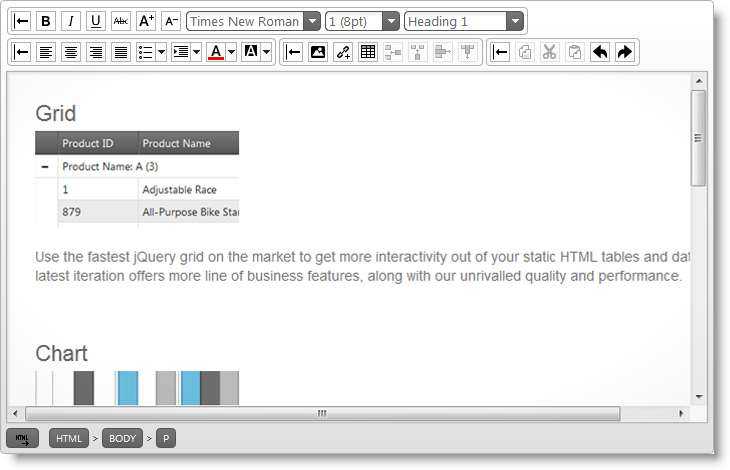

###関連トピック:

-   [igHtmlEditor の概要](igHtmlEditor-Overview.html)

## <a id="igdialog-control"></a>igDialog コントロール

Infragistics `igDialog` は jQuery UI 方式のウィジェットです。ダイアログのコンテンツとしてターゲット要素を表示します。`igDialog` のコンテンツには、有効な HTML コードのほか、別のダイアログ ウィンドウがあります。`igDialog` ウィジェットは、HTML DIV 要素や IFRAME 要素に適用されます。また、DIV/IFRAME 内部のコンテンツがダイアログ ウィンドウのコンテンツになります。

**HTML の場合:**

```html
<div id="dialog">
    igDialog Content
</div>
```

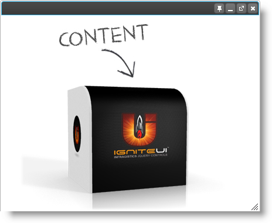

### 関連トピック:

-   [igDialog の概要](igDialog-Overview.html)

## <a id="cascading-igcombo"></a>カスケード igCombo

`igCombo` コントロールのカスケード機能では、親子関係でバインドされている少なくとも 2 つのコントロール インスタンスを構成する必要があります。親 `igCombo` に入力されている値が選択されると、子に入力されている値がフィルターされます。これは、`igCombo` から 「すぐに利用できる」 機能であり、あとは親と子の `igCombo` とそのデータ ソースを構成するだけです。


## <a id="add-remove-nodes-igtree"></a>igTree のノードの追加と削除

`igTree` コントロールの追加機能と削除機能では、ツリー ノードの追加や削除ができます。

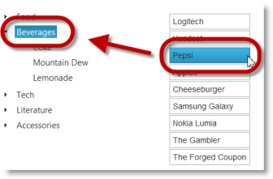

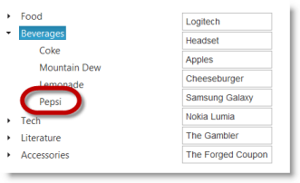

### 関連トピック:

-   [ノード追加/削除の概要と例 (igTree)](igTree-Adding-Removing-Nodes-Overview-Examples.html)

## <a id="drag-drop-tree"></a>igTree のドラッグ アンド ドロップ

ドラッグ アンド ドロップは、同じ `igTree` コントロール内だけでなく、2 つの `igTree` コントロール間で操作できます。2 つの igTree コントロール間で動作するよう設定できます。ドラッグ アンド ドロップ機能の操作方法を指定できます。サポートされる[ドラッグ アンド ドロップ モード](igTree-Drag-and-Drop-Overview.html#drag-drop-modes) に設定する必要があります。


### 関連トピック:

-   [ドラッグ アンド ドロップの概要 (igTree)](igTree-Drag-and-Drop-Overview.html)

## <a id="multi-column-headers"></a>複数列ヘッダー

`igGrid` と `igHierarchicalGrid` は、複数列ヘッダーをサポートするようになりました。複数列ヘッダー機能では、ヘッダーをグループ分けできます。この機能は、非表示、サイズ変更、列移動機能とうまく統合されています。

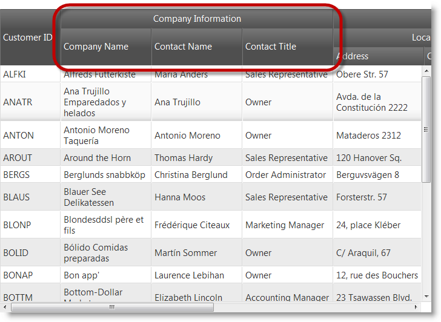

### 関連トピック:

[複数列ヘッダー (igGrid)](igGrid-MultiColumnHeaders-LandingPage.html)

[複数列ヘッダー (igHierarchicalGrid)](igHierarchicalGrid-MultiColumnHeaders-Configuring.html)

## <a id="rest-support"></a>REST サポート

`$.ig.DataSource` から継承した新しいタイプ  `$.ig.RESTDataSource` は、REST をサポートします。`igGrid` および `igHierarchicalGrid` は内部的に `$.ig.RESTDataSource` を使用して REST バインディングをサポートしています。すべての `$.ig.RESTDataSource` オプションを継承するため、これらのオプションはグリッドに直接設定できます。


### 関連トピック:

[REST の更新 (igGrid)](igGrid-REST-Updating.html)

[igHierarchicalGrid を REST サービスへバインド](igHierarchicalGrid-Binding-to-REST-Services.html)

## <a id="column-moving-ctp"></a>列の移動 (CTP)

列の移動機能では、列の順序を変更できます。列の移動には 2 つのモードがあります。

即時モードでは、ドラッグの間に列のヘッダーが移動し、アニメーションで他の列とスワップします。列コンテンツは、実際には列ヘッダーをドロップした時点で実際に移動します。

遅延モードでは、ドロップしたときに列が配置される位置を示す矢印が表示されます。

以下のスクリーンショットは即時モードによる列の移動機能の働きを示しています。

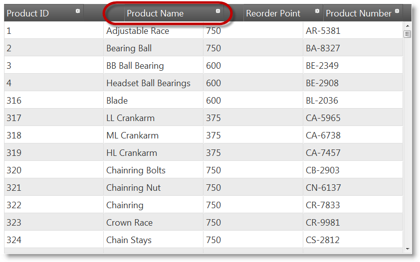

### 関連サンプル:

[列の移動 (igGrid)](%%SamplesUrl%%/grid/column-moving)

## <a id="datatable-dataset-binding"></a>igGrid と igHierarchicalGrid の DataTable と DataSet のバインディング

`igGrid` と `igHierarchicalGrid` では ADO.NET DataTable と DataSet へのバインディングが可能です。`igGrid` ASP.NET MVC ヘルパーに新しいプロパティ `DataMember` を導入しました。このプロパティを設定すると、グリッドは、DataSet から取得した `DataMember` 値と一致する DataTable の名前を検索して、それにグリッドをバインドします。`AutoGenerateLayouts` が false で、レイアウトを手動定義するとき、このプロパティが便利です。

v12.2 では、`AutogenerateLayouts` がデフォルトで false になるように変更しました。

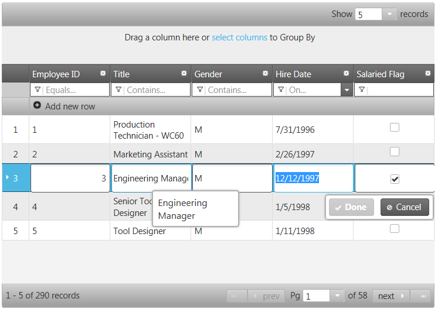

###関連トピック:

[igGrid を DataTable にバインディング (igGrid)](igGrid-Binding-to-DataTable.html)

[igHierarchicalGrid を DataSet にバインディング (igHierarchicalGrid)](igHierarchicalGrid-Binding-to-DataSet.html)

## <a id="unbound-columns"></a>非バインド列

非バインド列の機能では、データ ソースにバインドされておらず、計算値やその他のカスタム値をレンダリングするときに使用できる列を `igGrid` と `igHierarchicalGrid` に定義できます。`igGrid` には新しいプロパティ MergeUnboundColumns を導入しました。 : `MergeUnboundColumns`.これは、データ ソースのタイプがリモートのときに非バインド列をクライアントに送信する方法を定義します。

`MergeUnboundColumns` が true のとき、非バインド値は JSON 応答内のデータ行にマージします。マージしない場合、非バインド値は JSON 応答のメタデータ プロパティに保存します。

`MergeUnboundColumns` =true で、`SetUnboundValues` で非バインド値を設定していない場合、データ ソース全体のトラバースにより、非バインド列のすべての値がデフォルト値 (null 値) に設定されます。

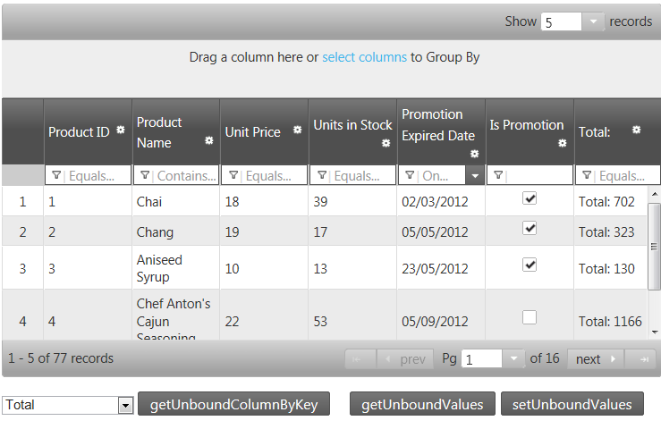

### 関連サンプル:

[非バインド列 (igGrid)](%%SamplesUrl%%/grid/unbound-column)

[非バインド列 (igHierarchicalGrid)](%%SamplesUrl%%/hierarchical-grid/unbound-column)

## <a id="row-edit-template"></a>行編集テンプレート

バージョン 12.2 以降、`igGrid` の更新機能には、行編集テンプレートが用意され、インライン編集より強力なポップアップ ダイアログのレコード編集機能が備わりました。

この機能は、グリッド更新機能の一部として実装します。`editMode` オプションには、現在の 「row」 と 「cell」 以外に新しい値 「`rowEditTemplate`」 が加わりました。

行編集テンプレートを自動的に生成するとき、列のデータ タイプが基準になります。行編集テンプレートは、更新機能に columnSettings を使用し、レンダリングするエディターをこれで決めます。

また、`rowEditDialogRowTemplate` オプションを使用するか、`rowEditDialogRowTemplateID` オプションでテンプレート要素を参照して、テンプレート文字列として指定すれば、行編集テンプレートを定義することもできます。これらのオプションは、行編集ダイアログのフォーマットとスタイル設定に使用できます。

行編集テンプレートには検証統合機能があります。

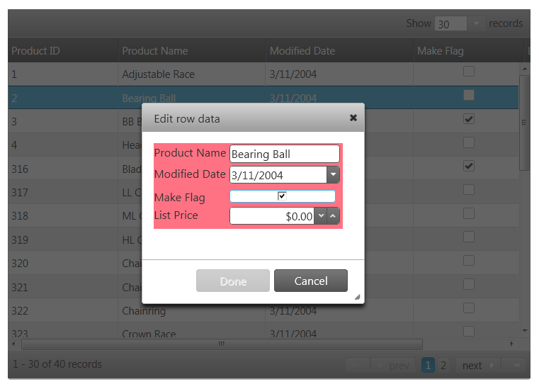

### 関連トピック:

[行編集テンプレート (igGrid)](igGrid-Updating-RowEditTemplate.html)

[行編集テンプレートを構成 (igGrid)](igGrid-Updating-RowEditTemplate-Configuring.html)

## <a id="grouping-dates"></a>日付別グループ分け

`groupBy` 機能では、フォーマットを考慮して、日付別にグループ分けができるようになりました。強化されたのは、リモートとローカル両方のグループ分け機能です。

新しい機能では、日付は 「*yyyy/dd/mm*」 フォーマットで表示され、年、日、月を比べてグループ分けが行われます。日付のフォーマットが 「*yyyy/dd/mm hh:mm*」 の場合は、値の比較によってグループ分けが行われます。

## <a id="excel-navigation-mode"></a>ExcelNavigationMode と HorizontalMoveOnEnter

`igGrid` と `igHierarchicalGrid` の更新機能に、新たに 2 つのプロパティが加わりました。ExcelNavigationMode では、矢印キーで編集したセル内にカーソルを移動できます。デフォルト値は 「false」 です。

HorizontalMoveOnEnter では、セルの編集時に Enter キーを押すと編集可能な次のセルにカーソルが移動します。デフォルト値は 「false」 です。

## <a id="igmap-rtm"></a>igMap コントロールは RTM

地図を表示する `igMap` コントロールをリリースしました。HTML5 Web アプリケーションやサイトでカスタム オーバーレイしたマップを作成するときに便利です。これは、HTML5 の Canvas タグを使って実際のマップを描画し、マップ上でデータを視覚化します。このコントロールでは、5 つのタイプの地理シリーズにより各種地理的視覚化が可能です。

-   地理記号シリーズ
-   地理シェイプ シリーズ
-   地理ポリライン シリーズ
-   地理散布 シリーズ
-   地理等高線シリーズ

以下に示したのは、地理シェイプ シリーズで人口別に色分けしたすべての国を網羅した世界地図の例です。

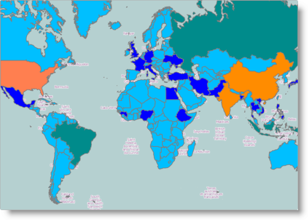

### 関連トピック:

-   [igMap の概要 ](Overview-igMap.html)

## <a id="financial-indicators"></a>igDataChart コントロールに財務指標が加わりました。

`igDataChart` コントロールは、さまざまな財務指標の表示用に新たに 35 の財務シリーズをサポートするようになりました。財務指標シリーズは、既存の財務シリーズと同じフォーマットでデータを受け付けます。レコードーには、一定期間の株価を表現した Open、Close、High、Low [price] などのプロパティがあります。財務指標は、価格変動のさまざまな特性を示し、補助的な情報や財務分析の洞察情報を提供します。

以下に示したのは標準的な財務チャートと新しいサポート対象財務指標を示すチャートです。

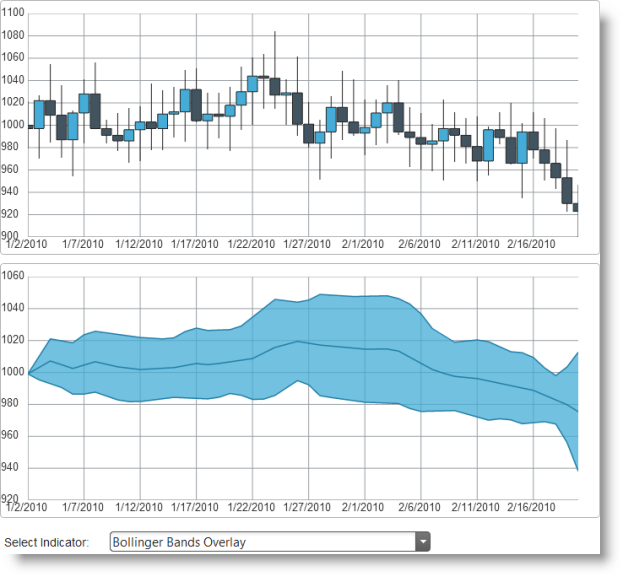

### 関連サンプル:

-   [財務指標](igDataChart-DataBinding.html)

## <a id="hover-null-support-igrating"></a>igRating のホバーと null サポート(Mobile)

`igRating` Mobile コントロールの値は、評価済みであれば null に設定できます。設定はスワイプ イベントで行います。現在の値から初めて、コントロールの最初までスワイプすると、評価済みの値が null に設定されます。これは、マウスを使用するデスクトップ環境では不可能です。

`igRating`™ Mobile コントロールをデスクトップ ブラウザーで使用すると、評価結果によってマウスのホバー スタイルが表示されます。

### 関連トピック:

-   [igRating の概要 ](igRating-Overview.html)

## <a id="generating-direct-links"></a>igListView における子レイアウトとのダイレクトリンクの生成

`igListView` コントロールでは、子レイアウトの静的リンクを生成できるようになりました。子レイアウトの静的リンクを生成すると、外部 Web ページのどれかから直接子レイアウトに移動できます。

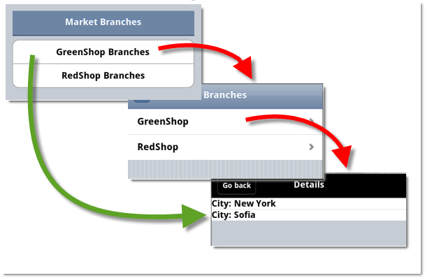

### 関連トピック:

-   [子レイアウトとの直接リンクの生成](igListView-Generating-Direct-Links-to-Child-Layouts.html)

## <a id="mobile-button"></a>Mobile Button

Button ASP.NET MVC ヘルパーは、コントロールをレンダリングするサーバー側のヘルパーです。このヘルパーは、ASP.NET MVC アプリケーションにボタンを追加し、クライアントかサーバーにその状態を構成します。


## <a id="mobile-checkbox"></a>Mobile CheckBox

CheckBox ASP.NET MVC ヘルパーは、コントロールをレンダリングするサーバー側のヘルパーです。このヘルパーは、ASP.NET MVC アプリケーションにチェック ボックスを追加し、クライアントかサーバーにその状態を構成します。したがって、jQuery Mobile プラグインでチェックボックスを動的に変更できます。


## <a id="mobile-checkbox-group"></a>Mobile CheckBoxGroup

CheckBoxGroup ASP.NET MVC ヘルパーでは、複数のチェック ボックスを 1 つのコンテキストにまとめることができます。したがって、jQuery Mobile プラグインでチェックボックスを動的に変更できます。個々のチェックボックスの構成方法と使用方法の詳細については、[CheckBox](CheckBox.html) トピックを参照してください。

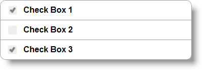

## <a id="mobile-collapsible"></a>Mobile Collapsible

Collapsible ASP.NET MVC ヘルパーでは折り畳み可能なコンテンツ ブロックを作成できます。

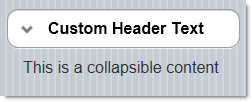

折り畳み可能ブロックのヘッダーをクリック可能ボタンのように設定するオプションがあります。折り畳み可能ブロックのコンテンツには、任意の HTML コンテンツを使用できます。

## <a id="mobile-collapse-set"></a>Mobile CollapsibleSet

CollapsibleSet ASP.NET MVC ヘルパーでは折り畳み可能なレイアウト コンテナーを作成できます。このヘルパーは折り畳み可能なコントロールをグループ分けします。同時に展開できる折り畳み可能コントロール グループは 1 つだけです。折り畳み可能なグループを展開すると、それまで展開されていたグループは自動的に折り畳まれます。

## <a id="mobile-link"></a>Mobile Link

Link ASP.NET MVC ヘルパーは HTML ハイパーリンクのレンダリングに使用します。このヘルパーには Link を構成し、それをカスタマイズするための補助メソッドがいくつかあります。


## <a id="mobile-navbar"></a>Mobile NavBar

NavBar ASP.NET MVC ヘルパーは外部ページや内部ページ ブロックを参照する項目メニューを定義します。コントロールには、個々の項目を構成しスタイルを設定できる API のほか、全体を設定する NavBar があります。NavBar ヘルパーは jQuery Mobile ウィジェットをレンダリングします。


## <a id="mobile-page"></a>Mobile Page、PageContent、PageFooter、PageHeader

Page ASP.NET MVC ヘルパーは、コンテキストのシングル ページのコンテナーを定義します。Page ラッパーのフラグメントを開いて閉じるまでの間に、Page HTML コンテンツのほか、[Page Content](PageContent.html)、[Page Footer](PageFooter.html)、[Page Header](PageHeader.html)、その他 jQuery モバイル コントロールを定義できます。1 つの MVC ビューに複数のページを定義できますが、最初のページだけがアクティブになります。ページを変更したい場合は、手動で変更する必要があります。Page MVC ヘルパーは jQuery Mobile [Page](Page.html) ウィジェットをレンダリングします。ページの構造やページの繊維の詳細については、jQuery Mobile が提供する[チュートリアル リスト](http://jquerymobile.com/demos/1.1.1/docs/pages/index.html)を参照してください。

## <a id="mobile-popup"></a>Mobile Popup

Popup は、ポップアップ ウィンドウに HTML コンテンツを表示できるウィジェットです。任意の HTML コンテンツを表示できます。ポップアップは HTML アンカーを利用すればを開きやすくなります。このウィジェットには、そのまますぐに使用できる機能セットがあります。


## <a id="mobile-radio-button"></a>Mobile RadioButtonGroup

RadioButtonGroup ASP.NET MVC ヘルパーはオプション セットをレンダリングします。ただし、選択できるオプションはその 1 つだけです。他の一部のコントロール同様に、RadioButtonGroup ASP.NET MVC ヘルパーは標準 HTML 入力要素を使用します。タッチ環境のサポートのためには補助マークアップや機能を追加します。たとえば、すべてラジオ ボタンによる通常の上下の位置決めの代わりに、RadioButtonGroup ASP.NET MVC ヘルパーでは、水平ボタン リストも使用できます。jQuery Mobile ウィジェットでは、任意のラジオ ボタンにアクセスできます。

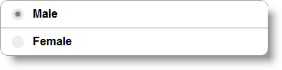

## <a id="mobile-select-menu"></a>Mobile SelectMenu

SelectMenu ASP.NET MVC ヘルパーは、ネイティブの select 要素に基づいて jQuery モバイルの selectmenu ウィジェットを生成します。

## <a id="mobile-slider"></a>Mobile Slider

スライダー ASP.NET MVC ヘルパーは、jQuery モバイルのスライダー ウィジェットを ASP.NET ビューに表示するために使用します。スライダーは、モバイル デバイスで数値データ入力用に使用される一般的な UI 要素です。次のスクリーンショットは、オプションと設定値を既定値のままで使用した場合のスライダーです。


## <a id="mobile-textbox"></a>Mobile TextBox

TextBox ASP.NET MVC ヘルパーは標準 HTML 入力をレンダリングします。レンダリングすると、jQuery Mobile はモバイル デバイスとタッチ デバイスに最適化します。したがって、jQuery Mobile プラグインで入力を動的に変更できます。


## <a id="mobile-toggle-switch"></a>Mobile ToggleSwitch

Toggle Switch ASP.NET MVC ヘルパーは、データ入力のオン/オフまたは  true/false を切り替えるバイナリ 「フリップ スイッチ」 を作成します。こうした仮想スイッチはモバイル デバイスの一般的なユーザー インターフェイス (UI)　要素です。Toggle Switch は、「スイッチ」の　2 つの状態 (つまり、有効状態と無効状態) を表す択一的な 2 つの位置 (左側と右側の位置) を備えたトラック スイッチです。現在の状態を示し、状態によって配色の変わるラベルもあります。

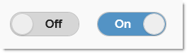


 

 


