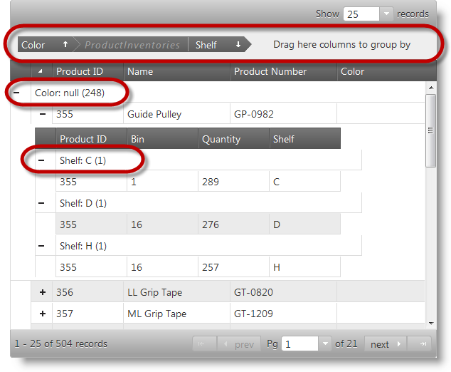
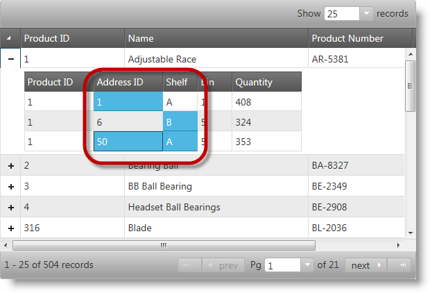
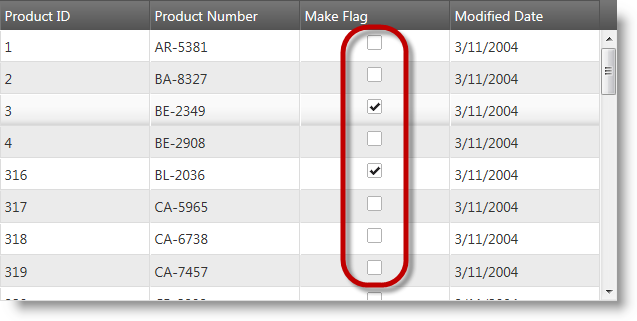
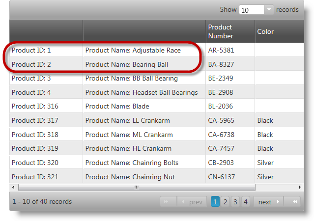
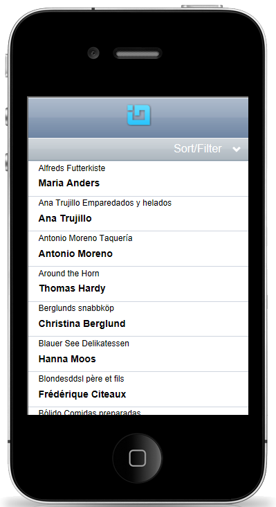
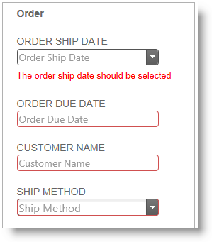
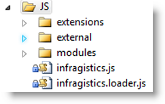

<!--
|metadata|
{
    "fileName": "jquery-whats-new-12-1-landing-page",
    "controlName": [],
    "tags": []
}
|metadata|
-->

# 2012 Volume 1 の新機能

## 新機能

以下の表に、%%ProductName%%™ 2012 Volume 1 リリースの新機能を簡単に説明します。詳細は、概要表の後に記載されています。

- [階層グリッド GroupBy](#hierarchical-grid-grouping): フラット グリッドで使用可能なグループ化機能が、階層グリッドで完全にサポートされるようになりました。

- [階層グリッドの選択](#hierarchical-grid-selection): フラット グリッドで使用可能な選択機能が、階層グリッドで完全にサポートされるようになりました。

- [階層グリッドの行セレクター](#hierarchical-grid-row-selectors): フラット グリッドの行選択機能が、階層グリッドで完全にサポートされるようになりました。

- [igGrid 用のチェックボックス エディター](#checkbox-editor): チェックボックス エディターは、`igGrid`™ コントロールのブール データ型の列で使用可能になりました。

- [グリッド正味トランザクション](#grid-net-transactions): グリッド編集機能が最適化され、データが更新、追加、または削除されるときに、コントロールから正味トランザクションのみが報告されます。

- [グリッドの仮想化](#grid-virtualization): 仮想化が階層グリッドと GroupBy モードでサポートされるようになり、ユーザー インターフェイスのパフォーマンスが向上しています。

- [グリッド MVC ラッパーの AutoGenerateColumns プロパティ](#autogeneratecolumns-mvc): AutoGenerateColumns プロパティの動作が変更されました。true に設定され、個別の列オプションを使用して列が明示的に定義されている場合、グリッド MVC ラッパーは、まず定義された列を表示し、その後新しい列をすべてのデータ ソース フィールドに自動的にバインドして、定義された列の後に表示します。

- [igHierarchicalGrid の OData へのバインド](#hierarchical-grid-odata): `igHierarchicalGrid` を OData サービスにバインドするとき、JSONPDataSource を中間レイヤーとして使用する必要はなく、OData サービスの URL をグリッド データ ソースとして直接設定できます。

- [チャート](#charting): `igDataChart`™、`igPieChart`™、および `igChartLegend`™ コントロールは、HTML5 キャンバスでデータ ビジュアライゼーションを描画する新しいチャート コントロールです。

- [チャートのモーション フレームワーク](#charts-motion-framework): チャート コントロールは、チャートの内容をさまざまな方法でアニメーション化できる新しいモーション フレームワークをサポートしています。

- [jQuery コントロール用のテンプレート エンジン](#templating-engine): 新しい `igTemplating`™ エンジンが %%ProductName%% バンドルに追加されました。`igTemplating` エンジンは、jQuery コントロールの内部での動的なテキスト レンダリング用のテンプレートを作成するための強力な機能を公開しています。

- [モバイル リスト ビュー コントロール](#mobile-list): 新しい `igListView`™ コントロールは、jQuery モバイル プラットフォーム用のリスト表示と相互作用機能を備えています。

- [モバイル レーティング コントロール](#mobile-rating): モバイル デバイス用の新しい `igRating`™ コントロールが、モバイルおよびタッチ デバイス環境固有の要件に対応するため、既存の `igRating` コントロールとは別に実装されました。

- [モバイル コントロールの iOS テーマ](#mobile-ios-theme): モバイル デバイス アプリケーションの外観を向上させるため、iPhone アプリケーション用の新しい iOS テーマが %%ProductName%% ライブラリに追加されました。

- [タッチ サポート](#touch-support): %%ProductName%% ライブラリのすべてのコントロールが、モバイル デバイスのタッチ インターフェイスをサポートするために設計およびテストされました。

- [コンボ ボックスのロード オン デマンド](#combo-load-on-demand): コンボ ボックスのロード オン デマンドは、多数のリモート データを、一度にすべてロードするのではなく、バッチでロードすることで、`igCombo`™ のパフォーマンスを向上させる新機能です。

- [MVC 検証のサポート](#mvc-validation): データ注釈を使用した MVC 検証のサポートが、コンボおよびエディター コントロールに取り込まれました。

- [新しい jQuery テーマと JavaScript リソース構造](#themes-resources-structure): %%ProductName%% ライブラリのすべての JavaScript リソースと CSS リソースが新しいフォルダー構造に整理され、その一部の名称が変更されて、ライブラリを使用する開発者が各項目の目的と場所をより容易に理解できるようになりました。これは最新の変更であることに注意してください。

- [CSS/JS リソース ローダー](#resources-loader): 新しい `igLoader` コントロールが追加され、新しいリソース構造との関連で、JavaScript リソースと CSS リソースを Web ページに容易にロードできるようになりました。

- [Metro テーマ](#metro-theme): 新しい Metro テーマが追加され、%%ProductName%% コントロールが、Microsoft® Windows® の次期バージョンの新しい Metro UI とより一体化されます。

##  階層グリッド GroupBy

フラット グリッドで使用可能なグループ化機能が、階層グリッドで完全にサポートされるようになりました。1 つ以上の列に基づく行の柔軟なグループ化、要約値 (小計) の計算、展開/縮小ボタン、ツールチップ、グループ ヘッダー行テンプレートなどの UI 要素の構成が可能です。以下のスクリーンショットで、GroupBy 機能の主な要素 (上部のグループ化領域、ルートおよび子レベルのグループ ヘッダー行) が強調表示されています。子レイアウトのグループ化された列の先頭に、GroupBy 領域の子レイアウト名が追加されていることに注意してください。

### 関連トピック:

-   [igHierarchicalGrid のグループ化の概要](igHierarchicalGrid-Grouping-Overview.html)

##  階層グリッドの選択

選択機能によって `igHierarchicalGrid`™ コントロールの行およびセルの選択が可能になります。その機能は Microsoft® Windows Explorer および Microsoft® Excel の選択およびアクティブ化動作を厳密に踏襲したものです。単一のみまたは複数項目の選択を構成できます。階層グリッドで複数選択が有効になっている場合、ユーザーは、単一のレイアウトのみで複数の項目を選択できます。以下のスクリーンショットに、いくつかのセルが選択された階層グリッドを示します。

### 関連トピック:

-   [igHierarchicalGrid Selection の概要](jQuery-igHierarchical-Grid-Selection-Overview.html)

##  階層グリッドの行セレクター

行選択機能は、グリッドの最初の列の左側に配置された行セレクター列をクリックすることで、行全体を選択する機能をユーザーに提供します。この機能は、`igRowSelectors`™ ウィジェットによって提供されます。この主な機能に加えて、このウィジェットはオプションで行の番号付け機能や行を選択するためのチェックボックスを備えています。このウィジェットは選択機能と密接に連携しますが、行の番号付け機能のために個別に使用することもできます。新しいオプション `showCheckBoxesOnFocus` があります。このオプションを有効にすると、チェックボックスの動作を変更できます。チェックボックスは最初に表示されず、ユーザーが行を選択するためにクリックすると、チェックボックスが表示され、複数選択が容易になります。以下のスクリーンショットで、行選択列が強調表示され、1 つの行が選択されています。

### 関連トピック:

-   [igHierarchicalGrid の行セレクターの有効化](igHierarchicalGrid-Enabling-RowSelectors.html)

##  igGrid 用のチェックボックス エディター

フラット グリッドおよび階層グリッドで、ブール データ列を、チェックボックスを使用して表示できます。これにより、ブール データ型を容易に扱うことができます。以下のスクリーンショットに、チェックボックス エディターを使用したブール列のグリッドを示します。

### 関連トピック:

-   [igGrid の列とレイアウト](igGrid-Columns-and-Layout.html)
-   [igHierarchicalGrid の列とレイアウト](igHierarchicalGrid-Columns-and-Layouts.html)

##  グリッド正味トランザクション

グリッド編集機能が改良され、データが更新、追加、または削除されるときに、グリッド コントロールから正味トランザクションのみが報告されます。つまり、互いに取り消すトランザクションは報告されず、クライアント アプリケーションは、下位のデータに対する実効的な変更のみを受け取ります。たとえば以下のようになります。行が追加されて削除された場合、挿入トランザクションも削除トランザクションも報告されません。以下の図に、更新および削除された行があるグリッドを示します。

### 関連トピック:

-   [igGrid の更新](igGrid-Updating.html)

##  グリッドの仮想化

大量のデータ セットを表示するときにパフォーマンスを向上させるために使用される仮想化技術が改良され、階層グリッドと、階層グリッドの GroupBy モードがサポートされています。現時点では、固定と連続の 2 つの仮想化モードがあります。固定モードは、%%ProductName%% コントロールに組み込まれている既存の仮想化機能です。連続モードは、子行の数が可変の状況に対処するために、階層グリッドと Group By 機能をサポートする、新たに開発された機能です。

### 関連トピック:

-   [igGrid の仮想化の概要](igGrid-Virtualization-Overview.html)
-   [igHierarchicalGrid の仮想化の概要](igHierarchicalGrid-Virtualization-Overview.html)

##  グリッド MVC ラッパーの AutoGenerateColumns プロパティ

MVC ラッパーの `AutoGenerateColumns` プロパティが、`igGrid` ウィジェットの対応するプロパティと同様に振る舞うようになりました。`AutoGenerateColumns` プロパティに true を設定し、個別の列オプションを表す定義済みの列設定配列を使用した場合、グリッド MVC ラッパーは、まず明示的に定義された列を表示し、次に他のすべての列をすべてのデータ ソース フィールドに自動的にバインドし、定義された列の後に表示します。これは、以前の 11.2 リリースのグリッド MVC の動作と異なります。以前のリリースでは、列設定の定義があり、`AutoGenerateColumns` プロパティに true が設定されている場合、定義された列のみが考慮されます。

注: この変更は、11.2 サービス リリースより有効です。

##  igHierarchicalGrid の OData へのバインド

`igHierarchicalGrid` を OData サービスにバインドするとき、`JSONPDataSource` を中間レイヤーとして使用する必要はなく、OData サービスの URL をグリッド データ ソースとして直接設定できます。このアプローチを使用しない場合、複雑にネストしたスキーマにより、以下の問題に遭遇する可能性があります。

-   ルート リモート機能が動作しない
-   第 2 レベルの子がまったく表示されず、JavaScript エラーが発生する。

注: この変更は、11.2 サービス リリースより有効です。

##  チャート作成

Web ページでチャートを操作する必要性に対処するため、新しいコントロール `igDataChart`™、`igPieChart`™、および `igChartLegend`™ がライブラリに追加されました。これらのコントロールは、HTML5 のキャンバス要素とキャンバス API に基づいています。

-   `igDataChart`では、財務、バー/列、スキャッター、極、ラジアルなど、さまざまな種類のデータ シリーズを表現できます。
-   `igPieChart` は、円チャートを表示するために設計されています。
-   `igChartLegend` はチャートの凡例を生成するために内部的に使用されます。

以下のスクリーンショットに、3 つのデータ シリーズがある列状チャートを示します。

### 関連トピック:

-   [igDataChart 概要](igDataChart-Overview.html)
-   [igPieChart の概要](igPieChart-Overview.html)

##  チャートのモーション フレームワーク

チャートの Motion Framework を使用すると、%%ProductName%% のチャート コントロールを使用する開発者は、チャートの内容をアニメーション化して見た目を向上させ、データの背後にある傾向などの意味を表現できます。フレームワークの基本的な原則として、チャートの背後にあるデータが更新されると、`igDataChart` コントロールの対応する API メソッドが必ず呼び出され、チャートのアニメーションが開始されます。

### 関連トピック:

-   [チャートの Motion Framework](igDataChart-Motion-Framework.html)

##  jQuery コントロール用のテンプレート エンジン

新しい `igTemplating` エンジンは、%%ProductName%% コントロールの内部での動的なコンテンツ レンダリング用のテンプレートを作成するための強力な機能を開発者に公開しています。このエンジンは、UI 要素内のテキストをカスタマイズしてコンテンツを動的に表示できるときには必ず、%%ProductName%% ライブラリ全体で、jQuery テンプレート プラグインの代わりに使用されています。以下のスクリーンショットで、データ グリッドの最初の 2 列にテンプレートが適用されています。

### 関連トピック:

-   [igTemplating の概要](igTemplating-Overview.html)

##  モバイル リスト ビュー コントロール

新しい `igListView`™ コントロールは、jQuery モバイル プラットフォーム用のリスト表示と相互作用機能を備えています。モバイル リスト ビュー コントロールは、`igDataSource` と、UL または OL HTML 要素で使用可能なすべてのデータ ソースにバインドできます。このコントロールは、jQuery のモバイル ナビゲーションの概念に従った階層化ナビゲーションをサポートしています。テンプレートを使用すると、リスト要素の表示とレイアウトをカスタマイズできます。並べ替え、フィルター処理、およびグループ化機能も使用できます。モバイル リスト ビュー コントロールは、実行時のパフォーマンスを向上させるため、ロード オン デマンドをサポートしています。

### 関連トピック:

-   [igListView の概要](igListView-Overview.html)

##  モバイル レーティング コントロール

項目のカスタマー レーティングが要件である場合に、モバイルおよびタッチ アプリケーションをサポートするため、モバイル デバイス用の新しい `igRating` コントロールが実装されました。これは、既存の `igRating` コントロールとは別のコントロールであり、その対象はタッチ機能を備えたモバイル デバイスです。

### 関連トピック:

-   [igRating (モバイル) の概要](igRating%28Mobile%29-Overview.html)

##  モバイル コントロールの iOS テーマ

モバイル デバイスを対象にするため、モバイル %%ProductName%% コントロール用の新しい iOS テーマが実装されました。その目的は、iPhone および iPad のモバイルおよびタッチ対応アプリケーションに外観を合わせ、一体性を高めるためです。

##  タッチ サポート

すべてのインフラジスティックス jQuery コントロールがタッチ操作をサポートしています。すべてのコントロールがタッチ インターフェイスと互換になるように、新しい機能とコンポーネントが追加されました。インフラジスティックス jQuery コントロールのコンセプトは、デスクトップ プラットフォームとタッチ プラットフォームで外観と動作を同じにすることです。

### 関連トピック:

-   [%%ProductName%% コントロールのタッチ サポート](Touch-Support-for-IgniteUI-for-jQuery-Controls.html)

##  コンボ ボックスのロード オン デマンド

`igCombo` コントロールは、構成可能なロード オン デマンド機能をサポートしています。ロード オン デマンドを有効にすると、サーバーとクライアントの両方で帯域幅と処理のオーバーヘッドが大幅に削減されます。

ロード オン デマンドを有効にする場合は、最初にドロップダウン コンテナにスクロールバーを表示します。リストの最後までスクロールすると、非同期コールバックを介して追加の項目がフェッチされてリストの一番下に追加されます。

### 関連トピック:

-   [ロードオンデマンド (igCombo)](igCombo-Load-on-Demand.html)

##  MVC 検証のサポート

データ注釈を使用した MVC スタイルの検証が、コンボおよびエディター コントロールに取り込まれました。この機能を使用すると、データ注釈を使用して、%%ProductName%% の検証機能を既存のアプリケーションにシームレスに統合できます。

### 関連トピック:

-   [ASP.NET MVC 検証の構成](Configuring-ASP.NET-MVC-Validation.html)

##  新しい jQuery テーマと JavaScript リソース構造

%%ProductName%% ライブラリのすべての JavaScript リソースと CSS リソースが新しいフォルダー構造に整理され、その一部の名称が変更されて、ライブラリを使用する開発者が各項目の目的と場所をより容易に理解できるようになりました。新しい構造を使用すると、アプリケーションが不可欠なリソースのみをロードできるため、スクリプトとリソースをはるかに高速にロードできます。結合および縮小されたバージョンのリソースも引き続き使用できます。

注: これは重大な変更です。

### 関連トピック:

-   [%%ProductName%% での JavaScript ファイル](Deployment-Guide-JavaScript-Files.html)
-   [プロジェクトを %%ProductName%% の最新バージョンにアップグレード](Manually-Updating-Previous-Versions.html)

##  CSS/JS リソース ローダー

新しい `igLoader` コントロールが追加され、新しいリソース構造との関連で、JavaScript リソースと CSS リソースを Web ページに容易にロードできるようになりました。コントロールによって必要なリソースのロードが自動化され、アプリケーションで %%ProductName%% JavaScript ファイルと CSS ファイルの場所を指定する必要があります。純粋な HTML/jQuery ページでは、たとえば、ページ上でインスタンスを作成するコントロールと機能を指定する必要があります。フラット グリッドのすべての機能の場合は "`igGrid`.*"、カテゴリ チャートのプロットのみの場合は "`igDataChart.Category`" とします。MVC 側のローダーでは、ロードする必要があるスクリプトと CSS ファイルが自動的に検出されるため、アプリケーションで必要なリソースを指定する必要はありません。

`igLoader` コントロールは、以前のバージョンからアップグレードするための最も簡単で推奨される方法であり、複数の JS ファイルと CSS ファイルを Web ページの head 部分で指定する必要がありません。

### 関連トピック:

-   [プロジェクトを %%ProductName%% の最新バージョンにアップグレード](Manually-Updating-Previous-Versions.html)

##  Metro テーマ

新しい Metro テーマは、Microsoft® Windows® の次期バージョン向けに、ネイティブな Metro UI のルック アンド フィールを %%ProductName%% コントロールに与えるための研究作業の成果です。スタイル設定とカラーのみでなく、動作とタッチに適したユーザー インターフェイスも目的としています。以下の図に、Metro テーマを適用したフラット グリッドを示します。

### 関連トピック:

-   [%%ProductName%% のスタイル設定とテーマ設定](Deployment-Guide-Styling-and-Theming.html)

 

 

