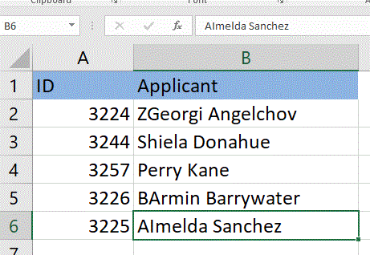

<!--
|metadata|
{
    "fileName": "igExcelEngineSorting",
    "controlName": ["igExcel"],
    "tags": ["Sort"]
}
|metadata|
-->

# ワークシート レベルの並べ替え

JavaScript Excel ライブラリの機能を活用するには、操作方法のトピック[『Excel ファイルをブックに読み込む』](JavaScript-Excel-Library-Read-an-Excel-2007-XLSX-File-Into-a-Workbook.html)に従って既存の Microsoft® Excel® ファイルを読み込む、または空白の [Workbook](%%jQueryApiUrl%%/ig.excel.Workbook) を作成します。空白のワークブックを作成する場合、ファイルに書き込む前にワークシートを少なくとも 1 つ追加する必要があります。

ワークシート レベル オブジェクトに並べ替えを追加します。並べ替えは、ワークシート レベル オブジェクトで列または行に並べ替えの条件を設定して実行します。列または行を昇順または降順に並べ替えることができます。

シートの並べ替え条件は、並べ替え条件が追加、削除、変更される時に、または [reapplySortConditions](%%jQueryApiUrl%%/ig.excel.WorksheetSortSettings#methods: reapplySortConditions) メソッドがシートで呼び出されるときに限り再適用されます。列または行を領域で並べ替えます。'Rows' がデフォルトの並べ替えタイプです。

## プロパティ設定

以下の表は、任意のメソッドとそれを管理する並べ替えプロパティ設定のマップを示します。

| メソッド			| 説明     																	|
| ------------- 	|:-------------:																	|
|[CaseSensitive](%%jQueryApiUrl%%/ ig.excel.SortSettings%601#methods:caseSensitive) |文字列の並べ替えを行う際に大文字と小文字を区別して文字列を比較するかどうかに基づいて true または false です。|
|[SetRegion](%%jQueryApiUrl%%/ig.excel.WorksheetSortSettings#methods:setRegion)|並べ替える領域を指定するために使用されます。|
|[SortConditions](%%jQueryApiUrl%%/ ig.excel.SortSettings%601#methods:sortConditions) |領域を並べ替えるために使用される条件のコレクションです。|
| [SortType](%%jQueryApiUrl%%/ig.excel.WorksheetSortSettings#methods:sortType) |列または行を領域で並べ替えるかどうかを決定するために使用されます。'Rows' がデフォルト設定です。|

列に設定する並べ替え条件タイプは次のとおりです。

| メソッド			| 説明     																	|
| ------------- 	|:-------------:																	|
|[OrderedSortCondition](%%jQueryApiUrl%%/ig.excel.OrderedSortCondition#methods:ig.excel.OrderedSortCondition) | セル値に基づいてセルを昇順または降順に並べ替えます。 |
|[CustomListSortCondition](%%jQueryApiUrl%%/ ig.excel.CustomListSortCondition#methods:ig.excel.CustomListSortCondition) |テキストまたは表示値に基づいて定義された順序でセルを並べ替えます。これは、カレンダーに表示、またはアルファベット順でなく、定義したカスタム リストに表示される並べ替えで役に立ちます。|
|[FillSortCondition](%%jQueryApiUrl%%/ig.excel.FillSortCondition#methods:ig.excel.FillSortCondition)|塗りつぶしが特定のパターン/グラデーションであるかどうかによってセルを並べ替えます。|
|[FontColorSortCondition](%%jQueryApiUrl%%/ ig.excel.FontColorSortCondition#methods:ig.excel.FontColorSortCondition) |フォントが特定の色であるかどうかによってセルを並べ替えます。|
|[IconSortCondition](%%jQueryApiUrl%%/ ig.excel.FontColorSortCondition#methods:ig.excel.IconSetConditionalFormat) |アイコン値 (しきい値) に基づいてセルを並べ替えます。|

以下のコード スニペットは、JavaScript Excel ライブラリでワークシート レベル並べ替えを実行する方法を示します。以下の例で、A2:B8 の領域のデータが B2:B8 のデータによって昇順に並べ替えます。

以下のコードはこの例を実装します。


**JavaScript の場合:**


```js
// Create a new workbook

var workbook = new $.ig.excel.Workbook($.ig.excel.WorkbookFormat.excel2007);
var sheet = workbook.worksheets().add('Sheet1');

// Set the value of one of the cells

sheet.getCell('A1').value('ID');
sheet.getCell('B1').value('Applicant');

sheet.getCell('A2').value(3224);
sheet.getCell('B2').value('BArmin Barrywater');
sheet.getCell('A3').value(3244);
sheet.getCell('B3').value('ZGeorgi Angelchov');
sheet.getCell('A4').value(3257);
sheet.getCell('B4').value('AImelda Sanchez');
sheet.getCell('A5').value(3226);
sheet.getCell('B5').value('Perry Kane');
sheet.getCell('A6').value(3225);
sheet.getCell('B6').value('Shiela Donahue');            

// Sort the worksheet object

sheet.sortSettings().sortType($.ig.excel.WorksheetSortType.rows);		
sheet.sortSettings().caseSensitive(true);			
sheet.sortSettings().setRegion("A2:B8");
sheet.sortSettings().sortConditions().add(new $.ig.excel.RelativeIndex(1), new $.ig.excel.OrderedSortCondition($.ig.excel.SortDirection.ascending));        


```

