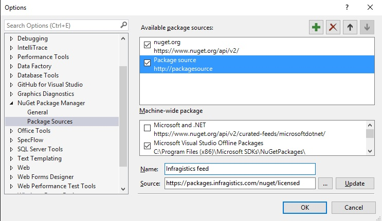
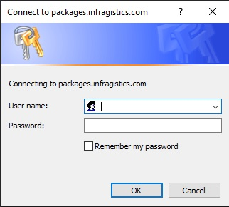
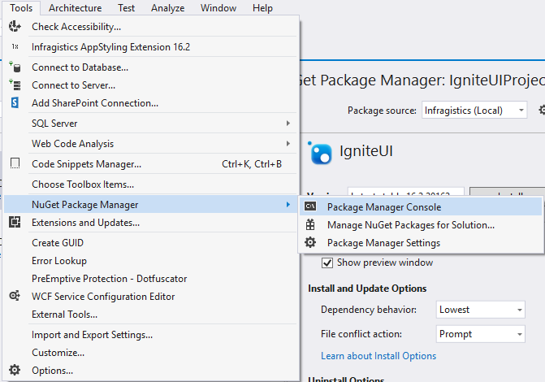

<!--
|metadata|
{
    "fileName": "Using-Ignite-UI-NuGet-Packages",
    "controlName": [],
    "tags": ["NuGet"]
}
|metadata|
-->
# Using %%ProductName%% NuGet packages

### In this topic

This topic contains the following sections:

-   [Using %%ProductName%% NuGet packages](#usingNuGet)
-   [Installing %%ProductName%% packages from the online private feed](#privateFeedInstallation)
-   [Installing %%ProductName%% packages from the local feed](#localFeedInstallation)
-   [Installing %%ProductName%% packages via GUI](#guiInstallation)
-   [Installing %%ProductName%% packages via Package Manager Console](#consoleInstallation)
-   [What is installed by the %%ProductNameMVC%% NuGet package](#whatIsInstalled)
-   [Uninstalling the %%ProductName%% NuGet packages](#uninstalling)
-   [Using the %%ProductNameASPNETCore%% NuGet package](#aspnetcore)

# <a id="usingNuGet"></a> Using %%ProductName%% NuGet packages

NuGet is a powerful ecosystem of tools and services. It was introduced in 2010 as an open source package manager for the Microsoft development platform including .NET.  NuGet is the easiest way to improve and automate your development practices.

When you install a package via NuGet, it copies the library files to your solution and automatically updates your project. That means adding references, changing config files, replacing old version script files, etc.
NuGet is available since Visual Studio 2010 and since Visual Studio 2012, it is included by default. For more information on how to get going with it, read the official [NuGet documentation](http://docs.nuget.org/ndocs/guides/install-nuget).

Infragistics %%ProductName%% controls are available to explore as a NuGet package and this is the easiest and the fastest way to install the Infragistics files and assemblies required for your project.
There are two approaches to start using the NuGet packages. We suggest you to set up and use our private NuGet feed hosted on  [https://packages.infragistics.com/nuget/licensed](https://packages.infragistics.com/nuget/licensed) which will keep you up to date with all the NuGet packages Infragistics provide. Using this approach you will be able to get the latest version of the packages each time you create a new project or restore the packages of an existing one.

## <a id="privateFeedInstallation"></a> Installing %%ProductName%% packages from the online private feed

The first step is to add the Infragistics feed as a package source. To do that, the user needs to go to Tools/Options/NuGet Package Manager/Package Sources.

Add a new package source using Add new source button and name it Infragistics feed (in fact, you can name it however you want). Set the Source to [*https://packages.infragistics.com/nuget/licensed*](https://packages.infragistics.com/nuget/licensed) and click OK to save the source.



After that you have several ways to add references to the packages. The most "visual" way is to right click on the project and select "Manage Nuget Packages".

Inside the NuGet packages manager dialog you will need to select "Infragistics feed" as your Package Source and you will get prompted for a user/password where you will need to use your infragistics.com credentials:



If you check the "Remember my password" checkbox the credentials will be stored in Windows and you will be able to manage them from the Credential Manager. After authenticating you will get a list of the packages that are available to install. When you pick a package, you get the required assemblies installed in the project and the packages.config is updated with the installed packages.

### <a id="consoleInstallation"></a> Installing %%ProductName%% packages via Package Manager Console

Here we will describe how you can add %%ProductName%% package using the Package Manager Console. Using the Console may be a bit faster as you do not need to search for the package that you want to install.

To show the Console, navigate to **Tools** in the Visual Studio's menu and after hovering **NuGet Package Manager**, select **Package Manager Console**.


The **Package Manager Console** will be shown at the bottom of the screen and you just need to enter “Install-Package *name_of_the_package*” to initiate the installation. For example, if you want to install Infragistics.Web.Mvc”, you must enter Install-Package Infragistics.Web.Mvc and the manager will install this assembly and all the assemblies it depends on. Note that in the console you should select Infragistics(local) from the Package source drop down.

When the installation is finished, you will see a message in the Console that your %%ProductName%% package is successfully added to the project.
 

## <a id="whatIsInstalled"></a> What is installed by the %%ProductNameMVC%% NuGet package


If you install the %%ProductNameMVC%% package a JavaScript and Content folder will be added to your project. Those folders will contain the Infragistics JS and CSS resources. If you choose to install one of the MVC packages, you will also see that the needed assemblies will be added to the references.

## <a id="uninstalling"></a> Uninstalling the %%ProductName%% NuGet packages

You can uninstall any of the assemblies installed with the package. This can be done either using the GUI or the Package Manager Console. You can use any of the approaches no matter if you've installed the package via the GUI or via the Console. 

To remove an assembly right-click the project again and select **Manage NuGet Packages**. The view is opened and is showing all the installed assemblies. Select the one you want to uninstall and click the **Uninstall** button.


Have in mind that this will uninstall only the assemblies you've selected and all other assemblies that were installed with the package as dependencies will be preserved. 

In addition, you won't be able to uninstall an assembly if another one depends on it. For example, if you have installed **Infragistics.Web.MVC** to your project and for some reason try to uninstall IgniteUI which was installed as a dependency, you will see an error saying you are not able to uninstall it because another assembly depends on it. If you want to uninstall it, you must first uninstall all the assemblies that depend on it. 


To uninstall an assembly through the Console, enter “Uninstall-Package *name_of_the_package*”. For example, Uninstall-Package IgniteUI.MVC. 

The %%ProductName%%  NuGet packages will boost your productivity and they are the fastest way to start creating your next high-performance application.

## <a id="aspnetcore"></a> Using the %%ProductNameASPNETCore%% NuGet package

Using the %%ProductNameASPNETCore%% NuGet package has some specifics that you should have in mind when creating a ASP.NET Core application. Until version 2017.2 of %%ProductNameASPNETCore%% the NuGet package was distributed under the name “Infragistics.Web.Mvc”. In version 2017.2 this package was renamed to “Infragistics.Web.AspNetCore” in order to differentiate it from the packages for MVC4 and MVC5, which are also called "Infragistics.Web.Mvc".  

After we install the "Infragistics.Web.AspNetCore" package in our ASP.NET Core 2.x project – it will be placed under the “NuGet” dependency, where we can find the “Microsoft.AspNetCore.All” package that is installed by default.

If you look at the dependencies for the "Infragistics.Web.AspNetCore" package, you will find “IgniteUI” as a dependency. This means that installing this package will also install the %%ProductName%% script files wich we will need in our project. As the default project uses PackageReferences, the static script files are not added to the project automatically. They are installed under “%UserProfile%\.nuget\packages” folder. So, you need to copy the %%ProductName%% files that are needed by your application and place it inside the “wwwroot” folder of the project. Inside your .cshtml pages, you need to reference those scripts from this folder.

After the script files are added, we can use them in the .cshtml page that we want to add our  %%ProductNameASPNETCore%% control in. We need to import our namespace like this: 

```js
@using Infragistics.Web.Mvc 
```

Below we need to reference our %%ProductName%% scripts. For example, like this: 

```js
<link href="~/css/themes/infragistics/infragistics.theme.css" rel="stylesheet" /> 

<link href="~/css/structure/infragistics.css" rel="stylesheet" /> 

<script src="~/js/infragistics.core.js"></script> 

<script src="~/js/infragistics.lob.js"></script> 
```

Of course, do not forget to reference jQuery and jQuery UI before using the %%ProductName%% scripts. When this is done, you will be able to create the  %%ProductNameASPNETCore%% controls that you need in your scenario. In this example, I will create a numeric editor using the following line: 

@(Html.Infragistics().NumericEditor().ID("newEditor").MaxValue(100).Render())