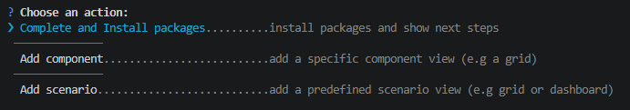
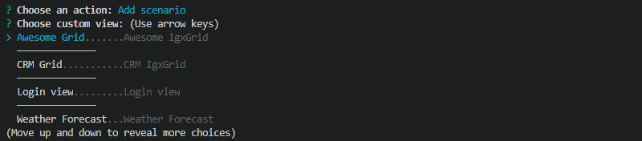

import DocsAside from 'igniteui-astro-components/components/mdx/DocsAside.astro';
import { Image } from 'astro:assets';
import play from '../../../images/general/play.svg';
import igStepByStepProjectType from '../../../images/general/ig-step-by-step-project-type.png';
import igStepByStepNewProjectName from '../../../images/general/ig-step-by-step-new-project-name.png';
import igStepByStepNewProjectTemplate from '../../../images/general/ig-step-by-step-new-project-template.png';
import igStepByStepNewProjectTheme from '../../../images/general/ig-step-by-step-new-project-theme.png';
import igStepByStepNewProjectAction from '../../../images/general/ig-step-by-step-new-project-action.png';
import igStepByStepTemplateGroup from '../../../images/general/ig-step-by-step-template-group.png';
import igStepByStepComponentFeatures from '../../../images/general/ig-step-by-step-component-features.png';
import igStepByStepScenarioTemplates from '../../../images/general/ig-step-by-step-scenario-templates.png';

# Step-by-Step Guide Using Ignite UI for Angular Schematics

If you want to get a guided experience through the available options, you can initialize the step by step mode that will help you create and setup your new application, as well as update project previously created with the [Ignite UI Angular Schematics](/general/cli/getting-started-with-angular-schematics).

To activate the guided wizard, run:

```cmd
ng new --collection="@igniteui/angular-schematics"
```

<div style="display:inline-block;">
    <a style="background: url(/images/general/buildCLIapp.gif); display:flex; justify-content:center; width: 80vw; max-width:540px; min-height:315px;"
       href="https://youtu.be/QK_NsdtdA70" target="_blank">
        <Image src={play} alt="Play video" style="vertical-align: middle;" />
    </a>
</div>

<DocsAside type="note">
Step by step mode relies on `Inquirer.js`, see [supported terminals](https://github.com/SBoudrias/Inquirer.js#support-os-terminals)
</DocsAside>

Standalone components are the Angular 17+ default and are recommended for new projects. Choose NgModules only if you are integrating with an existing NgModule-based codebase.

### Step 2: Enter a project name

Enter a name for the new application. The project is created in a directory with the same name.

<Image src={igStepByStepProjectType} alt="Step by step project type" class="responsive-img" />

### Step 3: Choose a project template

<Image src={igStepByStepNewProjectName} alt="Step by step new project name" class="responsive-img" />

Then you will be guided to choose one of the available project templates. You can create an empty project, project with side navigation or [authentication project](/general/cli/auth-template) with basic authentication module. Navigate through the available options using the arrow keys and press ENTER to confirm the selection:

<Image src={igStepByStepNewProjectTemplate} alt="Step by step new project template" class="responsive-img" />

The next step is to choose a theme for your application. If you select the default option a pre-compiled CSS file (`igniteui-angular.css`) with the default Ignite UI for Angular theme is included in your project's `angular.json`. The custom option generates code for a color palette and theme with our [Theming API](/themes) in the `app/styles.scss`.

<Image src={igStepByStepNewProjectTheme} alt="Step by step new project theme" class="responsive-img" />

- **default** - includes a pre-compiled CSS file (`igniteui-angular.css`) with the default Ignite UI for Angular Material-based theme in `angular.json`
- **custom** - generates a color palette and theme configuration using the [Theming API](../../themes.md) in `app/styles.scss`, ready for customization

<Image src={igStepByStepNewProjectAction} alt="Step by step new project action" class="responsive-img" />

After completing these four steps, the wizard generates the project structure, initializes a Git repository, and commits the initial state. It then asks whether to finish or continue by adding a component view.



## Add Component Views

The Ignite UI for Angular Schematics collection provides individual component templates and more elaborate scenario templates. This mode is available both as a continuation of project creation and as a standalone operation in an existing project.

To activate the component wizard in an existing project, run the `component` schematic (alias: `c`):

```bash
ng g @igniteui/angular-schematics:component
```

In case you choose to add a new control, you will be provided with a [list of the available templates](/general/cli/component-templates#component-templates), grouped in categories.

<Image src={igStepByStepTemplateGroup} alt="Step by step template group" class="responsive-img" />

Scenario templates are also available and provide more complete application views that combine multiple components. Select "Scenarios" in the category list to browse them.



<Image src={igStepByStepComponentFeatures} alt="Step by step component features" class="responsive-img" />

If you choose to add a scenario to your application you will also get a list of the available [scenario templates](/general/cli/component-templates#scenario-templates):

<Image src={igStepByStepScenarioTemplates} alt="Scenario templates" class="responsive-img" />

The Ignite UI CLI - which shares the same scaffolding toolchain as these Schematics - includes a built-in MCP server that connects AI coding assistants to live Ignite UI component documentation. If your workflow uses the Ignite UI CLI alongside the Angular CLI, start the server with `ig mcp` after installing the CLI globally.

For MCP client configuration and a full description of available tools, see [Ignite UI CLI MCP](../../ai/cli-mcp.md).
