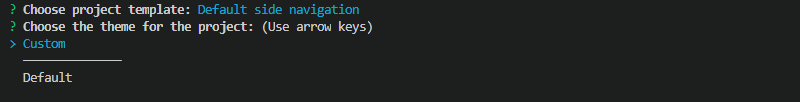
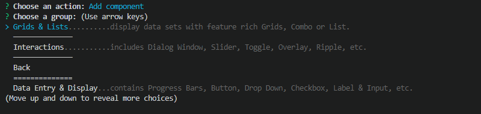

import DocsAside from 'igniteui-astro-components/components/mdx/DocsAside.astro';
import { Image } from 'astro:assets';
import play from '../../../images/general/play.svg';
import igStepByStepProjectTypeCli from '../../../images/general/ig-step-by-step-project-type-cli.png';
import igStepByStepScenarioTemplates from '../../../images/general/ig-step-by-step-scenario-templates.png';

# Step-by-Step Guide using Ignite UI CLI

If you want to get a guided experience through the available options, you can initialize the step by step mode that will help you create and setup your new application, as well as update project previously created with the [Ignite UI CLI](/general/cli/getting-started-with-cli).

The Ignite UI CLI step-by-step mode is an interactive wizard that guides you through project creation, template selection, theming, and component view addition for [Ignite UI CLI](getting-started-with-cli.md)-based Angular projects. It covers the same operations as the non-interactive `ig new` and `ig add` commands but prompts you at each step rather than requiring all arguments upfront.

The step-by-step mode does not support scripted or non-interactive use - for that, use the direct `ig new` and `ig add` commands with explicit arguments. The wizard relies on `Inquirer.js`; see [supported terminals](https://github.com/SBoudrias/Inquirer.js#support-os-terminals) for compatibility.

To activate the wizard, run:

```bash
ig
```

or:

```bash
ig new
```

<div style="display:inline-block;">
    <a style="background: url(/images/general/buildCLIapp.gif); display:flex; justify-content:center; min-width:540px; min-height:315px;"
       href="https://youtu.be/QK_NsdtdA70" target="_blank">
        <Image src={play} alt="Play video" style="vertical-align: middle;" />
    </a>
    <p style="text-align:center;">Building Your First Ignite UI CLI App</p>
</div>

<DocsAside type="note">
Step by step mode relies on `Inquirer.js`, see [supported terminals](https://github.com/SBoudrias/Inquirer.js#support-os-terminals)
</DocsAside>


## Create new project

First you will be prompted to enter a name for your application:


After selecting `Angular` as a framework, you will be prompted to choose the type of the project that is to be generated:
<Image src={igStepByStepProjectTypeCli} alt="Step by step project type" class="responsive-img" />

Then you will be guided to choose one of the available project templates. You can create an empty project, project with side navigation or [authentication project](/general/cli/auth-template) with basic authentication module. Navigate through the available options using the arrow keys and press ENTER to confirm the selection:


The next step is to choose a theme for your application. If you select the default option a pre-compiled CSS file (`igniteui-angular.css`) with the default Ignite UI for Angular theme is included in your project's `angular.json`. The custom option generates code for a color palette and theme with our [Theming API](/themes) in the `app/styles.scss`.





## Add view

The Ignite UI CLI supports multiple component templates and scenario templates that can be added to a project. This mode can be activated either as a continuation of project creation or inside an existing project using the command below.

```bash
ig add
```

In case you choose to add a new control, you will be provided with a [list of the available templates](/general/cli/component-templates#component-templates), grouped in categories.




Use the arrow keys to navigate through the options and ENTER to select. For some templates, such as `Custom Grid`, you will be provided with a list of optional features that can be toggled with the SPACE key:


If you choose to add a scenario to your application, you will also get a list of the available [scenario templates](/general/cli/component-templates#scenario-templates):

<Image src={igStepByStepScenarioTemplates} alt="Scenario templates" class="responsive-img" />

To add more Ignite UI for Angular views to a project later without the wizard, use the direct `add` command:

You can always add more Ignite UI for Angular views to your application at a later moment using the [`add`](/general/cli/getting-started-with-cli#add-template) command with the following syntax:
`ig add [template] [name]`.
