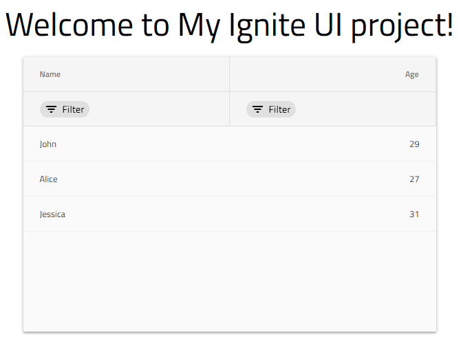

import ApiLink from 'igniteui-astro-components/components/mdx/ApiLink.astro';
import DocsAside from 'igniteui-astro-components/components/mdx/DocsAside.astro';
import { Image } from 'astro:assets';
import nodejs from '../../images/general/nodejs.svg';
import vsCode from '../../images/general/vs-code.svg';
import play from '../../images/general/play.svg';
import igniteuiProject from '../../images/general/igniteui-project.png';

# Getting started with Ignite UI for Angular

# Get Started with Ignite UI for Angular

Ignite UI for Angular is offered under a dual-license model, which allows for both commercial and permissive open-source use, depending on the components, modules, directives, and services being used. For more details, refer to the [Ignite UI Licensing](/general/ignite-ui-licensing) and [Open Source vs Premium](/general/open-source-vs-premium) topics.

Ignite UI for Angular targets Angular 17 and later, with standalone components as the default bootstrapping model. It does not support Vue, React, or Web Components natively - for those frameworks see [Ignite UI for React](https://www.infragistics.com/products/ignite-ui-react), [Ignite UI for Web Components](https://www.infragistics.com/products/ignite-ui-web-components), and [Ignite UI for Blazor](https://www.infragistics.com/products/ignite-ui-blazor).

Ignite UI for Angular is offered under a dual-license model: some components are open source under MIT, others require a commercial license. For details see [Ignite UI Licensing](./ignite-ui-licensing.md) and [Open Source vs Premium](./open-source-vs-premium.md).

<div>
    <div style="display:inline-block;width:45%;text-align:center;">
      <Image src={nodejs} alt="NodeJS" style="display:flex;max-height:100px;margin:auto auto 20px auto;" />
      <a target="_blank" href="https://nodejs.org/en/download/" class="no-external-icon"
         style="color:white;background-color:#09f;text-decoration:none;font-weight:700;font-size:16px;padding: 5px 15px 5px 15px;">
        DOWNLOAD NODE
      </a>
    
</div>
    <div style="display:inline-block;width:45%;text-align:center;">
      <Image src={vsCode} alt="Visual Studio Code" style="display:flex;max-height:100px;margin:auto auto 20px auto;" />
      <a target="_blank" href="https://code.visualstudio.com/download" class="no-external-icon"
         style="color:white;background-color:#09f;text-decoration:none;font-weight:700;font-size:16px;padding: 5px 15px 5px 15px;">
        DOWNLOAD VS CODE
      </a>
    
</div>
</div>
<hr/>

- Node.js 20 LTS or later (Node.js 22 LTS recommended)
- npm 10+ (bundled with Node.js 20), yarn, or pnpm
- Angular CLI 17+ for the `ng add` installation path
- Visual Studio Code or any editor with TypeScript language support

## Install Ignite UI for Angular

Ignite UI for Angular supports three installation paths. Use the Ignite UI CLI or Angular Schematics when starting a new project from scratch. Use `ng add` when adding Ignite UI for Angular to an existing Angular workspace.

### Install with Ignite UI CLI

The Ignite UI CLI is a standalone command-line tool that scaffolds a fully configured Angular project with Ignite UI for Angular in a single command. Install it globally:

```cmd
npm install -g igniteui-cli
```

You can specify the file extension or preprocessor to use for your application's style files with the `--style` option. We recommend using SCSS since our components' styles are based on the [Ignite UI for Angular theming library](/themes). Later on, when you install the Ignite UI for Angular package, your application will be configured to use the default styling theme which can be then easily customized either for all or for specific component instances.

Thereafter you can install the Ignite UI for Angular package, along with all of its dependencies, font imports and styles references to your project, by running the following command:

```cmd
ig
```

<DocsAside type="note">
You don't need to install the `igniteui-theming` package explicitly, it comes with Ignite UI for Angular.
</DocsAside>

<DocsAside type="note">
Keep in mind that with the command above you will install the Trial version of any Ignite UI for Angular component under commercial license (such as `igxGrid`).
</DocsAside>

#### Additional packages

In addition, you may want to include a number of Ignite UI components to your project, such as:

- Grid Lite - Open-Source

The [Grid Lite component](/grid-lite/overview) is designed to provide a minimal set of features under MIT license that should serve a wide range of projects that need essential data-display functionality with minimal overhead, and the performance users expect. It is designed for developers who need fast, lightweight data presentation without the complexity of an enterprise grid. Its API resembles that of the commercial `IgxGrid` ensuring a simple and straightforward upgrade path.

```cmd
ig new <project-name> --framework=angular --type=igx-ts --template=side-nav
```

<DocsAside type="note">
As of Ignite UI CLI v13.1.0, the `igx-ts` project type generates a project that uses standalone components by default. To use NgModule-based bootstrapping instead, set `--type=igx-ts-legacy`.
</DocsAside>

### Upgrading from Trial to Licensed

If you want to start using the **Licensed Ignite UI for Angular package** it is strongly recommended to follow the [Upgrading packages guide with Schematics and Ignite UI CLI](/general/ignite-ui-licensing#upgrading-packages-using-our-angular-schematics-or-ignite-ui-cli).

The Ignite UI for Angular Schematics collection integrates into the Angular CLI workflow and provides the same guided experience as the standalone CLI, without requiring a separate global tool:

```cmd
npm i -g @igniteui/angular-schematics
```

Activate the guided wizard:

```cmd
ng new --collection="@igniteui/angular-schematics"
```

The schematic will take care of switching the package dependencies of the project and update source references.
[You'll be asked to login to our npm registry if not already setup](/general/ignite-ui-licensing#how-to-setup-your-environment-to-use-the-private-npm-feed-step-by-step-guide).

#### Login to our npm registry with a new setup

### Install with Angular CLI (`ng add`)

It's very important to [perform a correct setup of the private npm feed environment](/general/ignite-ui-licensing#how-to-setup-your-environment-to-use-the-private-npm-feed-step-by-step-guide), by:

- Ensuring a valid setup of the private registry.
- Log in to our private feed using npm by specifying a non-trial user account and password.

Details on the entire process [could be found here](/general/ignite-ui-licensing#how-to-setup-your-environment-to-use-the-private-npm-feed-step-by-step-guide).

### Quick Start with Angular Schematics & Ignite UI CLI

To create an application from scratch and configure it to use the Ignite UI for Angular components you can use either the Ignite UI for Angular Schematics or the Ignite UI CLI. The first step is to install the respective package globally as follows:

```cmd
ng new <project-name> --style=scss
```

SCSS is recommended because the [Ignite UI for Angular Theming Library](../themes.md) is built on it and `ng add` configures the default theme automatically. Then add Ignite UI for Angular:

```cmd
ng add igniteui-angular
```

Our [guided experience using the Ignite UI CLI](/general/cli/step-by-step-guide-using-cli) or [Ignite UI for Angular Schematics](/general/cli/step-by-step-guide-using-angular-schematics) is the easiest way to bootstrap a configured application.

#### Additional packages

Some Ignite UI for Angular components ship as separate npm packages and are added independently:

**[Grid Lite](../grid-lite/overview.md) - open source (MIT)**

A lightweight grid for projects that need basic data display without the full commercial feature set. Its API is compatible with `IgxGrid`, so upgrading later requires minimal changes.

```cmd
ng add igniteui-grid-lite
```

<DocsAside type="note">
At some point during the steps execution [you'll be asked to login to our npm registry if not already setup](/general/ignite-ui-licensing#how-to-setup-your-environment-to-use-the-private-npm-feed-step-by-step-guide). This is part of the Trial to License account setup and is applicable if you plan to use any of the components under [commercial license](/general/open-source-vs-premium#comparison-table-for-all-components).
</DocsAside>

<div style="display:inline-block;">
    <a style="background: url(/images/general/buildCLIapp.gif); display:flex; justify-content:center; width: 80vw; max-width:540px; min-height:315px;"
       href="https://youtu.be/QK_NsdtdA70" target="_blank">
        <Image src={play} alt="Play Video" style="vertical-align: middle;" />
    </a>
    <div style="text-align:center;">Building Your First Ignite UI CLI App</div>
</div>

Learn more about our [Angular Schematics & Ignite UI CLI](/general/cli-overview).

A pane-based layout component where end users can pin, resize, move, and hide panes at runtime.

```cmd
ng add igniteui-dockmanager
```

## Add Components with CLI or Schematics

After the initial project setup, add Ignite UI for Angular component views using either the `component` schematic or the `add` command:

```cmd
ng g @igniteui/angular-schematics:component
```

```cmd
ig add
```

<DocsAside type="note">
Please note that the [`ig add`](https://github.com/IgniteUI/igniteui-cli/wiki/add) command can be used if the application was created by using the Ignite UI CLI or
if it was created by using the Angular CLI with Ignite UI for Angular added to it by using the **ng add igniteui-angular** command.
</DocsAside>

After going through the options of the menu and choosing which component we want to add to our application, we will notice that we have a brand new component in our project, which we can use anywhere on our page!

#### Run application

## Add Components Manually (Standalone)

As of Angular 19, standalone components are the default bootstrapping model. The following example adds an `IgxGridComponent` to a standalone Angular application without using Schematics or the CLI.

As of Angular 19, standalone components are the default way to build Angular apps, removing the need for `NgModules` and simplifying the process of adding components significantly. So let's use this to add an [**igxGrid**](/grid/grid) component to our app.

Before we start though, please note that some components have animations that require a provider as part of the `bootstrapApplication` call.

```typescript
// main.ts

import { appConfig } from './app/app.config';
import { AppComponent } from './app/app.component';

bootstrapApplication(AppComponent, appConfig)
  .catch((err) => console.error(err));
```

```typescript
// app/app.config.ts
import { ApplicationConfig, importProvidersFrom } from '@angular/core';
import { BrowserModule } from '@angular/platform-browser';
import { provideAnimations } from '@angular/platform-browser/animations';
import { Provider } from '@angular/core';

const providers: Provider[] = [
  importProvidersFrom(BrowserModule),
  provideAnimations()
];

export const appConfig: ApplicationConfig = { providers };
```

### Import and use the Grid

We are now ready to use the igxGrid in our markup! Let's go ahead and define it in our **app.component.html** file:

```html
{/* app.component.html */}

<div style="text-align:center; margin-bottom: 20px;">
  <h1>
    Welcome to {{title}}!
  </h1>
</div>

<div style="text-align: center;">
  <igx-grid [data]="localData" width="600px" height="400px" style="margin: auto" [allowFiltering]="true">
    <igx-column field="Name" dataType="string"></igx-column>
    <igx-column field="Age" dataType="number"></igx-column>
  </igx-grid>
</div>
```

We will also define the data of the grid and the title of our application that are referenced from the **app.component.ts**. As we are using standalone components we simply have to add the `IgxGridComponent` class to our app's imports, alongside any other components used in the template. In our example, as we are defining columns, we also have to add the `IgxColumnComponent` to the import array.

```typescript
// app.component.ts
import { Component } from '@angular/core';
import { IgxGridComponent, IgxColumnComponent } from 'igniteui-angular';

@Component({
  selector: 'app-root',
  templateUrl: './app.component.html',
  styleUrls: ['./app.component.css'],
  imports: [IgxGridComponent, IgxColumnComponent]
})
export class AppComponent {
  localData = [
    { Name: 'John', Age: 29 },
    { Name: 'Alice', Age: 27 },
    { Name: 'Jessica', Age: 31 },
  ];
}
```

### Upgrading from Grid Lite to Commercial Grid

`Grid Lite` is a great way to start with a free, open-source grid. However, as your application grows, you might need advanced features like Excel Export, Advanced Filtering, Master-Detail or the various grid flavors like `Tree Grid` or `Pivot Grid`. This means upgrading to commercial Ignite UI for Angular Grid component. We made this process simple and straightforward:

Add the grid to the component template, binding `[data]` to the local array and defining columns explicitly:

```html
<!-- app.component.html -->
<igx-grid [data]="localData" width="600px" height="400px" [allowFiltering]="true">
  <igx-column field="Name" dataType="string"></igx-column>
  <igx-column field="Age" dataType="number"></igx-column>
</igx-grid>
```

This renders an Ignite UI for Angular Grid with column filtering enabled, displaying three rows of local data.

### Run the application

Run the application using the command for your setup:

```cmd
ig start
```

Or, for projects created with the Angular CLI:

```cmd
ng serve
```



<Image src={igniteuiProject} alt="Ignite UI Project" class="responsive-img" />

Or, using the Ignite UI CLI:

In this article we learned how to create our own Ignite UI for Angular application from scratch by taking advantage of the fully-automated process of Ignite UI for Angular projects creation in the Ignite UI CLI. We also learned how to add Ignite UI for Angular to an existing application by using the Angular CLI. We designed our own page by including the <ApiLink type="Grid" /> to it, which itself offers some awesome features, which you can take a look at by referring to the navigation menu.

- <ApiLink type="Grid" />
- [IgxGridComponent Styles]({environment:sassApiUrl}/themes#function-grid-theme)

## AI-Assisted Development

Ignite UI for Angular ships two tools for AI-assisted development.

Learn more in the [Ignite UI for Angular Skills](/ai/skills) topic.

**The Ignite UI MCP Server** is a built-in server in the Ignite UI CLI that connects AI assistants to live Ignite UI component documentation and API references directly inside your editor. Unlike static skills, the MCP server answers queries about current APIs, retrieves setup guides on demand, and supports accurate code generation for Ignite UI components. Start it with `ig mcp` after installing the CLI. For client configuration and available tools, see [Ignite UI CLI MCP Overview](../ai/cli-mcp.md).

<hr/>

- [Ignite UI for Angular Skills](/ai/skills)
- [Ignite UI CLI](https://github.com/IgniteUI/igniteui-cli)
- [Ignite UI CLI Commands](https://github.com/IgniteUI/igniteui-cli/wiki#available-commands)
- [Grid overview](/grid/grid)
- [Grid Lite overview](/grid-lite/overview)

<hr/>
Our community is active and always welcoming to new ideas.

- [Ignite UI for Angular **Forums**](https://www.infragistics.com/community/forums/f/ignite-ui-for-angular)
- [Ignite UI for Angular **GitHub**](https://github.com/IgniteUI/igniteui-angular)
- [Ignite UI for Angular **Discord**](https://discord.com/channels/836634487483269200/836636712292581456)
