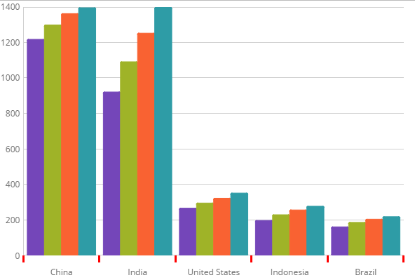

# Axis Tickmarks

Tick marks display points on the axes. They represent a certain numeric point on a scale or the value of the category in a category axis.

### In this topic

This topic contains the following sections:

- [Property Settings](#propertysettings)
- [Code Snippet](#codesnippet)
- [Related Topics](#relatedtopics)

### <a id="propertysettings"></a>Property Settings
In the igCategoryChart™ control, you can change the length, thickness and color of the x-axis and y-axis labels using the following properties:

Property Name|Property Type|Description
---|---|---
`xAxisTickLength`, `yAxisTickLength` | number |Determines the length of the tickmark along the x-axis or y-axis 
`xAxisTickStroke`, `yAxisTickStroke` |string |Determines the color of the tickmark along the x-axis or y-axis  
`xAxisTickStrokeThickness`, `yAxisTickStrokeThickness`|number|Determines the thickness of of the tickmark along the x-axis or y-axis 

### <a id="codesnippet"></a>Code Snippet

The following code snippet demonstrates how to set the color, length and thickness of the tickmark on the x-axis

*In HTML:*

```html
$(function () {
            $("#chart").igCategoryChart({
                dataSource: data,
                xAxisTickLength: 10,
                xAxisTickStrokeThickness: 3,
                xAxisTickStroke: 'red'
            });
        });
```



## <a id="relatedtopics"></a> Related Topics:

- [Walkthrough](/igcategorychart-adding.mdx)

- [Binding to Data](/categorychart-binding-to-data.mdx)

- [Configuring Axis Gap and Overlap](/categorychart-configuring-axis-gap-and-overlap.mdx)

- [Configuring Axis Labels](igcategorychart-axis-labels.html)

- [Configuring Axis Intervals](/igcategorychart-axis-intervals.mdx)

- [Configuring Axis Range](/categorychart-configuring-axis-range.mdx)

- [Configuring Axis Titles](/categorychart-configuring-axis-titles.mdx)