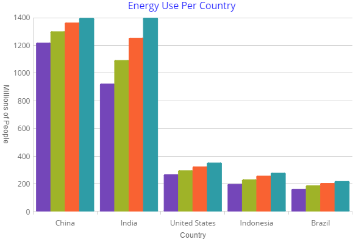

# igCategoryChart

### Introduction

The igCategoryChart is a lightweight, highly performant chart. This chart can be easily configured to display category data using an extremely simple and intuitive API. All you need to do is bind your data (a collection or a collection of collections) and the chart takes care of everything else.

The following screenshot demonstrates the category chart displaying a column chart.

### Topics
The topics in this section provide detailed information regarding the igCategoryChart control.

-  [Overview](/categorychart-overview.mdx)

- [Walkthrough](/igcategorychart-adding.mdx)

- [Binding to Data](/categorychart-binding-to-data.mdx)

- [Axes](/axes/categorychart-axes.mdx)

- [Chart Types](/categorychart-chart-types.mdx)

- [Configuring Chart Types](/categorychart-configuring-chart-types.mdx)

- [Configuring Chart Markers](/categorychart-configuring-chart-types.mdx)

- [Chart Requirements](/categorychart-chart-requirements.mdx)

- [Chart Title and Subtitle](/categorychart-chart-title-subtitle.mdx)

- [Chart Styling](/categorychart-styling.mdx)

- [Chart API Overview](/categorychart-api-overivew.mdx)