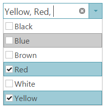

import ApiLink from 'docs-template/components/mdx/ApiLink.astro';

# Configuring Selection (igCombo)


## Topic Overview


### Purpose


The `igCombo`™ control supports single and multiple selection, checkboxes, selection events and an API for changing the selection behavior programmatically. This topic shows how these different aspects of the selection functionality can be configured.

### In this topic


This topic contains the following sections:

-   [igCombo Selection Configuration Overview](#configuration_overview)
-   [Configure Multiple Selection](#configure_multiple_selection)
    -   [Multiple selection details](#multiple_selection_details)
    -   [Multiple selection settings](#multiple_selection_settings)
-   [Code Example: Configure checkboxes](#code_example)
-   [Clear Selection](#clear_selection)
    -   [Clear selection details](#clear_selection_details)
    -   [Clear selection settings](#clear_selection_settings)
-   [Handle selection Events](#handle_selection_events)
    -   [Selection events details](#selection_events_details)
    -   [Selection events settings](#selection_events_settings)
-   [Cancel Selection](#cancel_selection)
    -   [Introduction](#cancel_selection_introduction)
    -   [Overview](#cancel_selection_overview)
    -   [Steps](#cancel_selection_steps)
-   [Related Topics](#related_topics)

### Required background


The table below lists the background you need to fully understand the information in this topic.

**Topics**

You need to first read the [igCombo Overview](/igcombo-overview.mdx) and [Adding igCombo](/igcombo-getting-started.mdx) topic.

**External Resources**

You need to first read the following articles:

-   [jQuery bind() API](http://api.jquery.com/bind/)
-   [jQuery live() API](http://api.jquery.com/live/)

## igCombo Selection Configuration Overview


### Selection configuration 


The table below lists the configurable behaviors of the `igCombo` control.


| Configurable behavior | Behavior details | Configuration properties |
| --- | --- | --- |
| Multiple selection | Multiple selection allows users to select more than one item in the combo from the dropdown or by typing multiple values in the text box. | <ApiLink type="igCombo" member="multiSelection" section="options" label="multiSelection" /> |
| Clear selection | Programmatically clears the selection from the igCombo control. | <ApiLink type="igCombo" member="deselectAll" section="methods" label="deselectAll" /> |
| Handle selection events | Capture selection events to perform logic in response to a selection operation occurring. | <ApiLink type="igCombo" member="selectionChanging" section="events" label="selectionChanging" /> |
| Handle selection events | Capture selection events to perform logic in response to a selection operation occurring. | <ApiLink type="igCombo" member="selectionChanging" section="events" label="selectionChanging" />, <ApiLink type="igCombo" member="selectionChanged" section="events" label="selectionChanged" /> |
| Cancel Selection | Cancel the selection changing event to cancel a selection operation. | <ApiLink type="igCombo" member="selectionChanging" section="events" label="selectionChanging" /> |


## Configure Multiple Selection


### Multiple selection details


Enabling multiple selection allows the user to select multiple items with the mouse or keyboard from the dropdown. In addition, the users also can type multiple values in the text box separating them by ``itemSeparator`` to select corresponding values. Default value for the ``itemSeparator`` is ``', '``.

Finally, you can enable checkboxes to facilitate multiple selection.



### Multiple selection settings


The table below maps the desired configurations to property settings. The properties are accessed through the `igCombo` control options.


| In order to configure | Use this option | Set it to |
| --- | --- | --- |
| Multiple selection | <ApiLink type="igCombo" member="multiSelection.enabled" section="options" label="**multiSelection.enabled**" /> | true |
| Show checkboxes | <ApiLink type="igCombo" member="multiSelection.showCheckboxes" section="options" label="**multiSelection.showCheckboxes**" /> | true |


### Code Example: Configure checkboxes


Following is the full code used in this example to configure multiple selection with checkboxes using the `igCombo` control options with the following parameters:

**Multiple Selection** – Enabled with checkboxes

**In HTML:**

```html
<script type="text/javascript">
    $(function () {
        $("#comboTarget").igCombo({
            dataSource: colors,
            multiSelection: {
				enabled: true,
				showCheckboxes: true
			}
        });
    });
</script>
```


**In ASPX:**

```csharp
<%= Html.
    Infragistics().
    Combo().
    DataSource(this.Model as IQueryable<System.Drawing.Color>).
    MultiSelectionSettings(ms => {
		ms.Enabled(true);
		ms.ShowCheckBoxes(true);
	}).   
    Render()
%>
```

### Multiple selection property reference


For detailed information about these properties, refer to their listing in the property reference section:

**igCombo Options**

#### Clear selection


###### Clear selection details


To clear the selection of the `igCombo` control programmatically, use the method deselectAll.


###### Clear selection settings


The table below maps the desired behaviors to property settings. The properties are accessed through the `igCombo` options.


| In order to | Use this method and event |
| --- | --- |
| Clear selection | <ApiLink type="igCombo" member="delesectAll" section="methods" label="**delesectAll**" /> |
| Handle an event after selection has been changed | <ApiLink type="igCombo" member="selectionChanged" section="events" label="**selectionChanged**" /> |


### Handle selection events


###### Selection events details


You can use selection events to perform logic when a selection operation occurs. The `selectionChanging` is raised before the selection is changed within the control and the `selectionChanged` event is raised directly after the igCombo’s selection is changed.

###### Selection events settings


The table below maps the desired configurations to property settings. The properties are accessed through the `igCombo` options.


| In order to | Use this event | Set it to |
| --- | --- | --- |
| Handle an event prior to selection being changed | <ApiLink type="igCombo" member="selectionChanging" section="events" label="**selectionChanging**" /> | `function()` |
| Handle an event after selection has been changed | <ApiLink type="igCombo" member="selectionChanged" section="events" label="**selectionChanged**" /> | `function()` |


## Cancel Selection


### Introduction


By handling the `selectionChanging` event, you can cancel a selection operation.

### Overview


-	Following is a conceptual overview of the process:

-	Handling the `selectionChanging` event

-	Cancelling the event by returning false

### Steps


1.  Handle the `selectionChanging` event.

    1.  Define a handler function.

        Define a function that is called when the `selectionChanging` event is raised.

        **In HTML and JavaScript:**

```html
        <script type="text/javascript">        
            function comboSelectionChanging(evt, ui) {

            };   
        </script>
```

    2.  Configure the handler for the `selectionChanging` event.

        Once you have a handler defined, you must set it as the handler for the `selectionChanging` event. In jQuery, this can be done when the widget is instantiated. In ASP.NET MVC, the event should be attached using the jQuery live or bind API. Using the live or bind API is an option for attaching the event in a pure jQuery implementation as well. The type for this event is ‘igcomboselectionchanging’.

        **In HTML:**

```html
        $("#comboTarget").igCombo({
                    selectionChanging: comboSelectionChanging
        });
```

		 **In ASPX:**

```csharp
		 $("#comboTarget").bind("igcomboselectionchanging", comboSelectionChanging);
```

2.  Cancel the event by returning false.

    **In HTML and JavaScript:**

```html
    <script type="text/javascript">
            
        function comboSelectionChanging(evt, ui) {
           if (conditionNotMet)
              return false;
         };   
    </script>
```

## Related Topics


Following are some other topics you may find useful.

-	[Configuring igCombo](/igcombo-configuring.mdx)

 

 


