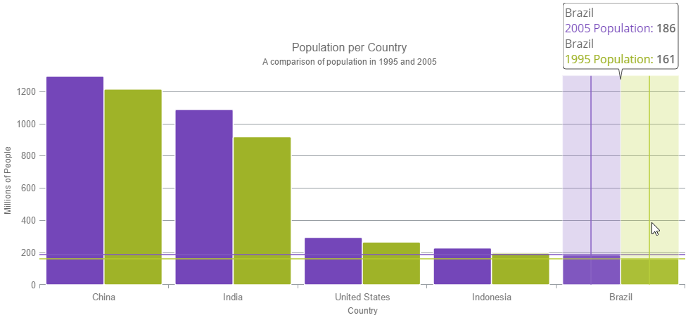

# Configuring Hover Interactions (igDataChart)

## In This Group of Topics

### Introduction

The topics in this group explain the hover interaction feature.

In order to implement all hover, highlight and tooltip interactions, layers are added to the `igDataChart` control, such as the Crosshair and Category Highlight layers.

### Topics

- [Hover Interactions Overview (igDataChart)](//overview/hoverinteractions-hover-interactions-overview.mdx): This topic provides conceptual information about the hover interactions available on the igDataChart control including the different types of hover interaction layers available.

- [Hover Interactions Property Reference (igDataChart)](/hoverinteractions-common-properties.mdx): This topic provides information about the properties and methods that the hover interaction feature uses for highlighting, hovering and interacting with the tooltip interactions inherited from the series class.

- [Configuring the Crosshair Layer (igDataChart)](/hoverinteractions-crosshair-layer.mdx): This topic provides information about the crosshair layer used for hover interactions. It describes the properties of the crosshair layer and provides an implementation example.

- [Configuring the Category Highlight Layer (igDataChart)](/hoverinteractions-category-highlight-layer.mdx):  This topic provides information about the category highlight layer which is used for hover interactions. It describes the properties of the category highlight layer and provides an example of its implementation.

- [Configuring the Category Item Highlight Layer (igDataChart)](/hoverinteractions-category-item-highlight-layer.mdx): This topic provides information about the category item highlight layer used for hover interactions. It describes the properties of the category item highlight layer and provides an example of its implementation.

- [Configuring the Category Tooltip Layer (igDataChart)](/hoverinteractions-category-tooltip-layer.mdx): This topic provides information about the category tooltip layer used for hover interactions. It describes the properties of the category tooltip layer and provides an example of its implementation.

- [Configuring the Item Tooltip Layer (igDataChart)](/hoverinteractions-item-tooltip-layer.mdx): This topic provides information about the item tooltip layer which is used for hover interactions. It describes the properties of the item tooltip layer and also provides an example of its implementation.

- [Configuring the Final Value Layer (igDataChart)](/hoverinteractions-final-value-layer.mdx): This topic provides information about the final value layer which is used for axis annotations. It describes the properties of the final value layer and also provides an example of its implementation.

- [Configuring the Callout Layer (igDataChart)](/hoverinteractions-callout-layer.mdx): This topic provides information about the callout layer which is used for annotations. It describes the properties of the callout layer and also provides an example of its implementation.
