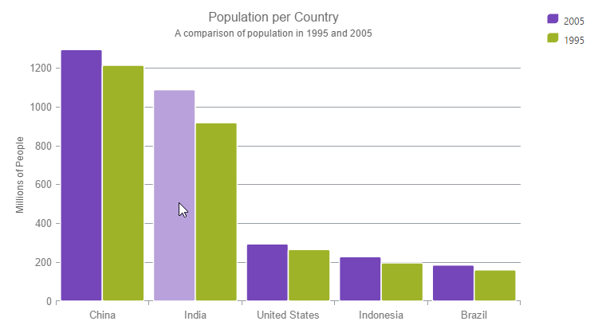
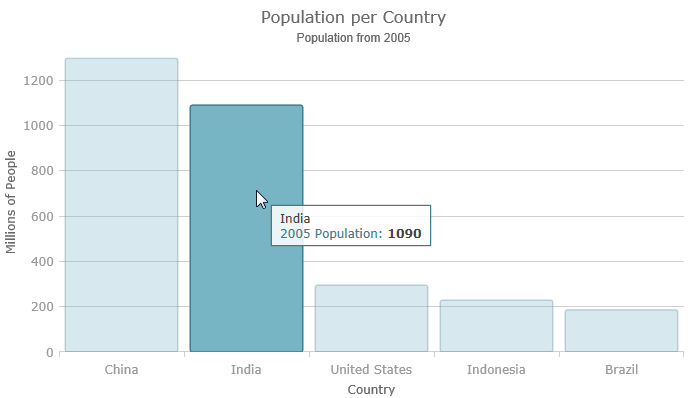

# Configuring the Series Highlighting (igDataChart)

## Topic Overview

### Purpose

This topic provides information on enabling the series highlighting feature along with a listing of the supported series. This topic also explains how to configure the series highlighting using the available events.

### Required background

The following topic is a prerequisite to understanding this topic:

[Adding igDataChart](/igdatachart-adding.mdx)

This topic demonstrates how to add the `igDataChart`™ control to a page and bind it to data.

### In this topic

This topic contains the following sections:

-   [Series Highlighting](#series-highlighting)
    -   [Overview](#overview)
    -   [Preview](#preview)
    -   [Properties](#properties)
    -   [Example](#example)
-   [Events](#events)
    -   [Overview](#events-overview)
    -   [Event Arguments Properties](#event-arguments-properties)
    -   [Example](#event-example)
-   [Related Content](#related-content)

## Series Highlighting

### Overview

This feature allows you to highlight an entire series or individual items within the series. For example, highlights the entire line in a series such as the `lineSeries` as it is all one shape; however, highlights can be applied to each individual column in a series such as `columnSeries`. Individual markers can be highlighted in all supported series.

Currently the feature only supports highlighting via the mouse.

The series highlighting feature is supported for the following series types:

-   Category Series
-   RangeCategory Series

-   Financial Price Series
-   Financial Indicators

### Preview

The following screenshot is a preview of the `igDataChart` control with a `columnSeries` and the series highlighting feature enabled.

### Properties

The following table summarizes the properties used for series highlighting. These properties are set on the supported series.

|  |  |  |
| --- | --- | --- |
| Property Name | Property Type | Description |
| isHighlightingEnabled | boolean | Enables the series highlighting feature, by default it is set to False. |
| highlightingTransitionDuration | timeSpan | Determines the duration that the highlighting change takes. |

### Examples
This sample demonstrates the series highlighting feature on different series types by configuring the `isHighlightingEnabled` and `highlightingTransitionDuration` series properties.

   [Series Highlighting](&#123;environment:SamplesEmbedUrl&#125;/data-chart/series-highlighting)
   

The following example shows the same functionality, applied to a financial chart.

   [Series Highlighting (Financial)](&#123;environment:SamplesEmbedUrl&#125;/data-chart/series-highlighting-financial)

## Events

### Overview

There are two events that are specifically related to the series highlighting feature.

-   `assigningCategoryStyle`
-   `assigningCategoryMarkerStyle`

These events can be configured to achieve the following:

-   Modify the way that the highlighting is represented
-   Modify the appearance properties assigned to the entire series such as a `lineSeries`, or each individual item in the series for the series having individual items such as `columnSeries`.

When using the above series to configure the highlighting on the series, only the properties that are available on that particular series can be used. For example, overriding the fill or `radiusX` property of a `lineSeries` does not have any affect since those properties do not affect the `lineSeries`.

### Event Arguments Properties

The following table summarizes the properties of the `assigningCategoryStyleEventArgsBase`.

|  |  |  |
| --- | --- | --- |
| Property Name | Property Type | Description |
| startIndex | int | Start index of the range of data that is currently being highlighted. |
| endIndex | int | End index of the range of the data that is currently being highlighted. |
| startDate | dateTime | Start date of the range of data that is currently being highlighted. |
| endDate | dateTime | End date of the range of data that is currently being highlighted. |
| getItems | getCategoryItemsEventHandler | Actual items from the data source being highlighted. However, if there is a lot of data and you called it every time the event was fired, will negatively impact performance. |
| Fill | brush | Overrides the default fill property of the series. However, this property only takes affect if the Fill property only affects that particular series. |
| stroke | brush | Overrides the default stroke property of the series. |
| opacity | double | Overrides the default the opacity property of the series. |
| highlightingInfo | higlightingInfo | Determine the styling of the highlighted series. |
| maxAllSeriesHighlightingProgress | double | Progress state of the highlighting of the series. Value from 0 to 1. |
| sumAllSeriesHighlightingProgress | double | Progress state of the highlighting of the series. Value from 0 to 1. |
| highlightingHandled | bool | When set to True the default highlighting does not apply. |
| HasDateRange | bool |  |

The following table summarizes the properties of the     `assigningCategoryMarkerStyleEventArgs`

|  |  |  |
| --- | --- | --- |
| Property Name | Property Type | Description |
| strokeThickness | double | Overrides the default StrokeThickness property of the marker. |
| strokeDashArray | doubleCollection | Overrides the default StrokeDashArray property of the marker. |
| strokeDashCap | penLineCap | Overrides the default StrokeDashCap property of the marker. |
| radiusX | double | Overrides the default RadiusX property. |
| radiusY | double | Overrides the default RadiusY property. |

### Example

The following example shows the usage of the `assigningCategoryStyle` event to change the highlighting feature to fade non highlighting columns instead of changing the highlighting column.

   [Custom Series Highlighting](&#123;environment:SamplesEmbedUrl&#125;/data-chart/custom-series-highlighting)
   

## Related Content

### Topics

The following topic provides additional information related to this topic:

-	[Adding igDataChart](/igdatachart-adding.mdx):  This topic demonstrates how to add the `igDataChart` control to a page and bind it to data.

 

 

