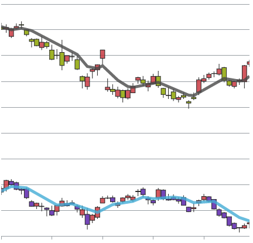
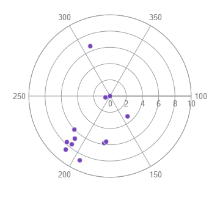
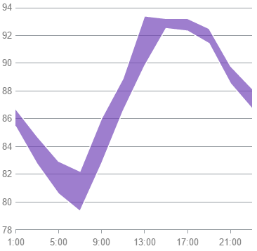
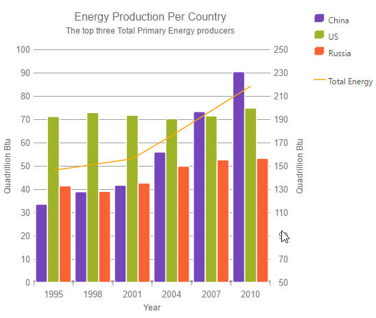

import ApiLink from 'docs-template/components/mdx/ApiLink.astro';

# Series Types (igDataChart)

## Topic Overview

### Purpose

This topic explains conceptually the kinds of chart series that can be produced with the `igDataChart`™ control.

### Required Background

The following topics are prerequisite to understanding this topic:

-	[igDataChart Overview](/igdatachart-overview.mdx)

This topic provides conceptual information about the `igDataChart` control including its main features, minimum requirements for using charts and user functionality.

#### In This Topic

This topic contains the following sections:

-   [Chart Series Types](#chart-series-types)
      -   [Supported chart types summary](#supported-chart-types)
        -   [Supported chart types table](#supported-chart-types-table)
        -   [Bar and Column series](#bars-and-columns)
        -   [Bubble series](#bubble)
        -   [Category series](#category-series)
        -   [Financial series](#financial-series)
        -   [Polar series](#polar-series)
        -   [Radial series](#radial-series)
        -   [Range Category series](#range-series)
        -   [Scatter series](#scatter-series)
-   [Composite Charts](#composite)
-   [Related Content](#related-content)
    -   [Topics](#topics)
        -   [Samples](#samples)

## Chart Series Types

### Supported chart types summary

The `igDataChart` control allows for a variety of series types to be implemented for different visualization purposes.

See the next block for detailed information on supported series types and basic configuration information.

>**Note:** Pie charts can be created using the separate `igPieChart` control. For details see [igPieChart Overview](//igpiechart/overview.mdx).

### Supported chart types table

| Chart type | Series type | Description | `Series.type` property setting | Data binding properties |
| --- | --- | --- | --- | --- |
| [Bar and Column](./00_igDataChart_Series_Types.mdx#bars-and-columns) | Bar | Visualizes categorized data with horizontal bars. | `bar` | <ApiLink type="igDataChart" member="series.valueMemberPath" section="options" label="valueMemberPath" /> |
|  | Column | Visualizes categorized data with vertical columns. | `column` | <ApiLink type="igDataChart" member="series.valueMemberPath" section="options" label="valueMemberPath" /> |
|  | Stacked Bar | Visualize categorized data with horizontal bars containing horizontally stacked segments. | `stackedBar` | <ApiLink type="igDataChart" member="series.valueMemberPath" section="options" label="valueMemberPath" /> |
|  | Stacked 100 Bar | Visualize categorized data with horizontal bars containing horizontally stacked segments normalized to percentage values. | `stacked100Bar` | <ApiLink type="igDataChart" member="series.valueMemberPath" section="options" label="valueMemberPath" /> |
|  | Stacked Column | Visualize categorized data with vertically stacked columns. | `stackedColumn` | <ApiLink type="igDataChart" member="series.valueMemberPath" section="options" label="valueMemberPath" /> |
|  | Stacked 100 Column | Visualize categorized data with vertically stacked columns where the values are normalized to percentages. | `stacked100Column` | <ApiLink type="igDataChart" member="series.valueMemberPath" section="options" label="valueMemberPath" /> |
| [Bubble](./00_igDataChart_Series_Types.mdx#bubble) | Bubble | Visualizes data described by multiple parameters with colored circles with different diameter. | `bubble` | <ApiLink type="igDataChart" member="series.xMemberPath" section="options" label="xMemberPath" /> <ApiLink type="igDataChart" member="series.yMemberPath" section="options" label="yMemberPath" /> <ApiLink type="igDataChart" member="series.radiusMemberPath" section="options" label="radiusMemberPath" /> <ApiLink type="igDataChart" member="series.fillMemberPath" section="options" label="fillMemberPath" /> <ApiLink type="igDataChart" member="series.labelMemberPath" section="options" label="labelMemberPath" /> |
| [Category](./00_igDataChart_Series_Types.mdx#category-series) | Line | Visualizes categorized data with a line with sharp edges on data points. | `line` | <ApiLink type="igDataChart" member="series.valueMemberPath" section="options" label="valueMemberPath" /> |
|  | Area | Visualizes categorized data with colored area below a line with sharp edges on data points. | `area` | <ApiLink type="igDataChart" member="series.valueMemberPath" section="options" label="valueMemberPath" /> |
|  | Spline | Visualizes categorized data with a line with smooth edges on data points. | `spline` | <ApiLink type="igDataChart" member="series.valueMemberPath" section="options" label="valueMemberPath" /> |
|  | Spline Area | Visualizes categorized data with colored area below a line with smooth edges on data points. | `splineArea` | <ApiLink type="igDataChart" member="series.valueMemberPath" section="options" label="valueMemberPath" /> |
|  | Waterfall | Visualizes categorized data with vertical columns where the first column for the first category starts from the x-axis and each next category starts where the previous one ends. | `waterfall` | <ApiLink type="igDataChart" member="series.valueMemberPath" section="options" label="valueMemberPath" /> |
|  | Point | Visualize categorized data with individually plotted point markers. | `point` | <ApiLink type="igDataChart" member="series.valueMemberPath" section="options" label="valueMemberPath" /> |
|  | Stacked Area | Visualize categorized data with stacked colored area below a line with sharp edges on data points. | `stackedArea` | <ApiLink type="igDataChart" member="series.valueMemberPath" section="options" label="valueMemberPath" /> |
|  | Stacked Line | Visualize categorized data in stacked lines with sharp edges on data points. | `stackedLine` | <ApiLink type="igDataChart" member="series.valueMemberPath" section="options" label="valueMemberPath" /> |
|  | Stacked Spline | Visualize categorized data in stacked lines with smooth edges on data points | `stackedSpline` | <ApiLink type="igDataChart" member="series.valueMemberPath" section="options" label="valueMemberPath" /> |
|  | Stacked Spline Area | Visualize categorized data with stacked colored area below a line with smooth edges on data points. | `stacked100Bar` | <ApiLink type="igDataChart" member="series.valueMemberPath" section="options" label="valueMemberPath" /> |
|  | Stacked 100 Area | Visualize categorized data with stacked colored area below a line with sharp edges on data points where the values are normalized to percentages. | `stacked100Area` | <ApiLink type="igDataChart" member="series.valueMemberPath" section="options" label="valueMemberPath" /> |
|  | Stacked 100 Line | Visualize categorized data in stacked lines with sharp edges on data points where the values are normalized to percentages. | `stacked100Line` | <ApiLink type="igDataChart" member="series.valueMemberPath" section="options" label="valueMemberPath" /> |
|  | Stacked 100 Spline | Visualize categorized data in stacked lines with smooth edges on data points where the values are normalized to percentages. | `stacked100Spline` | <ApiLink type="igDataChart" member="series.valueMemberPath" section="options" label="valueMemberPath" /> |
|  | Stacked 100 Spline Area | Visualize categorized data with stacked colored area below a line with smooth edges on data points where the values are normalized to percentages. | `stacked100SplineArea` | <ApiLink type="igDataChart" member="series.valueMemberPath" section="options" label="valueMemberPath" /> |
| [Financial](./00_igDataChart_Series_Types.mdx#financial-series) | Candlestick | Displays opening, closing, highest and lowest value of a financial (investment) instrument in the form of a candlestick. | `candlestick` | <ApiLink type="igDataChart" member="series.openMemberPath" section="options" label="openMemberPath" /> <ApiLink type="igDataChart" member="series.closeMemberPath" section="options" label="closeMemberPath" /> <ApiLink type="igDataChart" member="series.highMemberPath" section="options" label="highMemberPath" /> <ApiLink type="igDataChart" member="series.lowMemberPath" section="options" label="lowMemberPath" /> |
|  | OHLC | Abbreviation for Open, High, Low, Close. Displays opening, closing, highest and lowest value of a financial (investment) instrument in the form of vertical lines with markings for opening and closing values. | `ohlc` | <ApiLink type="igDataChart" member="series.openMemberPath" section="options" label="openMemberPath" /> <ApiLink type="igDataChart" member="series.closeMemberPath" section="options" label="closeMemberPath" /> <ApiLink type="igDataChart" member="series.highMemberPath" section="options" label="highMemberPath" /> <ApiLink type="igDataChart" member="series.lowMemberPath" section="options" label="lowMemberPath" /> |
| [Polar](./00_igDataChart_Series_Types.mdx#polar-series) | Polar Scatter | Visualizes data with dots (or other types of markers) in a polar coordinate system. | `polarScatter` | <ApiLink type="igDataChart" member="series.angleMemberPath" section="options" label="angleMemberPath" /> <ApiLink type="igDataChart" member="series.radiusMemberPath" section="options" label="radiusMemberPath" /> |
|  | Polar Line | Visualizes data with a line with sharp edges on data points in a polar coordinate system. | `polarLine` | <ApiLink type="igDataChart" member="series.angleMemberPath" section="options" label="angleMemberPath" /> <ApiLink type="igDataChart" member="series.radiusMemberPath" section="options" label="radiusMemberPath" /> |
|  | Polar Area | Visualizes data with colored area below a line with sharp edges on data points in a polar coordinate system. | `polarArea` | <ApiLink type="igDataChart" member="series.angleMemberPath" section="options" label="angleMemberPath" /> <ApiLink type="igDataChart" member="series.radiusMemberPath" section="options" label="radiusMemberPath" /> |
|  | Polar Spline | Visualize data with a spline displaying Bezier-curved transitions between data points in a polar coordinate system. | `polarSpline` | <ApiLink type="igDataChart" member="series.angleMemberPath" section="options" label="angleMemberPath" /> <ApiLink type="igDataChart" member="series.radiusMemberPath" section="options" label="radiusMemberPath" /> |
|  | Polar Spline Area | Visualize data with colored area below a spline displaying Bezier-curved transitions between data points in a polar coordinate system. | `polarSplineArea` | <ApiLink type="igDataChart" member="series.angleMemberPath" section="options" label="angleMemberPath" /> <ApiLink type="igDataChart" member="series.radiusMemberPath" section="options" label="radiusMemberPath" /> |
| [Radial](./00_igDataChart_Series_Types.mdx#radial-series) | Radial Line | Visualizes categorized data with a line with sharp edges on data points with all categories distributed in a circle. | `radialLine` | <ApiLink type="igDataChart" member="series.valueMemberPath" section="options" label="valueMemberPath" /> |
|  | Radial Column | Visualizes categorized data with columns starting from a common center and turned on different angles. | `radialColumn` | <ApiLink type="igDataChart" member="series.valueMemberPath" section="options" label="valueMemberPath" /> |
|  | Radial Pie | Visualizes categorized data with pie-slice shaped elements starting from a common center and turned on different angles. | `radialPie` | <ApiLink type="igDataChart" member="series.valueMemberPath" section="options" label="valueMemberPath" /> |
|  | Radial Area | Visualize categorized data with colored area below a line with sharp edges on data points with all categories distributed in a circle. | `radialArea` | <ApiLink type="igDataChart" member="series.valueMemberPath" section="options" label="valueMemberPath" /> |
| [Range Category](./00_igDataChart_Series_Types.mdx#range-series) | Range Area | Visualizes categorized data in ranges between two values with colored area between two lines with sharp edges on data points. | `rangeArea` | <ApiLink type="igDataChart" member="series.lowMemberPath" section="options" label="lowMemberPath" /> <ApiLink type="igDataChart" member="series.highMemberPath" section="options" label="highMemberPath" /> |
|  | Range Column | Visualizes categorized data in ranges between two values with columns. | `rangeColumn` | <ApiLink type="igDataChart" member="series.lowMemberPath" section="options" label="lowMemberPath" /> <ApiLink type="igDataChart" member="series.highMemberPath" section="options" label="highMemberPath" /> |
| [Scatter](./00_igDataChart_Series_Types.mdx#scatter-series) | Scatter | Visualizes data with dots in Cartesian coordinate system. | `scatter` | <ApiLink type="igDataChart" member="series.xMemberPath" section="options" label="xMemberPath" /> <ApiLink type="igDataChart" member="series.yMemberPath" section="options" label="yMemberPath" /> |
|  | Scatter Line | Visualizes data with a line with sharp edges on data points in Cartesian coordinate system. | `scatterLine` | <ApiLink type="igDataChart" member="series.xMemberPath" section="options" label="xMemberPath" /> <ApiLink type="igDataChart" member="series.yMemberPath" section="options" label="yMemberPath" /> |
|  | Scatter Spline | Visualize data with a spline displaying Bezier-curved transitions between data points in Carthesian coordinate system. | `scatterSpline` | <ApiLink type="igDataChart" member="series.xMemberPath" section="options" label="xMemberPath" /> <ApiLink type="igDataChart" member="series.yMemberPath" section="options" label="yMemberPath" /> |
|  | Scatter Area | Visualize data as a colored 2D surface based on a triangulation of X+Y+Value points in a Cartesian coordinate system. | `scatterArea` | <ApiLink type="igDataChart" member="series.xMemberPath" section="options" label="xMemberPath" /> <ApiLink type="igDataChart" member="series.yMemberPath" section="options" label="yMemberPath" /> <ApiLink type="igDataChart" member="series.colorMemberPath" section="options" label="colorMemberPath" /> |
|  | Scatter Contour | Visualize data as isarithmic contours based on a triangulation of X+Y+Value points in a Cartesian coordinate system. | `scatterContour` | <ApiLink type="igDataChart" member="series.xMemberPath" section="options" label="xMemberPath" /> <ApiLink type="igDataChart" member="series.yMemberPath" section="options" label="yMemberPath" /> <ApiLink type="igDataChart" member="series.valueMemberPath" section="options" label="valueMemberPath" /> |
|  | Scatter Polygon | Visualize data as a series of polygons in a Cartesian coordinate system. | `scatterPolygon` | <ApiLink type="igDataChart" member="series.shapeMemberPath" section="options" label="shapeMemberPath" /> |
|  | Scatter Polyline | Visualize data as a series of polylines in a Cartesian coordinate system. | `scatterPolyline` | <ApiLink type="igDataChart" member="series.shapeMemberPath" section="options" label="shapeMemberPath" /> |

### Bar and Column series

Bar and column charts visualize data with the help of filled rectangles where the larger size corresponds to the visualized value.

Technically, bar and column charts mean one and the same but we make a distinction that bar charts have bars span horizontally and column charts have bars span vertically.

Bar charts are used to display data of separate functions for a discrete category axis values. For example the figure below shows a bar chart with the volume of car sales from three manufacturers (separate functions, i.e. single manufacturer sales as a function of region) for different geographical regions (discrete category axis values).

### Bubble series

Bubble charts represent data entities with four independent numeric parameters in the form of (typically) filled circles.

The coordinates of the center of each circle represent the common x- and y-coordinate parameters of each entity. The radius of the bubble represents the third parameter. Part of the bubbles can be filled with different color to represent a possible fourth parameter of the data series. The fourth parameter is not mandatory and if skipped all bubbles will be depicted with the same color. There is also an additional fifth parameter that can be used as a label for each data point.

### Category series

Category series charts are a range of series types for the `igDataChart` control that allow data for separate distinct category axis values to be plotted. This various types are: area, column, line, spline, spline area, step area, step line and waterfall. For more details you can investigate the topic dedicated on category series charts.

Following is an example of a waterfall chart.

### Financial series

Financial charts (also called candlestick charts) are a variation of bar charts which allows for more variables to be depicted.

They are mainly used to visualize stock market movements of a particular commodity, currency or stock representing opening, closing, minimum and maximum price for a particular period. Each “candlestick” stands for a specific time period (for example, a day), the lowest point of the candlestick is the lowest price, the highest point is the highest price, and the lower and higher end of the bar are the closing and opening prices, correspondingly.

Usually these charts are combined with trend lines which are derived by using some mathematical function applied on the data series to calculate approximation and extrapolation of the data. For example, average, quadratic, or logarithmic functions.

### Polar series

Polar scatter charts are plotted in polar coordinate system where the first coordinate is expressed in angle units (degrees, radians) and the second as distance from center (radius). The chart shows discrete points which are not connected and is useful to assess the “density” of the points (for example, measurement samples) in a certain area on the chart.

It is also possible to plot polar line or area depending on the purpose.

### Radial series

Radial line charts are similar to polar scatter charts but it is a category type series, i.e. it lacks angle coordinate and instead data is divided into categories that are spread evenly across a full circle. The distance from the center depicts the visualized value.

It is usually used to visualize small datasets and to compare quantitatively between multiple aspects of one object. For example, it is used for player statistics in sports regarding different aspects like agility, speed, effectiveness, etc.

### Range Category series

Range category charts are used to depict the spread between two values that fall in a certain category. The variables used to plot the chart are the category coordinate, and two values in the same measurement unit for the category.

This chart was invented by stock market traders and used primarily in that industry. The specific feature is that these charts are not time based but rather *movement* based, i.e. two different values on the category (x) axis represent two different movements and the change between deals can be tracked.

Using `igDataChart` you can implement range area and range column charts, and the sample chart above is a range area chart.

### Scatter series

Scatter charts depict individual points in orthogonal (Cartesian) coordinate system, and is sometimes also called XY-chart. It is possible to plot only discrete points or points connected with lines.

Scatter charts are used to represent scientific measurement or other data collection for the relation of two variables and easily shows the density of samples in particular area of the measurement, and it is possible to spot trends in the distribution of data.

Two of the scatter types, `scatterPolygon` and `scatterPolyline`, depict data differently than the other types. They depict collections of points as two-dimensional shapes where each point makes up one corner, or vertex, of the shape.  For example, a rectangle is produced by having 4 points, one in each corner. The `scatterPolygon` type depicts a filled shape while the `scatterPolyline` type depicts the point collection as line segments connecting each point.

## Composite Charts

### Composite charts summary

Composite charts plot at least two data series that either use different axis ranges or are visualized by two different types of graphs. That means that, for example, one function spans between 1 and 100, and the other between 5 and 500, or even has a logarithmic scale, or one function is depicted by columns and the other by line.

This sample demonstrates how to configure a composite chart with two Y-axes with different range and two different data series types: column and line series.
There are no specific settings for creating composite charts but rather you can mix different series types and use multiple axes.

   [Composite Chart](&#123;environment:SamplesEmbedUrl&#125;/data-chart/composite-chart)
   

## Related Content

### Topics

The following topics provide additional information related to this topic.

-	[Adding igDataChart](/igdatachart-adding.mdx): This topic demonstrates how to add the igDataChart control to a web page and bind it to data.

-	[jQuery and MVC API Reference Links (igDataChart)](/igdatachart-api-links.mdx): This topic provides links to the API documentation for jQuery and &#123;environment:ProductNameMVC&#125; class for `igDataChart`

### Samples

The following samples provide additional information related to this topic.

-	[Bar and Column Series](&#123;environment:SamplesUrl&#125;/data-chart/bar-and-column-series): This sample demonstrates creating bar and column series charts.

-	[Category Series](&#123;environment:SamplesUrl&#125;/data-chart/category-series): This sample demonstrates creating category series charts.

-	[Composite Chart](&#123;environment:SamplesUrl&#125;/data-chart/composite-chart): This sample demonstrates creating a composite chart.

-	[Financial Series](&#123;environment:SamplesUrl&#125;/data-chart/financial-series): This sample demonstrates creating financial (or “candlestick”) charts.

-	[Polar Series](&#123;environment:SamplesUrl&#125;/data-chart/polar-series): This sample demonstrates creating polar charts.

-	[Radial Series](&#123;environment:SamplesUrl&#125;/data-chart/radial-series): This sample demonstrates creating radial charts.

-	[Range Category Series](&#123;environment:SamplesUrl&#125;/data-chart/range-category-series): This sample demonstrates creating range category charts.

-	[Scatter Series](&#123;environment:SamplesUrl&#125;/data-chart/scatter-series): This sample demonstrates creating scatter (or “XY series) charts.

-	[Stacked Series](&#123;environment:SamplesUrl&#125;/data-chart/stacked-series): This sample demonstrates creating Stacked series charts (XY charts).