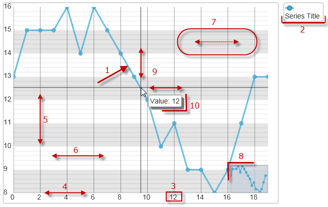

import ApiLink from 'docs-template/components/mdx/ApiLink.astro';

# Configurable Visual Elements (igDataChart)

##Topic Overview

### Purpose

This topic lists all configurable visual elements of the `igDataChart`™ control and the properties that manage them.

### Required Background

The following topics are prerequisite to understanding this topic:

-	[igDataChart Overview](/igdatachart-overview.mdx)

This topic provides conceptual information about the `igDataChart` control including its main features, minimum requirements for using charts and user functionality.

Configurable Visual Elements of the `igDataChart` Control and Related Properties

### Configurable visual elements summary

The following picture demonstrates the configurable visual elements of the `igDataChart` control. A listing of the properties that manage them is available in the [Configurable visual elements and related properties](#configuring-visual-elements-properties) block below.

**Configurable Visual Elements:**

​1) Data series

​2) Legend

​3) Axis label

​4) Axis line

​5) Axis major line

​6) Axis minor line

​7) Axis strip

​8) Overview plus detail panel

​9) Cross-hairs and cross-hair point

​10) Tooltip

### Configurable visual elements and related properties

The following table maps the visual elements of the `igDataChart` control and the properties that configure them.

<table class="table table-striped">
	<thead>
		<tr>
            <th colspan="">Visual Element</th>
            <th>Property</th>
</tr>
	</thead>
	<tbody>
        <tr>
            <td>Data Series</td>
            <td><ApiLink type="igDataChart" member="series" section="options" label="series[]" /></td>
</tr>
        <tr>
            <td>Legend</td>
            <td><ApiLink type="igDataChart" member="series.legend" section="options" label={'series["key"].legend'} /></td>
</tr>
        <tr>
            <td>Axis Labels</td>
            <td><ApiLink type="igDataChart" member="axes.labelVisibility" section="options" label={'axes["key"].labelVisibility'} />   <ApiLink type="igDataChart" member="axes.labelLocation" section="options" label={'axes["key"].labelLocation'} />   <ApiLink type="igDataChart" member="axes.labelExtent" section="options" label={'axes["key"].labelExtent'} />   <ApiLink type="igDataChart" label={'axes["key"].labelHorizontalAlignment'} />   <ApiLink type="igDataChart" member="axes.labelVerticalAlignment" section="options" label={'axes["key"].labelVerticalAlignment'} />   <ApiLink type="igDataChart" member="axes.labelTopMargin" section="options" label={'axes["key"].labelTopMargin'} />   <ApiLink type="igDataChart" member="axes.labelRightMargin" section="options" label={'axes["key"].labelRightMargin'} />   <ApiLink type="igDataChart" member="axes.labelBottomMargin" section="options" label={'axes["key"].labelBottomMargin'} />   <ApiLink type="igDataChart" member="axes.labelLeftMargin" section="options" label={'axes["key"].labelLeftMargin'} /></td>
</tr>
        <tr>
            <td>Axis Lines</td>
            <td><ApiLink type="igDataChart" member="axes.stroke" section="options" label={'axes["key"].stroke'} /></td>
</tr>
        <tr>
            <td>Axis Major Lines</td>
            <td><ApiLink type="igDataChart" member="axes.majorStroke" section="options" label={'axes["key"].majorStroke'} /></td>
</tr>
        <tr>
            <td>Axis Minor Lines</td>
            <td><ApiLink type="igDataChart" member="axes.minorStroke" section="options" label={'axes["key"].minorStroke'} /></td>
</tr>
        <tr>
            <td>Axis Stripes</td>
            <td><ApiLink type="igDataChart" member="axes.strip" section="options" label={'axes["key"].strip'} /></td>
</tr>
        <tr>
            <td>Axis Ticks</td>
            <td><ApiLink type="igDataChart" member="axes.tickLength" section="options" label={'axes["key"].tickLength'} />   <ApiLink type="igDataChart" member="axes.tickStroke" section="options" label={'axes["key"].tickStroke'} />   <ApiLink type="igDataChart" member="axes.tickStrokeThickness" section="options" label={'axes["key"].tickStrokeThickness'} />   <ApiLink type="igDataChart" member="axes.tickStrokeDashArray" section="options" label={'axes["key"].tickStrokeDashArray'} /></td>
</tr>
        <tr>
            <td>Overview Plus Detail window</td>
            <td><ApiLink type="igDataChart" member="overviewPlusDetailPaneVisibility" section="options" label="overviewPlusDetailPaneVisibility" /></td>
</tr>
        <tr>
            <td>Cross-hairs</td>
            <td><ApiLink type="igDataChart" member="crosshairVisibility" section="options" label="crosshairVisibility" />   <ApiLink type="igDataChart" member="crosshairPoint" section="options" label="crosshairPoint" /></td>
</tr>
        <tr>
            <td>Tooltip</td>
            <td><ApiLink type="igDataChart" member="series.showTooltip" section="options" label={'series["key"].showTooltip'} />   <ApiLink type="igDataChart" member="series.tooltipTemplate" section="options" label={'series["key"].tooltipTemplate'} /></td>
</tr>
    </tbody>
</table>

###  Samples

This sample configures several of the elements, available in the `igDataChart` control.
Chart elements such as axis, labels, grid lines, grid stripes, zoom bars, series, trend lines, indicators and crosshairs are all available to enhance the control's presentation.

   [Chart Elements](&#123;environment:SamplesEmbedUrl&#125;/data-chart/chart-elements)

In addition to the settings above, the sample below demonstrates both enabling the default tooltip for the Chart’s series and configuring a custom tooltip template for the "United States" series.

   [Series Tooltips](&#123;environment:SamplesEmbedUrl&#125;/data-chart/series-tooltips)

##Related Content

### Topics

The following topics provide additional information related to this topic.

-	[Adding igDataChart](/igdatachart-adding.mdx): This topic demonstrates how to create add the `igDataChart`™ control and bind it to data.

-	[jQuery and MVC API Reference Links (igDataChart)](/igdatachart-api-links.mdx): This topic provides links to the API documentation for jQuery and &#123;environment:ProductNameMVC&#125; class for `igDataChart`™ control.

 

 

