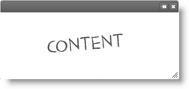
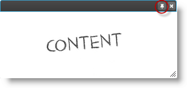

import ApiLink from 'docs-template/components/mdx/ApiLink.astro';

# igDialog Pin

## Topic Overview

### Purpose

This topic demonstrates how to configure the `igDialog`™ so that it can be pinned and unpinned and how to perform these actions.

### Required background

The following topics are prerequisites to understanding this topic:

- [***igDialog* Overview**](../00_igDialog Overview.mdx): The topic introduces the user to the `igDialog` control’s main features.

- [**Adding *igDialog***](../01_Adding igDialog.mdx): This topic demonstrates how to add the `igDialog` control to a web page.


### In this topic

This topic contains the following sections:

-   [**Introduction**](#introduction)
-   [**Control Configuration Summary**](#configuration-summary)
-   [**Configuring Pin/Unpin**](#pin-unpin)
    -   [Property Settings](#pin-unpin-properties)
    -   [Example](#pin-unpin-example)
-   [**Pin on Minimized**](#pin-on-minimized)
    -   [Property Settings](#pin-on-minimized-properties)
    -   [Example](#pin-on-minimized-example)
-   [**Pin igDialog**](#pin)
    -   [Code](#pin-code)
    -   [Example](#pin-example)
-   [**Unpin igDialog**](#unpin)
    -   [Code](#unpin-code)
    -   [Example](#unpin-example)
-   [**Related Content**](#related-content)
    -   [Topics](#topics)
    -   [Samples](#samples)


## Introduction

When the `igDialog` is pinned, then the whole control with its HTML content is moved to the original container and the dialog’s absolute position is removed. Pinned `igDialog` does not support modal and maximized states and it is not movable.

> **Note:** If the parent element of the original `igDialog` container is invisible, then when dialog is pinned it also becomes invisible.


## Control Configuration Summary

The following table lists the configurable aspects of the `igDialog` control. Additional details are available after the table.

|  |  |  |
| --- | --- | --- |
| Configurable aspects | Details | Properties and Methods |
| Configuring pin/unpin | The properties that need to be configured to allow pin and unpin of the *igDialog* using control UI. | <ApiLink type="igDialog" member="showPinButton" section="options" label="showPinButton" /> <ApiLink type="igDialog" member="pinned" section="options" label="pinned" /> |
| Pin on minimized | The property that allows you to configure the *igDialog* so that when the state is changed to minimized, it becomes pinned to its parent. | <ApiLink type="igDialog" member="pinOnMinimized" section="options" label="pinOnMinimized" /> |
| Pin *igDialog* | Method from *igDialog* API that allows pinning. | <ApiLink type="igDialog" member="pin" section="methods" label="pin()" /> |
| Unpin *igDialog* | Method from *igDialog* API that allows unpinning. | <ApiLink type="igDialog" member="unpin" section="methods" label="unpin()" /> |


## Configuring Pin/Unpin

The table below demonstrates which properties need to be configured in order to pin the `igDialog` control. Setting <ApiLink type="igDialog" member="showPinButton" section="options" label="showPinButton" /> property will enable the pin icon in the header, while setting the <ApiLink type="igDialog" member="pinned" section="options" label="pinned" /> property will configure the initial state of the control.

### Property Settings

The following table maps the desired functionality to property settings:

In order to: | Use this property: | And set it to:
--- | --- | ---
Show pin button | <ApiLink type="igDialog" member="showPinButton" section="options" label="showPinButton" /> | true
Pin the igDialog | <ApiLink type="igDialog" label="pinned" /> | true


### Example

The screenshot below demonstrates how the `igDialog` looks as a result of the settings above. The window will be pinned at the top left corner of its parent:




## Pin on Minimized

The `igDialog` is configured so that it will pin every time it is minimized. For the needs of this example, the `igDialog` is minimized when configured.

### Property Settings

The following table maps the desired functionality to the property settings:

In order to: | Use this property: | And set it to:
--- | --- | ---
Pin on minimize | <ApiLink type="igDialog" member="pinOnMinimized" section="options" label="pinOnMinimized" /> | true
Minimize igDialog | <ApiLink type="igDialog" member="state" section="options" label="state" /> | “minimized”


### Example

The screenshot below demonstrate how the `igDialog` looks as a result of the settings above. The window will be minimized and pinned at the top left corner of its parent:


## Pin igDialog

As a result of the configuration from the previous paragraph, you will be able to pin the dialog window when the window is unpinned and by pressing the button at the top right corner of the header. If you have the <ApiLink type="igDialog" member="showPinButton" section="options" label="showPinButton" /> option disabled, then you can pin the control using its API.

### Code

The following code demonstrates how to pin the `igDialog` using its API:

**In JavaScript:**

```js
$('#igDialog).igDialog("pin");
```

### Example

The screenshot below shows you the position of the pin button:




## Unpin igDialog

As a result of the configuration from the previous paragraph, you will be able to unpin the dialog window, when the window is pinned and by pressing the button at the top right corner of the header. If you have the <ApiLink type="igDialog" member="showPinButton" section="options" label="showPinButton" /> option disabled, then you can unpin the control using its API.

### Code

The following code demonstrates how to unpin the `igDialog` using its API:

**In JavaScript:**

```js
$('#igDialog).igDialog("unpin");
```

### Example

The screenshot below shows you the position of the unpin button:


## Related Content

### Topics

The following topics provide additional information related to this topic:

- [***igDialog* Overview**](../00_igDialog Overview.mdx): The topic introduces the user to the `igDialog` control’s main features.

- [Adding *igDialog*](../01_Adding igDialog.mdx): This topic demonstrates how to add the `igDialog` control to a web page.


### Samples

The following samples provide additional information related to this topic:

- [Icons](&#123;environment:SamplesUrl&#125;/dialog-window/icons): The sample that shows you how to show `igDialog` icons.


 

 


