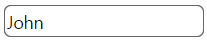
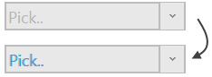

# igTextEditor Styling and Theming

The `igTextEditor` control is jQuery-based with a number of options for styling. To customize style of the text editor you can use different themes or apply custom CSS rules to the control. 

The &#123;environment:ProductName&#125; package comes with a number of jQuery UI and Bootstrap themes. Bootstrap support also includes generating and customizing your own bootstrap themes - see [Styling and Theming](///general-and-getting-started/styling-and-theming/deployment-guide-styling-and-theming.mdx) for details. All of the themes will style all controls including the editors on the page.


## Using ThemeRoller

As the `igTextEditor` control uses the jQuery UI CSS framework it can also be fully styled using the [jQuery UI ThemeRoller](http://jqueryui.com/themeroller/) where you can customize your own theme or choose from a gallery of available ones. These themes replace the ones that come by default with &#123;environment:ProductName&#125;.

Text editor with drop list using the Darkness theme:




## Custom styling

Your CSS may include style overrides for many more elements of the text editor. For a full list of available classes see the [API Reference Theming classes](&#123;environment:jQueryApiUrl&#125;/ui.igTextEditor#theming). Styles can be applied both by overriding the global classes applied to all editors or by targeting specific elements by ID or other specific trait to allow for more per-control customization.

The default class applied to the top element when editor is rendered in container is `'ui-igedit-container ui-state-default'` which can be used to target general element overrides or very specific ones, such as the placeholder `ui-igedit-placeholder`:

```html
<style>
.ui-igedit-placeholder
{
	text-shadow: 1px 0px #00aeef;
}
</style>
```



##Related Topics  

-   [igTextEditor Overview](/igtexteditor-overview.mdx)
-   [igTextEditor Known Issues](/igtexteditor-known-issues.mdx)

 

 


