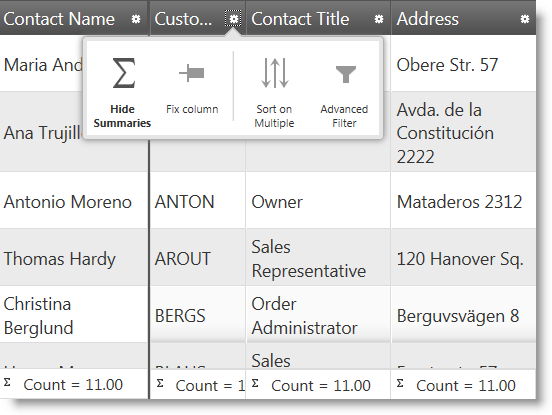
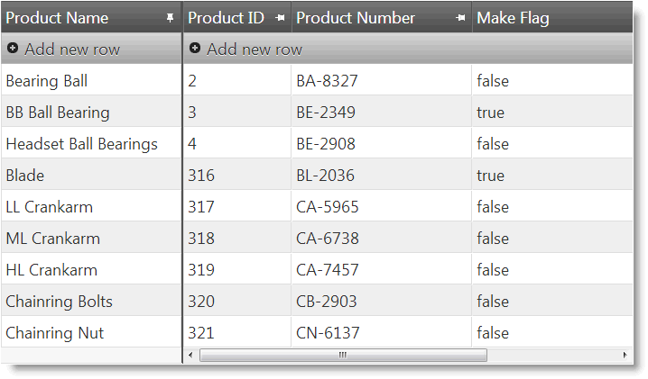
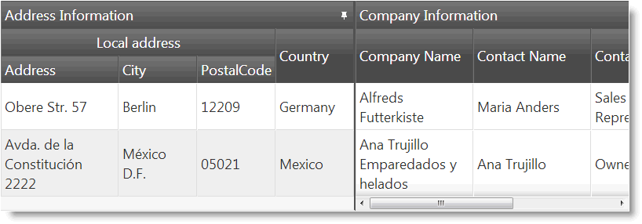
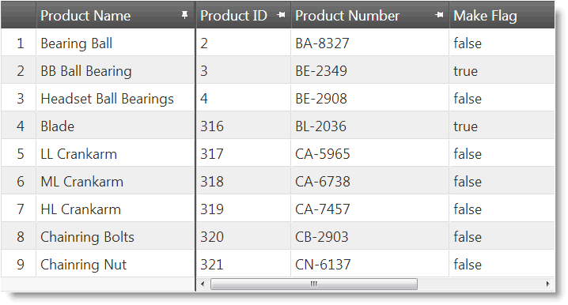

import ApiLink from 'docs-template/components/mdx/ApiLink.astro';

# Column Fixing Overview (igGrid)

## Topic Overview

### Purpose

This topic provides conceptual overview of the `igGrid`™ Column Fixing feature including the supported user interactions and the main configuration options.

### Required background

The following topics are prerequisites to understanding this topic:

- [igGrid Overview](///iggrid-overview.mdx): This topic provides a conceptual overview of the `igGrid` control and its features explains, with code examples, how to add it to an HTML page.

- [igGrid/igDataSource Architecture Overview](///iggrid-igdatasource-architecture-overview.mdx): This topic explains the inner workings of the `igGrid` control and its interaction with the data source component (`igDataSource`™).

- [Feature Chooser](//iggrid-feature-chooser.mdx): This topic explains the `igGrid` Feature Chooser menu and its sections.

- [igGrid Features](//iggrid-features-landing-page.mdx): This is a group of topics explaining the features of the `igGrid` control. Understanding of the other features is required because of their integration with the Column Fixing feature

### In this topic

This topic contains the following sections:

-   [**Introduction**](#introduction)
-   [**User Interactions and Usability**](#user-interactions-usability)
    -   [User interactions summary chart](#usability-summary)
    -   [Pin button summary](#pin-button-summary)
    -   [Feature Chooser menu summary](#feature-chooser-menu)
    -   [Touch support](#touch-support)
-   [**Configuring Column Fixing**](#configuring)
    -   [Column Fixing configuration summary chart](#configuring-summary)
    -   [Column Fixing default configuration](#default-configuration)
-   [**Column Fixing Integration with Other Features**](#feature-integration)
    -   [Supported features summary](#supported-features)
    -   [Non-supported features summary](#non-supported-features)
    -   [Updating feature](#updating-feature)
    -   [Multi-Column Headers feature](#multi-column-headers)
    -   [Row Selectors feature](#row-selectors)
    -   [Virtualization](#virtualization)
-   [**Keyboard Interactions**](#keyboard-interaction) 
-   [**Related Content**](#related-content)
    -   [Topics](#topics)
    -   [Samples](#samples)

## Introduction

Column Fixing is a feature of the `igGrid` that enables fixing a column on the left or on the right of the grid, so that it cannot get out of user view when scrolling horizontally. This can be performed either by the user from the grid interface or programmatically through the API of the Column Fixing feature. When Column Fixing is activated, the fixed/fixable columns are indicated with a pin button in their headers.

The user can fix columns by clicking on the pin icon in the column header or through feature chooser dialog when there are multiple features enabled. Column fixing works on touch-enabled devices as well.

When column fixing is applied, it defines the grid into two areas:

-   **Fixed Columns area** – a non-scrollable this area containing the fixed columns.
-   **Non-Fixed Columns area** – a scrollable area containing the rest of the columns (the unfixed columns). It has a horizontal scroll bar.

The Fixed Columns area can be either on the left (default) or the right. The following picture demonstrates a two-column Fixed Columns area position on the left.

Column Fixing feature requires the columns to have their width defined in pixels units (either explicitly or using the <ApiLink type="iggrid" member="defaultColumnWidth" section="options" label="defaultColumnWidth" /> option).

>**Note:** Only widths in pixel units is supported for the columns. The grid width can be set in either pixel or percentage units (cannot be omitted).

Fixed and Non-Fixed Columns areas in the `igGrid`™ control are implemented as a two separate table DOM elements. This requires all grid DOM manipulation methods to be duplicated for the Fixed Columns area. Usually, the Fixed Column area APIs are prefixed with the word fixed.

## User Interactions and Usability

Users can fix and unfix columns using:

-   [The pin button](#pin-button-summary) on the column header
-   [The Feature Chooser drop-down menu](#feature-chooser-menu)

### User interactions summary chart

The following table lists the actions with which the user can fix columns on either a standard computer or a touch-enabled device. The user can fix/unfix column:

Using… | Details | Configurable?
---|---|---
The pin button on the column header | The user can fix or unfix a column by clicking the pin button on the column header. | 
The Feature Chooser menu | The user can fix or unfix a column by selecting the Fix column / Unfix column option from the Feature Chooser’s drop-down menu. | 

### Pin button summary

The pin button in the column header is available only when the Column Fixing feature is enabled for that column. The pin buttons’ icon indicates state of the column:

-   Column is fixed:

    

-   Column is not fixed:

    

Clicking on the pin button fixes/unfixes the column. Columns which are disabled from fixing do not have a pin button or feature chooser menu item.

Fixing a column queues it at the last (utmost-right) position of the Fixed Columns area. Unfixing a column inserts it at the first (utmost-left) position of the Non-Fixed Columns area.

### Feature Chooser menu summary

If Column Fixing is enabled in the [Feature Chooser](//iggrid-feature-chooser.mdx), it will display as a menu item in the Feature Chooser menu.

When Column Fixing is enabled, the Fix/Unfix Column option is listed as an item in the Feature Chooser menu.

### Touch support

On touch-enabled devices, both the pin button and the Feature Chooser drop-down menu are operational.

## Configuring Column Fixing

### Column Fixing configuration summary chart

The following table lists the configurable aspects of `igGrid` Column Fixing.

|  |  |  |
| --- | --- | --- |
| Configurable aspect | Details | Properties |
| [Enabling/Disabling](/iggrid-columnfixing-configuring.mdx) | By default, columns can be fixed by users. You can enable/disable column from fixing. | <ApiLink type="iggridcolumnfixing" member="columnSettings" section="options" label="columnSettings" /> <ApiLink type="iggridcolumnfixing" member="columnSettings.columnKey" section="options" label="columnSettings.columnKey" /> <ApiLink type="iggridcolumnfixing" member="columnSettings.allowFixing" section="options" label="columnSettings.allowFixing" /> |
| [Fixed columns placement](/iggrid-columnfixing-configuring.mdx) | By default, the fixed columns are placed on the left and the unfixed columns – on the right. You can swap the positions of the fixed and unfixed columns (i.e. fixed columns are placed on the right and the unfixed columns – on the left). | <ApiLink type="iggridcolumnfixing" member="fixingDirection" section="options" label="fixingDirection" /> |
| [Initial fix state](/iggrid-columnfixing-configuring.mdx) | By default, the initial fix state of a column is unfixed. You can configure the initial fix state to be fixed. | <ApiLink type="iggridcolumnfixing" member="columnSettings" section="options" label="columnSettings" /> <ApiLink type="iggridcolumnfixing" member="columnSettings.columnKey" section="options" label="columnSettings.columnKey" /> <ApiLink type="iggridcolumnfixing" member="columnSettings.isFixed" section="options" label="columnSettings.isFixed" /> |
| [Minimum Non-Fixed Columns area width](/iggrid-columnfixing-configuring.mdx) | You configure the minimum width of the Non-Fixed Columns area. The minimum width ensures that the scrollbar will always be kept operational for the user. The default width of the Non-Fixed Columns area is 30 px. | <ApiLink type="iggridcolumnfixing" member="minimalVisibleAreaWidth" section="options" label="minimalVisibleAreaWidth" /> |
| Initial fix state of data-skip columns | Some features like Row Selectors use data-skip columns to render additional content to the grid. These columns are not bindable to data and serve functional purposes (e.g. the Row Selector column) so their initial fix state is managed separately from the data-bound columns. This is done with a special property, <ApiLink type="iggridcolumnfixing" member="fixNondataColumns" section="options" label="fixNondataColumns" />. **Note:** This property works only when fixed columns are positioned on the left (i.e. the <ApiLink type="iggridcolumnfixing" member="fixingDirection" section="options" label="fixingDirection" /> option is set to “left”). | <ApiLink type="iggridcolumnfixing" member="fixNondataColumns" section="options" label="fixNondataColumns" /> |

### Column Fixing default configuration

By default, columns are indicated with a pin button in their headers and the fixed columns are placed on the left.

The following table lists the default settings for the Fixed Column feature and explains their meaning.

Property | Type | Default Value | Description
---|---|---|---
<ApiLink type="iggridcolumnfixing" member="fixingDirection" section="options" label="fixingDirection" /> | string | “left” | Fixed columns are placed on the left.
<ApiLink type="iggridcolumnfixing" member="showFixButtons" section="options" label="showFixButtons" /> | bool | true | The pin buttons for Column Fixing are shown in the header cells.
<ApiLink type="iggridcolumnfixing" member="syncRowHeights" section="options" label="syncRowHeights" /> | bool | true | The heights of the rows in the Fixed Columns area are synchronized with heights of the rows in the Non- Fixed Columns area.
<ApiLink type="iggridcolumnfixing" member="scrollDelta" section="options" label="scrollDelta" /> | number | 40 | The delta space when scrolling with the mouse wheel or keyboard in the Fixed Columns area is set to 40px.
<ApiLink type="iggridcolumnfixing" member="minimalVisibleAreaWidth" section="options" label="minimalVisibleAreaWidth" /> | number | 30 | The minimal visible width of the Non-Fixed Columns area is set to30px.
<ApiLink type="iggridcolumnfixing" member="fixNondataColumns" section="options" label="fixNondataColumns" /> | bool | true | The initial fix state of the data-skip columns is fixed.

## Column Fixing Integration with Other Features

### Supported features summary

The `igGrid` Column Fixing feature is integrated with the following `igGrid` features:

-   [Cell Merging](../../07_Cell Merging/~igGrid_CellMerging_LandingPage.mdx)
-   [Filtering](/iggrid-filtering.mdx)
-   [Multi-column Headers](/multi-headers/iggrid-multicolumnheaders-landingpage.mdx)
-   [Paging](//iggrid-paging.mdx)
-   [Resizing](/iggrid-column-resizing.mdx)
-   [Row Selectors](../../02_Row Selectors/~igGrid_Row_Selectors.mdx)
-   [Selection](//selection/iggrid-selection.mdx)
-   [Sorting](/sorting/iggrid-sorting.mdx)
-   [Summaries](/summaries/iggrid-column-summaries.mdx)
-   [Tooltips](igGrid-Tooltips.html)
-   [Virtualization](//virtualization/iggrid-virtualization.mdx)(Fixed and Continuous Virtualization are supported.)
-   [Updating](//updating/iggrid-updating.mdx)
-   [Hiding](/hiding/iggrid-column-hiding.mdx)

### Non-supported features summary

The column fixing functionality is not supported with the following `igGrid` features:

-   [GroupBy](/grouping/iggrid-groupby.mdx)
-   [Responsive Web Design (RWD) Mode](//responsive/iggrid-responsive-web-design-mode-landingpage.mdx)
-   [Unbound Columns](/unbound/iggrid-unboundcolumns-landing-page.mdx) 

When an unsupported feature is enabled with Column Fixing, an exception is thrown.

### Updating feature

When [`Updating`](//updating/iggrid-updating.mdx) is enabled in combination with Column Fixing, there are two separate **Add new row** buttons, one for the Fixed Columns area and one for the Non-Fixed Columns area, respectively.

### Multi-Column Headers feature

When the Multi-Column Headers feature is enabled, Column Fixing works only for the topmost level of the multi-column header. Inner level groups or individual columns cannot be fixed.

### Row Selectors feature

Column Fixing’s <ApiLink type="iggridcolumnfixing" member="fixNondataColumns" section="options" label="fixNondataColumns" /> option affects the row selectors’ column behavior. When `fixNondataColumns` is set to true, the row selectors column is initially fixed. When `fixNondataColumns` is set to false, the row selectors column retains the normal behavior to be always positioned on the left and not being fixed in Fixed Columns area. By default, `fixNondataColumns` is set to true.

The `fixNondataColumns` option is ignored when the Fixed Columns and Non-Fixed Columns areas are swapped, i.e. when the <ApiLink type="iggridcolumnfixing" member="fixingDirection" section="options" label="fixingDirection" /> option is set to ‘right’.

### Virtualization

The `igGrid` feature Column Fixing is integrated with the igGrid [Virtualization](//virtualization/iggrid-virtualization.mdx) feature (both Fixed Virtualization as well as Continues Virtualization). When the Virtualization is enabled it will be applied on all of the columns – the fixed and the non-fixed ones and the scroll position between the two areas of the Grid will synchronize.

>**Note:** Pay attention that column virtualization is not supported.

## Keyboard Interactions

The following keyboard interactions are available.

When focus is on the grid:

-	TAB: Can move focus between the focusable elements of the column fixing UI: fix/unfix icon in the column header.

When focus is on the fix/unfix icon of a column header:

-	ENTER – Fixes/Unfixes the related column.

## Related Content

### Topics

The following topics provide additional information related to this topic.

- [Enabling Column Fixing (igGrid)](/iggrid-columnfixing-enabling.mdx): This topic explains, with code examples, how to enable the Column Fixing feature of the `igGrid` in both JavaScript and ASP.NET MVC.

- [Configuring Column Fixing (igGrid)](/iggrid-columnfixing-configuring.mdx): This topic explains, with code examples how to configure Column Fixing feature of the `igGrid` control including the position of the Fixed Columns area, the initial column fix state, and the minimum Non-Fixed Columns area width.

- [Method Reference (Column Fixing, igGrid)](/iggrid-columnfixing-method-reference.mdx): This topic provides reference information about the methods related to the Column Fixing feature of the `igGrid` control.

### Samples

The following samples provide additional information related to this topic.

- [Column Fixing](&#123;environment:SamplesUrl&#125;/grid/column-fixing): This sample demonstrates the basic functionalities of the `igGrid`’s Column Fixing feature – setting columns fixed by default and preventing columns from being fixed by the user.

 

 

