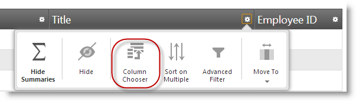
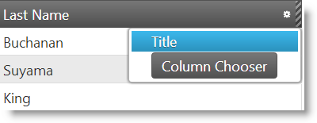
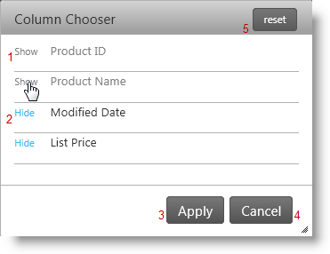
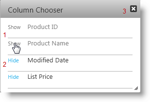

import ApiLink from 'docs-template/components/mdx/ApiLink.astro';

# Configuring the Column Chooser (igGrid)

## Topic Overview

### Purpose

This topic demonstrates how to use the `igGrid`™ control’s Hiding Column Chooser.

### Required background

The following table lists the topics required as a prerequisite to understanding this topic.

- [**Touch Support for &#123;environment:ProductName&#125; Controls**](/////general-and-getting-started/touch-support-for-igniteui-for-jquery-controls.mdx): This topic introduces the updates to &#123;environment:ProductName&#125;™ controls for touch-support interactions.

- [**igGrid Feature Chooser**](//iggrid-feature-chooser.mdx): This topic explains the `igGrid` Feature Chooser menu and its sections.

- [**igGrid Hiding Overview**](/iggrid-column-hiding.mdx): Overview of the `igGrid` control’s Hiding feature.

### In this topic

This topic contains the following sections:

-   [**Introduction**](#introduction)
-   [**Dialog Window**](#dialog-window-states)
    -   [Hide multiple columns at once](#hide-multiple-columns)
    -   [Hide columns on click](#hide-on-click)
-   [**Property Reference**](#property-reference)
-   [**Method Reference**](#method-reference)
-   [**Event Reference**](#event-reference)
-   [**Related Content**](#related-content)
    -   [Topics](#topics)
    -   [Samples](#samples)

## Introduction

#### Introduction to the igGridHiding Column Chooser

This topic demonstrates how to work with the `igGrid` Hiding dialog also known as Column Chooser. You can activate the Columns Chooser window in two different ways. The first way is to select *Column Chooser* list item from the `igGrid` Feature Chooser advanced section and second on is to press *Column Chooser* button from the hidden column context menu.

 

## Dialog Window states

The following table summarizes the states of the Hiding Column Chooser Window. The window has two states as defined by the value of the option <ApiLink type="iggridhiding" member="columnChooserHideOnClick" section="options" label="columnChooserHideOnClick" /> (default value is `false`). If set to `true`, then the columns will hide immediately on click of the column name in the Column Chooser.

Additional details are available after the summary table.

State | <ApiLink type="iggridhiding" member="columnChooserHideOnClick" section="options" label="columnChooserHideOnClick" /> | Description
------|----------------------------------|------------
[Hide multiple columns at once](#hide-multiple-columns) | `false` | Multiple columns are selected from the column chooser window and columns are hidden when the changes are applied in the window.
[Hide column on click](#hide-on-click) | `true` | Columns are immediately hidden by selecting a column from the column chooser window.

### Hide multiple columns at once

By default the property <ApiLink type="iggridhiding" member="columnChooserHideOnClick" section="options" label="columnChooserHideOnClick" /> is set to `false`. This means that you must select which columns to show or hide and then apply the changes to the grid.

Use the following buttons:

1.  Show - to show the column( the whole row is clickable)
2.  Hide – to hide the column( the whole row is clickable)
3.  Apply – to apply the columns you want to show/hide
4.  Cancel – to close the Column Chooser and don’t apply any changes
5.  Reset – to return the default state of all the columns, like they were when the modal dialog was opened\.
6.  ESC (key) – close the modal dialog

### Hide columns on click

When the property <ApiLink type="iggridhiding" member="columnChooserHideOnClick" section="options" label="columnChooserHideOnClick" /> is set to `true` then when you click on a **Show** or **Hide** button the selected action will take effect immediately to a column.

To close the window use the button at the top right or press the **ESC** key.

Use the following buttons:

1.  Show – to immediately show the column( the whole row is clickable)
2.  Hide – to immediately hide the column( the whole row is clickable)
3.  Close button – close the modal dialog
4.  ESC (key) – close the modal dialog

## Property Reference

This section explains `igGrid` control’s Hiding properties that affect Column Chooser.

The following table shows the `igGrid` control’s Hiding properties that are responsible for the configuration of the Column Chooser.

Property | Description
---------|----------
<ApiLink type="iggridhiding" member="columnChooserHideOnClick" section="options" label="columnChooserHideOnClick" /> | Specifies whether the grid will show or hide a column when the column name is clicked in the column chooser.
<ApiLink type="iggridhiding" member="columnChooserWidth" section="options" label="columnChooserWidth" /> | The default column chooser width in pixels.
<ApiLink type="iggridhiding" member="columnChooserHeight" section="options" label="columnChooserHeight" /> | The default column chooser height in pixels
<ApiLink type="iggridhiding" member="columnChooserAnimationDuration" section="options" label="columnChooserAnimationDuration" /> | Specifies time in milliseconds for the animation duration to show or hide Column Chooser
<ApiLink type="iggridhiding" member="columnChooserCaptionText" section="options" label="columnChooserCaptionText" /> | The caption of the column chooser dialog.
<ApiLink type="iggridhiding" member="columnChooserDisplayText" section="options" label="columnChooserDisplayText" /> | The text used in the drop down tools menu (Feature Chooser) to launch the column chooser dialog.
<ApiLink type="iggridhiding" member="hiddenColumnIndicatorTooltipText" section="options" label="hiddenColumnIndicatorTooltipText" /> | The text displayed in the tooltip of the hidden column indicator.
<ApiLink type="iggridhiding" member="columnHideText" section="options" label="columnHideText" /> | The text used in the drop down tools menu (Feature Chooser) to hide a column.
<ApiLink type="iggridhiding" member="columnChooserShowText" section="options" label="columnChooserShowText" /> | The text used in the column chooser to show a column.
<ApiLink type="iggridhiding" member="columnChooserHideText" section="options" label="columnChooserHideText" /> | The text used in the column chooser to hide a column.
<ApiLink type="iggridhiding" member="columnChooserResetButtonLabel" section="options" label="columnChooserResetButtonLabel" /> | Text label for reset button.
<ApiLink type="iggridhiding" member="columnChooserButtonApplyText" section="options" label="columnChooserButtonApplyText" /> | Specifies text of button which applies changes in modal dialog.
<ApiLink type="iggridhiding" member="columnChooserButtonCancelText" section="options" label="columnChooserButtonCancelText" /> | Specifies text of button which cancels changes in modal dialog.

## Method Reference

This section explains `igGrid` control’s Hiding methods that affect Column Chooser.

The following table shows the `igGrid` control’s Hiding methods exposed by the Column Chooser API.

Method | Description
-------|------------
<ApiLink type="iggridhiding" member="showColumnChooser" section="methods" label="showColumnChooser" /> | Shows the Column Chooser dialog. If it is visible the method does nothing.
<ApiLink type="iggridhiding" member="hideColumnChooser" section="methods" label="hideColumnChooser" /> | Hides the Column Chooser dialog. If it is not visible the method does nothing.
<ApiLink type="iggridhiding" member="resetHidingColumnChooser" section="methods" label="resetHidingColumnChooser" /> | Reset hidden/shown column to initial state of dialog (when it is opened)
<ApiLink type="iggridhiding" member="removeColumnChooserResetButton" section="methods" label="removeColumnChooserResetButton" /> | Remove Reset button in column chooser modal dialog

## Event Reference

This section explains `igGrid` control’s Hiding events raised by the Modal Windows.

The following table shows the `igGrid` Hiding events that are fired during user interaction with the Column Chooser.

Event | Description
-------|---------
<ApiLink type="iggridhiding" member="columnChooserOpening" section="events" label="columnChooserOpening" /> | Event fired before the column chooser is opened.
<ApiLink type="iggridhiding" member="columnChooserOpened" section="events" label="columnChooserOpened" /> | Event fired after the column chooser opens.
<ApiLink type="iggridhiding" member="columnChooserMoving" section="events" label="columnChooserMoving" /> | Event fired every time the column chooser changes its position.
<ApiLink type="iggridhiding" member="columnChooserClosing" section="events" label="columnChooserClosing" /> | Event fired before the column chooser is closed.
<ApiLink type="iggridhiding" member="columnChooserClosed" section="events" label="columnChooserClosed" /> | Event fired after the column chooser is closed.
<ApiLink type="iggridhiding" member="columnChooserContentsRendering" section="events" label="columnChooserContentsRendering" /> | Event fired before the contents of the column chooser are rendered.
<ApiLink type="iggridhiding" member="columnChooserContentsRendered" section="events" label="columnChooserContentsRendered" /> | Event fired after the contents of the column chooser are rendered.
<ApiLink type="iggridhiding" member="columnChooserButtonApplyClick" section="events" label="columnChooserButtonApplyClick" /> | Event fired when Reset button in column chooser is clicked
<ApiLink type="iggridhiding" member="columnChooserButtonResetClick" section="events" label="columnChooserButtonResetClick" /> | Event fired when Reset button in column chooser is clicked

## Related Content

### Topics

The following topics provide additional information related to this topic.

- [**Touch Support for &#123;environment:ProductName&#125; Controls**](/////general-and-getting-started/touch-support-for-igniteui-for-jquery-controls.mdx): This topic introduces the updates to &#123;environment:ProductName&#125;™ controls for touch-support interactions.

- [**igGrid Feature Chooser**](//iggrid-feature-chooser.mdx): This topic explains the `igGrid` Feature Chooser menu and its sections.

- [**igGrid Hiding Overview**](/iggrid-column-hiding.mdx): Overview of the `igGrid` control’s Hiding feature.

### Samples

The following sample provides additional information related to this topic.

- [Feature Chooser](&#123;environment:SamplesUrl&#125;/grid/column-management): Sample that demonstrates the Feature Chooser.

