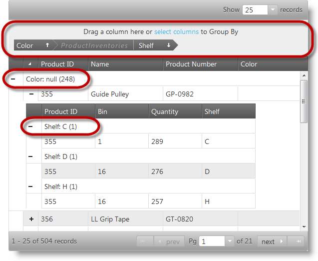

# Grouping Overview (igHierarchicalGrid)

import ApiLink from 'docs-template/components/mdx/ApiLink.astro';

# Grouping Overview (igHierarchicalGrid)

## Topic Overview
### Purpose

This topic introduces the igHierarchicalGrid™ control’s grouping feature as well as providing an overview of the configurable aspects of the feature.

#### In this topic

This topic contains the following sections:

-   [Introduction](#introduction)
-   [Grouping Configuration Summary](#summary)
-   [Related Content](#related-content)

##  Introduction

### Grouping in the igHierarchicalGrid summary

The igHierarchicalGrid control is implemented as a collection of flat grid objects (igGrid™) that work together. The grouping feature is enhanced to cover specific situations arising from having several flat grids nested within the hierarchical grid.

The igHierarchicalGrid supports a column grouping functionality that enables the user to utilize the data in one or more columns as a primary and, respectively, secondary criteria for grouping the records within the group.

Grouping in the igHierarchicalGrid works the same as the related function in Microsoft® Office Outlook® – you drag a column that you want to group by and drop it into a special grouping area above the grid. This re-arranges the grid with as many groups as distinct value existing in the selected column. In addition, inside the groups, the records are sorted. Dropping additional columns within the already existing groups results in further groupings.

You can define, implement and manage your own custom grouping method using the igGridGroupBy™ widget.

The picture bellow shows a hierarchical grid using the values of the Color column, at the root level, to group and arrange the data in the grid. That is to say the grid is grouped by its Color column at the root level. At the child level, the grid shows data from the ProductInventories table configured to group items by the Shelf column. Note columns serving as grouping criteria appear in the group by area (if the area is enabled) and in the group header rows with their corresponding value.

##  Grouping Configuration Summary
#### Grouping configuration summary chart

The configurable aspects of the igGridGroupBy widget related to the igHierarchicalGrid control.

| Configurable aspects | Details | Properties |
| --- | --- | --- |
| Grouping mode | There are local and remote grouping modes supported by the igGridGroupBy widget. | jQuery: <ApiLink type="iggridselection_hg" label="type" /> MVC: [Type](Infragistics.Web.Mvc~Infragistics.Web.Mvc.GridGroupBy~Type.html) |
| Column Settings | This option allows you to separately configure each column’s group by criteria. | jQuery: <ApiLink type="iggridselection_hg" label="columnSettings" /> MVC: [ColumnSettings](Infragistics.Web.Mvc~Infragistics.Web.Mvc.GridGroupBy~ColumnSettings.html) |
| Group summaries | Group summaries aggregate some group-specific information about every group, like the count of rows in the group. | jQuery: <ApiLink type="iggridselection_hg" label="summarySettings" /> MVC: [SummarySettings](Infragistics.Web.Mvc~Infragistics.Web.Mvc.GridGroupBy~SummarySettings.html) |
| Grouped row text templates | Template for the text of the grouped row. | jQuery: <ApiLink type="iggridselection_hg" label="groupedRowTextTemplate" /> MVC: [GroupedRowTextTemplate](Infragistics.Web.Mvc~Infragistics.Web.Mvc.GridGroupBy~GroupedRowTextTemplate.html) |
| Client events | The igGridGroupBy widget has special events that can be handled during its lifecycle. These events are raised when: The grouping action begins. (Cancelable.) The grouping action ends. | jQuery: <ApiLink type="iggridselection_hg" label="groupedColumnsChanging" /> <ApiLink type="iggridselection_hg" label="groupedColumnsChanged" /> |
| Appearance | Numerous features allowing you change the look-and-feel of the group indicators and their text. | jQuery: <ApiLink type="iggridselection_hg" label="groupByAreaVisibility" /> <ApiLink type="iggridselection_hg" label="initialExpand" /> <ApiLink type="iggridselection_hg" label="emptyGroupByAreaContent" /> <ApiLink type="iggridselection_hg" label="expansionIndicatorVisibility" /> <ApiLink type="iggridselection_hg" label="groupByLabelWidth" /> <ApiLink type="iggridselection_hg" label="labelDragHelperOpacity" /> <ApiLink type="iggridselection_hg" label="indentation" /> <ApiLink type="iggridselection_hg" label="expandTooltip" /> <ApiLink type="iggridselection_hg" label="collapseTooltip" /> <ApiLink type="iggridselection_hg" label="removeButtonTooltip" /> MVC: [GroupByAreaVisibility](Infragistics.Web.Mvc~Infragistics.Web.Mvc.GridGroupBy~GroupByAreaVisibility.html) [InitialExpand](Infragistics.Web.Mvc~Infragistics.Web.Mvc.GridGroupBy~InitialExpand.html) [EmptyGroupByAreaContent](Infragistics.Web.Mvc~Infragistics.Web.Mvc.GridGroupBy~EmptyGroupByAreaContent.html) [ExpansionIndicatorVisibility](Infragistics.Web.Mvc~Infragistics.Web.Mvc.GridGroupBy~ExpansionIndicatorVisibility.html) [GroupByLabelWidth](Infragistics.Web.Mvc~Infragistics.Web.Mvc.GridGroupBy~GroupByLabelWidth.html) [LabelDragHelperOpacity](Infragistics.Web.Mvc~Infragistics.Web.Mvc.GridGroupBy~LabelDragHelperOpacity.html) [Indentation](Infragistics.Web.Mvc~Infragistics.Web.Mvc.GridGroupBy~Indentation.html) [ExpandTooltip](Infragistics.Web.Mvc~Infragistics.Web.Mvc.GridGroupBy~ExpandTooltip.html) [CollapseTooltip](Infragistics.Web.Mvc~Infragistics.Web.Mvc.GridGroupBy~CollapseTooltip.html) [RemoveButtonTooltip](Infragistics.Web.Mvc~Infragistics.Web.Mvc.GridGroupBy~RemoveButtonTooltip.html) |

##  Related Content

### Topics
The following topics provide additional information related to this topic.

- [Enabling and Configuring Grouping](/ighierarchicalgrid-grouping-enabling-and-configuring.mdx): This topic demonstrates, with code examples, how to enable and configure the Grouping feature of the igHierarchicalGrid™ control in both jQuery and MVC.
- <ApiLink type="iggridselection_hg" label="igGridGroupBy jQuery Reference" />: A complete reference to the jQuery options, methods, events and style classes for the igGridGroupBy control.