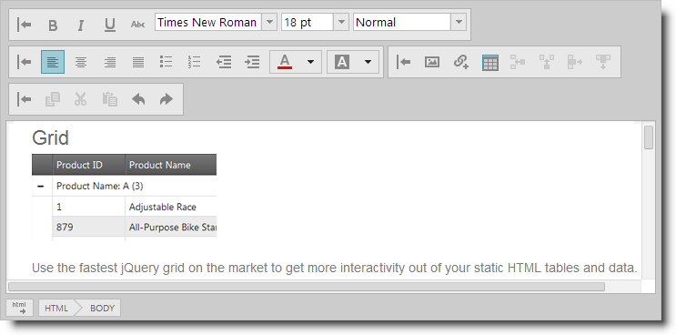

# igHtmlEditor

##In This Group of Topics

### Introduction

The `igHtmlEditor` control is a text editor control for creating and formatting online content. It has standard HTML editing capabilities.

Its options include managing the font face and size, the text alignment, as well as image, hyperlink and table support. These options are divided into four toolbars: text toolbar, formatting toolbar, insert objects toolbar, copy/paste toolbar. You can extend the `igHtmlEditor` functionality by creating custom toolbars.

### Topics

This section contains topics covering `igHtmlEditor` functionality.

-	[igHtmlEditor Overview](/ightmleditor-overview.mdx):  This topic explains the features of the `igHtmlEditor`.

-	[Adding igHtmlEditor](/ightmleditor-adding-ightmleditor.mdx):  This topic explains how to add `igHtmlEditor` to a web page. 

-	[Working with the igHtmlEditor](/working/ightmleditor-working-with-ightmleditor.mdx): This section explains how to use `igHtmlEditor`.

-	[Configuring Toolbars and Buttons](/working/ightmleditor-configuring-toolbars-and-buttons.mdx):  This topic explains how to configure `igHtmlEditor` toolbars and buttons.

-	[Saving the HTML Content Programmatically](/working/ightmleditor-saving-html-content.mdx):  This topic explains how to save `igHtmlEditor` content to server.

-	[Modifying Contents Programmatically](/working/ightmleditor-modifying-contents-programmatically.mdx):  This topic explains how to modify `igHtmlEditor` contents by using the API.

-	[Custom Toolbars](./03_Custom Toolbars/~igHtmlEditor_Custom_Toolbars.mdx): This topic makes an introduction to custom toolbars functionality of `igHtmlEditor`.

-	[Configuring Custom Toolbars](./03_Custom Toolbars/00_igHtmlEditor_Configuring_Custom_Toolbars.mdx): This topic describes how to configure custom toolbar of the `igHtmlEditor`.

-	[Adding a Button to a Custom Toolbar](./03_Custom Toolbars/01_igHtmlEditor_Adding_Button_to_Custom_Toolbar.mdx): This topic describes how to add buttons to a custom toolbar of the `igHtmlEditor`.

-	[Adding a Combo Box to a Custom Toolbar](./03_Custom Toolbars/02_igHtmlEditor_Adding_Combo_to_Custom_Toolbar.mdx): This topic describes how to add a combo to the custom toolbar of the `igHtmlEditor`.

-	[Styling and Theming](/ightmleditor-styling-and-theming.mdx): This topic explains how to apply styles to the `igHtmlEditor` control.

-	[MVC Helper API Reference Links](/ightmleditor-asp-net-mvc-helper-api.mdx): This topic provides links to the API documentation for the ASP.NET MVC helper class for the `igHtmlEditor` control.

-	[Accessibility Compliance](/ightmleditor-accessibility-compliance.mdx): This topic explains `igHtmlEditor` accessibility features and provides advice on how to achieve accessibility compliance for pages containing this control.

-	[Known Issues and Limitations](/ightmleditor-known-issues.mdx): This topic lists all known issues and limitations for the `igHtmlEditor` control.

 

 

