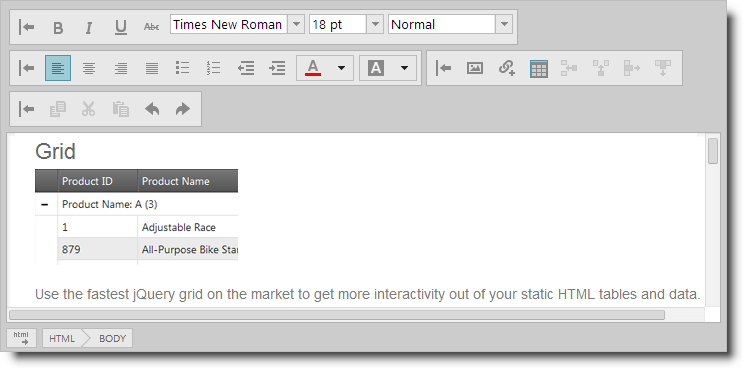

# Working with the igHtmlEditor

### Introduction

This section explains how to use the `igHtmlEditor`™.

### Topics

Detailed information regarding using the `igHtmlEditor` is covered in the following topics:

-	[Configuring Toolbars and Buttons](/ightmleditor-configuring-toolbars-and-buttons.mdx):  This topic explains how to configure `igHtmlEditor` toolbars and buttons.

-	[Saving the HTML Content Programmatically](/ightmleditor-saving-html-content.mdx): This topic explains how to save `igHtmlEditor` content to server.

-	[Modifying Contents Programmatically](/ightmleditor-modifying-contents-programmatically.mdx):  This topic explains how to modify `igHtmlEditor` contents by using the API.

 

 

