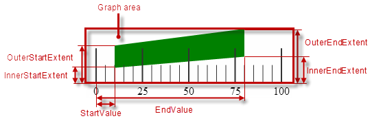

import ApiLink from 'docs-template/components/mdx/ApiLink.astro';

# Configuring Comparative Ranges (igLinearGauge)


##Topic Overview

### Purpose

This topic explains, with code examples, how to configure ranges in the `igLinearGauge`™ control. This includes the number of ranges and their positions, lengths, widths, and formatting.

### Required background

The following topics are prerequisites to understanding this topic:

-	[igLinearGauge Overview](//iglineargauge-overview.mdx): This topic provides conceptual information about the `igLinearGauge` control including its main features, minimum requirements, and user functionality.

-	[Adding igLinearGauge](//adding/iglineargauge-adding.mdx): This is a group of topics explaining how to add the `igLinearGauge` control to an HTML page and an ASP.NET MVC application.

### In this topic

This topic contains the following sections:

-   [Configuring Comparative Range](#configuring-comparative-ranges)
    -   [Comparative ranges configuration summary](#comparative-ranges-summary)
    -   [Comparative ranges configuration summary chart](#comparative-ranges-summary-chart)
    -   [Property settings](#property-settings)
    -   [Example](#example)
-   [Related Content](#related-topics)
    -   [Topics](#topics)
    -   [Samples](#samples)


##<a id="configuring-comparative-ranges"></a>Configuring Comparative Ranges


### <a id="comparative-ranges-summary"></a>Comparative ranges configuration summary

The `igLinearGauge` control supports multiple comparative ranges via instantiating its ranges object.



Each range can be configured individually by specifying its starting and ending value (in the measures of the scale), fill color, and border thickness and color. The size of a comparative range in the across-the-scale is configurable by adjusting its inner and outer margins.

### <a id="comparative-ranges-summary-chart"></a>Comparative ranges configuration summary chart

The following table explains briefly the configurable aspects of `igLinearGauge` control’s comparative ranges and maps them to properties that configure them.

<table cellspacing="0" cellpadding="0" class="table">
	<tbody>
		<tr>
			<th colspan="2">Configurable aspects</th>
			<th>Property</th>
			<th>Default value</th>
</tr>

		<tr>
			<th colspan="2">Number (of ranges in the graph)</th>
			<td><ApiLink type="igLinearGauge" member="ranges" section="options" label="ranges" /></td>
			<td>Not set</td>
</tr>

		<tr>
			<th rowspan="6" colspan="2">Length, width, and position</th>
			<td><ApiLink type="igLinearGauge" label="startValue" /></td>
			<td>Not set</td>
</tr>

		<tr>
			<td><ApiLink type="igLinearGauge" label="endValue" /></td>
			<td>Not set</td>
</tr>

		<tr>
			<td><ApiLink type="igLinearGauge" label="innerStartExtent" /></td>
			<td>Not set</td>
</tr>

		<tr>
			<td><ApiLink type="igLinearGauge" label="innerEndExtent" /></td>
			<td>Not set</td>
</tr>

		<tr>
			<td><ApiLink type="igLinearGauge" label="outerStartExtent" /></td>
			<td>Not set</td>
</tr>

		<tr>
			<td><ApiLink type="igLinearGauge" label="outerEndExtent" /></td>
			<td>Not set</td>
</tr>

		<tr>
			<th rowspan="3">Look-and-feel</th>
			<th>Fill color</th>
			<td><ApiLink type="igLinearGauge" member="ranges.brush" section="options" label="brush" /></td>
			<td>Defined in the default theme</td>
</tr>

		<tr>
			<th>Border color</th>
			<td><ApiLink type="igLinearGauge" member="ranges.outline" section="options" label="outline" /></td>
			<td>Defined in the default theme</td>
</tr>

		<tr>
			<th>Border thickness</th>
			<td><ApiLink type="igLinearGauge" member="ranges.strokeThickness" section="options" label="strokeThickness" /></td>
			<td>1.0</td>
</tr>

		<tr>
			<th colspan="2">Tooltip</th>
			<td><ApiLink type="igLinearGauge" member="rangeToolTipTemplate" section="options" label="rangeToolTipTemplate" /></td>
			<td>The start and end values of the range separated by a hyphen (-).</td>
</tr>
	</tbody>
</table>


>**Note:** If you do not explicitly provide values for the brush and outline properties for each range, the values are retrieved from the values of `igLinearGauge`’s `rangeBrushes` and `rangeOutlines` objects. They can also be used to predefine a set of brushes to be used consecutively for setting each range’s color or outline fill.

### <a id="property-settings"></a>Property settings

The following table maps the desired behavior to its respective property settings.

<table class="table table-bordered">
	<thead>
		<tr>
            <th colspan="3">In order to configure:</th>
            <th rowspan="2">Use this property:</th>
            <th rowspan="2">And set it to:</th>
</tr>
	</thead>
	<tbody>       
		 <tr>
            <th colspan="2">Aspect</th>
            <th>Details</th>
</tr>
        <tr>
            <th colspan="2">Name</th>
            <td>A name for the range. Used for displaying in the tooltip.</td>
            <td><ApiLink type="igLinearGauge" label="caption" /></td>
            <td>A string expressing the name of the range</td>
</tr>
        <tr>
            <th rowspan="2">[]()Position along the scale</th>
            <th>Range start</th>
            <td>Position on the scale at which the range begins</td>
            <td><ApiLink type="igLinearGauge" label="startValue" /></td>
            <td>The desired value (in the measures of the scale)</td>
</tr>
        <tr>
            <th>Range end</th>
            <td>Position on the scale at which the range ends</td>
            <td><ApiLink type="igLinearGauge" label="endValue" /></td>
            <td>The desired value (in the measures of the scale)</td>
</tr>
        <tr>
            <th rowspan="4">Breadth and position (across the scale)</th>
            <th>Inner vertex of the starting edge of the range</th>
            <td>The position of the inner vertex of the starting edge across the scale relative to the edge of the [Reserved area](../../00_igLinearGauge_Overview.mdx#graph-area). (Inner vertex is the point of the starting edge that is the closest to the edge of the Reserved area.)</td>
            <td><ApiLink type="igLinearGauge" label="innerStartExtent" /></td>
            <td>The desired value as a relative part of the height/width of the [Graph area](../../00_igLinearGauge_Overview.mdx#graph-area) depending on the orientation (horizontal / vertical) presented as a fraction of 1 (e.g. 0.2)</td>
</tr>
        <tr>
            <th>Inner vertex of the ending edge of the range</th>
            <td>The position of the inner vertex of the ending edge across the scale relative to the edge of the Reserved area</td>
            <td><ApiLink type="igLinearGauge" label="innerEndExtent" /></td>
            <td>The desired value as a relative part of the height/width of the Graph area depending on the orientation (horizontal / vertical) presented as a fraction of 1 (e.g. 0.3)</td>
</tr>
        <tr>
            <th>Outer vertex of the starting edge of the range</th>
            <td>The position of the outer vertex of the starting edge across the scale relative to the edge of the Reserved area. (Outer vertex is the point of the starting edge that is the closest to the edge of the Reserved area)</td>
            <td><ApiLink type="igLinearGauge" label="outerStartExtent" /></td>
            <td>The desired value as a relative part of the height/width of the Graph area depending on the orientation (horizontal / vertical) presented as a fraction of 1 (e.g. 0.7)</td>
</tr>
        <tr>
            <th>Outer vertex of the ending edge of the range</th>
            <td>The position of the outer vertex of the ending edge across the scale relative to the edge of the Reserved area</td>
            <td><ApiLink type="igLinearGauge" label="outerEndExtent" /></td>
            <td>The desired value as a relative part of the height/width of the Graph area depending on the orientation (horizontal / vertical) presented as a fraction of 1 (e.g. 0.8)</td>
</tr>
        <tr>
            <th rowspan="3">Look-and-feel</th>
            <th>Fill color</th>
            <td>Fill color of the range</td>
            <td><ApiLink type="igLinearGauge" label="brush" /></td>
            <td>The desired color</td>
</tr>
        <tr>
            <th>Border thickness</th>
            <td>Thickness of the range’s border</td>
            <td><ApiLink type="igLinearGauge" label="strokeThickness" /></td>
            <td>The desired value in pixels</td>
</tr>
        <tr>
            <th>Border color</th>
            <td>Color of the range’s border</td>
            <td><ApiLink type="igLinearGauge" member="ranges.outline" section="options" label="outline" /></td>
            <td>The desired color</td>
</tr>
        <tr>
            <th colspan="2">Tooltip</th>
            <td>Content of the tooltip of the comparative range(s)</td>
            <td><ApiLink type="igLinearGauge" member="rangeToolTipTemplate" section="options" label="rangeToolTipTemplate" /></td>
            <td>The desired template(See [Configuring the Tooltips (LinearGauge)](/iglineargauge-configuring-the-tooltips.mdx).)</td>
</tr>
    </tbody>
</table>


### <a id="example"></a>Example

The screenshot below demonstrates how a comparative range added to the `igLinearGauge` looks as a result of the following settings:

Property|Value
---|---
<ApiLink type="igLinearGauge" label="brush" />|“Green”
<ApiLink type="igLinearGauge" label="caption" />|“range1”
<ApiLink type="igLinearGauge" label="startValue" />|“6”
<ApiLink type="igLinearGauge" label="endValue" />|“89”
<ApiLink type="igLinearGauge" label="innerStartExtent" />|“0.5”
<ApiLink type="igLinearGauge" label="innerEndExtent" />|“0.5”
<ApiLink type="igLinearGauge" label="outerStartExtent" />|“0.8”
<ApiLink type="igLinearGauge" label="outerEndExtent" />|“0.8”
<ApiLink type="igLinearGauge" label="outline" />|“Black”


Following is the code that implements this example.

**In JavaScript:**

```js
$(function () {
    $("#linearGauge").igLinearGauge({
        width: "300px",
        height: "70px",
        ranges: [{
             name: 'range1',
             brush:'#008000',
             startValue:"6",
             endValue:"89",
             innerStartExtent:"0.5",
             innerEndExtent:"0.5",
             outerStartExtent:"0.8",
             outerEndExtent:"0.8"
        }]    
	});
});
```


##<a id="related-topics"></a>Related Content

### <a id="topics"></a>Topics

The following topics provide additional information related to this topic.

-	[Configuring the Scale (igLinearGauge)](/iglineargauge-configuring-the-scale.mdx): This topic explains, with examples, how to configure the scale of the `igLinearGauge` control. This includes positioning the scale inside the control and configuring the scale tick marks and labels.

-	[Configuring the Needle (igLinearGauge)](/iglineargauge-configuring-the-needle.mdx): This topic explains, with examples, how to configure the needle of the `igLinearGauge` control. This includes the value indicated by it, its width, position, and formatting.

-	[Configuring the Background (igLinearGauge)](/iglineargauge-configuring-the-background.mdx): This topic explains, with code examples, how to configure a background for the linear gauge. This includes setting the background’s size, position, color, and border.

-	[Configuring the Tooltips (igLinearGauge)](/iglineargauge-configuring-the-tooltips.mdx): This topic explains, with code examples, how to enable the tooltips in the `igLinearGauge` control and configure the delay with which they are displayed.


### <a id="samples"></a>Samples

The following samples provide additional information related to this topic.

-	[Range Settings](&#123;environment:SamplesUrl&#125;/linear-gauge/range-settings):This sample demonstrates setting comparative ranges in the `igLinearGauge` control.


 

 


