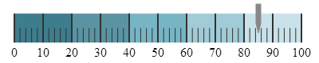

# igLinearGauge

##In This Group of Topics

### Introduction

The topics in this group cover the `igLinearGauge`™ control and its use.

The `igLinearGauge` control is an \{environment:ProductName\}™ control which allows for visualizing data in the form of a linear gauge. It provides a simple and concise view of a value compared against a scale and one or more ranges.

### Topics

-	[igLinearGauge Overview](/iglineargauge-overview.mdx): This topic provides conceptual information about the `igLinearGauge` control including its main features, minimum requirements, and user functionality.

-	[Adding igLinearGauge](/adding/iglineargauge-adding.mdx): This topic explains how to add the `igLinearGauge` control to a \{environment:PlatformName\} application.

-	[Configuring igLinearGauge](/configuring/iglineargauge-configuring.mdx): This is a group of topics explaining how to configure the various aspects of the `igLinearGauge` control including its orientation and visual elements, and the animated display of values.

-	[jQuery and MVC API Links (igLinearGauge)](/iglineargauge-api-links.mdx): This topic provides reference information about the key classes and properties related to the `igLinearGauge` control.

-	[Known Issues and Limitations (igLinearGauge)](/iglineargauge-known-issues-and-limitations.mdx): This topic provides information about the known issues and limitations of the `igLinearGauge` control.

 

 

