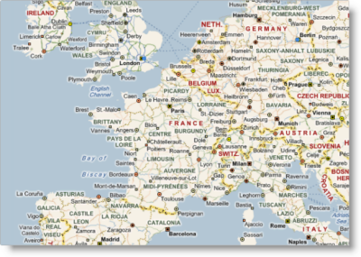

import ApiLink from 'docs-template/components/mdx/ApiLink.astro';

# Configuring the Map Provider (igMap)


## Topic Overview

### Purpose

This topic demonstrates, with code examples, how to configure the `igMap`™ control to use the supported map providers and their imagery sets.

### Required background

The following topics are prerequisites to understanding this topic:

-	[igMap Overview](/overview-igmap.mdx):This topic provides conceptual information about the `igMap` control including its main features, minimum requirements, and user interaction capabilities.

-	[Adding an igMap](/adding-igmap.mdx): This topic demonstrates how to add a simple map with basic features to a web page.


#### In this topic

This topic contains the following sections:

-   [Introduction](#introduction)
-   [Background Content Configuration](#background-config)
-   [Map Imagery Reference](#map-reference)
    -   [Map imagery summary](#map-imagery-summary)
    -   [Bing Maps imagery sets](#bing-maps-imagery)
-   [Code Examples](#code-examples)
    -   [Configuring OpenStreetMaps Background Content](#config-open-street-maps)
    -   [Configuring Bing Maps Background Content With Imagery Set](#config-bing-maps)
-   [Related Content](#related-content)
    -   [Topics](#topics)
    -   [Samples](#samples)
    -   [Resources](#resources)


## Introduction

### Map providers for igMap summary

The `igMap` control can use any of the following map providers:

-   [OpenStreetMap](http://www.openstreetmap.org/)
-   [Bing® Maps](http://www.bing.com/maps/)

The map providers deliver the map images and the map series are plotted as overlays over this background content. The control supports plotting any geographic series on any background content. In addition to being able to select your map provider, you can also select between different imagery sets the providers deliver. An imagery set is a themed set of maps like satellite images, satellite images with name labels or road network.

>**Note:** Bing maps require you to provide your custom access key to access their content.

The table below shows the same map area and geographic symbol series with the three available map providers.

OpenStreetMap|Bing Maps
---|---
|


## Background Content Configuration

### Control configuration summary chart

The following table lists the configurable aspects of the igMap control related to map providers and imagery sets. Additional details are available after the table.


|  |  |  |
| --- | --- | --- |
| Configurable aspect | Details | Properties |
| Background content | The control can be configured to use background tiles from a specific provider. | In JavaScript <ApiLink type="igMap" label="backgroundContent.type" /> In ASP.NET MVC [BackgroundContent()](Infragistics.Web.Mvc~Infragistics.Web.Mvc.BackgroundContent`1.html) [BackgroundContentBuilder.OpenStreetMaps()](Infragistics.Web.Mvc~Infragistics.Web.Mvc.BackgroundContentBuilder~OpenStreetMaps.html) [BackgroundContentBuilder.BingMaps()](Infragistics.Web.Mvc~Infragistics.Web.Mvc.BackgroundContentBuilder~BingMaps.html) |
| Imagery set for Bing Maps | The imagery set when the background content provider is set to Bing Maps, is configurable. | In JavaScript <ApiLink type="igMap" member="backgroundContent.imagerySet" section="options" label="backgroundContent.imagerySet" /> In ASP.NET MVC [BingMaps.ImagerySet()](Infragistics.Web.Mvc~Infragistics.Web.Mvc.BingMaps~ImagerySet.html) |
| Configurable key for the map provider | Configure the developer/customer key for access to the map content from the provider. | In JavaScript <ApiLink type="igMap" member="backgroundContent.key" section="options" label="backgroundContent.key" /> In ASP.NET MVC [BackgroundContentBuilder.BingMaps()](Infragistics.Web.Mvc~Infragistics.Web.Mvc.BackgroundContentBuilder~BingMaps.html) |


## Map Imagery Reference

### Map imagery summary

Some map providers offer multiple imagery sets for their maps. Imagery sets are different map images that provide different content or styling.

### Bing Maps imagery sets

The following summarizes the imagery sets for **Bing Maps** supported by the `igMap` control. Configure the selected style by assigning a style code to the <ApiLink type="igMap" member="backgroundContent.imagerySet" section="options" label="backgroundContent.imagerySet" /> option.

Aerial


AerialWithLabels


Road


collinsBart




## Code Examples

### Code examples summary

The following table lists the code examples included in this topic.

Example|Description
---|---
[](#config-open-street-maps)[Configuring OpenStreetMaps Background Content](#config-open-street-maps)|This example shows how to configure a map control with an OpenStreetMaps background.
[Configuring Bing Maps Background Content With Imagery Set](#config-bing-maps)|This example shows how to configure a map control with a  Bing Maps background and imagery.


## Code Example: Configuring OpenStreetMaps Background Content


### Description

This example shows how to configure a map control with OpenStreetMaps background.

### Code

The following code in JavaScript configures a map control to use OpenStreetMaps. Assign the `backgroundContent` option to an object with "`openStreet`" specified for `type`.

**In JavaScript:**

```js
$("#map").igMap({
    ...
    backgroundContent: {
        type: "openStreet"
    },
    ...
});
```

The following code in ASP.NET MVC configures a map control to use OpenStreetMaps. The `BackgroundContent()` function is passed a lambda expression that executes the `BackgroundContentBuilder. OpenStreetMaps()` static method. That action instantiates an **OpenStreetMaps** class instance that generates JavaScript code similar to the example above.

**In ASPX:**

```csharp
<%= Html.Infragistics().Map(Model)
        .ID("map")
        ...
        .BackgroundContent(bgr => bgr.OpenStreetMaps())
        ...
        .DataBind()
        .Render()
%>
```


## Code Example: Configuring Bing Maps Background Content With Imagery Set

### Description

This example shows how to configure a map control with the Bing Maps background. It also configures the imagery set to display Road.

### Code

The following code in JavaScript configures a map control to use Bing Maps. The `backgroundContent` option is assigned an object with **"bing"** specified for `type` and a `key` specified to enable access to the Bing Maps services. Specify the `Road` imagery set in the `imagerySet` option.

**In JavaScript:**

```js
$("#map").igMap({
    ...
    backgroundContent: {
        type: "bing",
        key: "123456789abcdef",
        imagerySet: "Road"
    },
    ...
});
```

The following code in ASP.NET MVC configures a map control to use Bing Maps. The `BackgroundContent()` function is passed a lambda expression which executes the `BackgroundContentBuilder.BingMaps()` static method with the Bing Maps services access key passed as a parameter. That action instantiates a BingMaps class instance that generates JavaScript code similar to the example above.

**In ASPX:**

```csharp
<%= Html.Infragistics().Map(Model)
        .ID("map")
        ...
        .BackgroundContent(bgr => bgr.BingMaps("123456789abcdef")
                .ImagerySet(ImagerySet.Road))
        ...
        .DataBind()
        .Render()
%>
```


## Related Content

### Topics

The following topics provide additional information related to this topic.

-	[Data Binding (igMap)](/data-binding-igmap.mdx): This topic explains how to bind the `igMap` control to different data sources depending on the map series visualized.

-	[Configuring Features (igMap)](/features/igmap-configuring-features.mdx): This topic is a landing page linking to the topics explaining how to configure various features of the `igMap` control.


### Samples

The following samples provide additional information related to this topic.

-	[Bing Maps](&#123;environment:SamplesUrl&#125;/map/bing-maps): This sample demonstrates how to use Bing Maps to render a geographic series with the map control.


### Resources

The following material (available outside the Infragistics family of content) provides additional information related to this topic.

-	[OpenStreetMap](http://www.openstreetmap.org/):The home page of OpenStreetMap.

-	[Bing Maps](http://www.bing.com/maps/): The home page of Bing Maps.