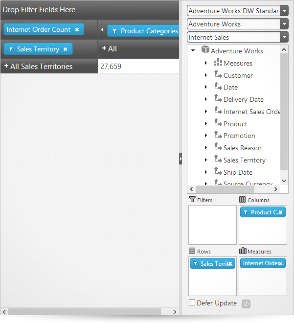

import ApiLink from 'docs-template/components/mdx/ApiLink.astro';

# Adding igPivotView to an HTML Page


##Topic Overview

### Purpose

This topic explains, in both conceptual and step-by-step form, how to add the `igPivotView`™ control to an HTML page.

### Required background

The following topics are prerequisites to understanding this topic:

- [Using JavaScript Resources in &#123;environment:ProductName&#125;](///general-and-getting-started/deployment-guide-javascript-resources.mdx): This topic provides general guidance on adding the required JavaScript resources for using the controls from the &#123;environment:ProductName&#125;® library.

- [igPivotView Overview](/igpivotview-overview.mdx): This topic provides conceptual information about the `igPivotView` control including its main features, requirements, and user functionality.


### In this topic

This topic contains the following sections:

-   [Adding igPivotView – Conceptual Overview](#overview)
    -   [Adding igPivotView summary](#summary)
    -   [Requirements](#requirements-summary)
    -   [Steps](#steps-summary)
-   [Adding igPivotView – Procedure](#procedure)
    -   [Introduction](#procedure-introduction)
    -   [Preview](#procedure-preview)
    -   [Prerequisites](#procedure-prerequisites)
    -   [Overview](#procedure-overview)
    -   [Steps](#procedure-steps)
-   [**Related Content**](#related-content)
    -   [Topics](#topics)
    -   [Samples](#samples)


##<a id="overview"></a>Adding igPivotView – Conceptual Overview

### <a id="summary"></a>Adding igPivotView summary

The `igPivotView` operates using an instance of `igOlapFlatDataSource`™ or `igOlapXmlaDataSource`™. Therefore, when adding the `igPivotView` to an HTML page, you need to provide a pre-configured data source instance or specify the required options so that one could be created internally.

The data source is specified through either the <ApiLink type="igPivotView" member="dataSource" section="options" label="dataSource" /> parameter or the <ApiLink type="igPivotView" member="dataSourceOptions" section="options" label="dataSourceOptions" /> property of the `igPivotView`. The data source setting is the only mandatory option to set when initializing the `igPivotView`.

### <a id="requirements-summary"></a>Requirements

The following table summarizes the requirements for using the `igPivotView` control.


|  |  |  |
| --- | --- | --- |
| Requirement / Required Resources | Description | What you need to do… |
| jQuery and jQuery UI JavaScript resources | &#123;environment:ProductName&#125;™ is built on top of these frameworks: [jQuery](http://jquery.com/) [jQuery UI](http://jqueryui.com/) | Add script references to both libraries in the `` section of your page. |
| Modernizr library (Optional) | The Modernizr library is used by the igPivotView to detect browser and device capabilities. It is not mandatory and, if not included, the control will behave as if in a normal desktop environment with an HTML5 compatible browser. [Modernizr](http://modernizr.com/) | Add a script reference to the library in the `` section of your page. |
| General igPivotView JavaScript Resources | The igPivotView functionality of the &#123;environment:ProductName&#125; library is distributed across several files. You can load the required resources in one of the following ways: **Including a custom JavaScript file**: This is the recommended approach to reference &#123;environment:ProductName&#125; JavaScript files. You can [create a custom download](&#123;environment:SamplesUrl&#125;/download) of selected &#123;environment:ProductName&#125; controls and components. **Using Infragistics Loader**: The *Infragistics Loader* can be used to resolve all the Infragistics resources (styles and scripts) Load the required resources manually. You need to use the dependencies listed in the table below. The following table lists the &#123;environment:ProductName&#125; library dependences related to the igPivotView control. These resources need to be referred to explicitly if you chose to load resources manually (i.e. not to use igLoader). JavaScript Resource | Description |
| `infragistics.util.js`, `infragistics.util.jquery.js` | &#123;environment:ProductName&#125; utilities |  |
| (Conditional - if using `igOlapFlatDataSource`) `infragistics.datasource.js` | The `igDataSource`™ component |  |
| `infragistics.olapflatdatasource.js` or `infragistics.olapxmladatasource.js` | Data source framework |  |
| `infragistics.templating.js` | Template engine (`igTemplate`™) |  |
| `infragistics.ui.shared.js` | &#123;environment:ProductName&#125; shared code |  |
| `infragistics.ui.scroll.js` | A scroll helper which is internally used |  |
| `infragistics.ui.combo.js` | Combo box control (`igCombo`™) |  |
| `infragistics.ui.splitter.js` | The `igSplitter`™ control |  |
| `infragistics.ui.tree.js` | The `igTree`™ control |  |
| `infragistics.ui.grid.framework.js` | The `igGrid`™ control |  |
| `infragistics.ui.grid.multicolumnheaders.js` | The multi-column headers feature for the `igGrid` control |  |
| `infragistics.ui.pivot.shared.js` | &#123;environment:ProductName&#125; shared code for pivot components |  |
| `infragistics.ui.pivotgrid.js` | The `igPivotGrid` control |  |
| `infragistics.ui.pivotdataselector.js` | The `igPivotDataSelector`™ control |  |
| `infragistics.ui.pivotview.js` | The `igPivotView`™ control |  |
<br/>
			&lt;/td&gt;
			&lt;td&gt;Add one of the following: <ul> <li>A reference to custom JavaScript file</li> <li>A reference to igLoader</li> <li>A reference to all the required JavaScript files (listed in the table on the left).</li> </ul>&lt;/td&gt;
		&lt;/tr&gt;

		&lt;tr&gt;
			&lt;td&gt;IG Theme (Optional)&lt;/td&gt;
			&lt;td&gt;This theme contains the visual styles for the &#123;environment:ProductName&#125; library. The theme file is: <ul> <li>`<IG CSS root>/themes/Infragistics/infragistics.theme.css`</li> </ul>&lt;/td&gt;
			&lt;td&gt;&lt;/td&gt;
		&lt;/tr&gt;

		&lt;tr&gt;
			&lt;td&gt;igPivotView CSS resources files&lt;/td&gt;
			&lt;td&gt;The styles from the following CSS file are used for rendering various elements of the control: <ul> <li>`<IG CSS root>/structure/modules/infragistics.ui.shared.css`</li> <li>`<IG CSS root>/structure/modules/infragistics.ui.combo.css`</li> <li>`<IG CSS root>/structure/modules/infragistics.ui.splitter.css`</li> <li>`<IG CSS root>/structure/modules/infragistics.ui.tree.css`</li> <li>`<IG CSS root>/structure/modules/infragistics.ui.grid.css`</li> <li>`<IG CSS root>/structure/modules/infragistics.ui.pivot.css`</li> </ul>&lt;/td&gt;
			&lt;td&gt;Add style reference to the file in your page.&lt;/td&gt;
		&lt;/tr&gt;
	&lt;/tbody&gt;
&lt;/table&gt;


### <a id="steps-summary"></a>Steps

Following are the general conceptual steps for adding the `igPivotView` to an HTML page.

​1. Adding references to required resources

​2. Adding HTML markup required by the `igPivotView`

​3. Adding a data source

​4. Initializing the `igPivotView`


##<a id="procedure"></a>Adding igPivotView – Procedure

### <a id="procedure-introduction"></a>Introduction

The procedure below demonstrates, with code examples, how to add the `igPivotView` component to an HTML application visualizing the Adventure Works sample database. The procedure uses the Infragistics Loader (`igLoader`) to reference the required resources, which is the recommended option.

### <a id="procedure-preview"></a>Preview

The following screenshot is a preview of the final result.



### <a id="procedure-prerequisites"></a>Prerequisites

To complete the procedure, you need the following:

-   The Adventure Works sample database.
-   An instance of `$.ig.OlapXmlaDataSource` object or `$.ig.OlapFlatDataSource` object

### <a id="procedure-overview"></a>Overview

​1. Adding references to required resources

​2. Adding HTML markup required by the `igPivotView`

​3. Adding a data source

​4. Initializing the `igPivotView`

### <a id="procedure-steps"></a>Steps

The following steps demonstrate how to add a jQuery `igPivotView`.

1. Add references to required resources.

	1. Organize the required files.

		A. **Add the jQuery, jQueryUI, and Modernizr JavaScript resources to a folder named Scripts in the directory where your web page resides.**

		B. **Add the &#123;environment:ProductName&#125; CSS files to a folder named Content/ig (For details, see the [Styling and Theming in &#123;environment:ProductName&#125;](///general-and-getting-started/styling-and-theming/deployment-guide-styling-and-theming.mdx) topic).**

		C. **Add the &#123;environment:ProductName&#125; JavaScript files to a folder named Scripts/ig in your web site or application (For details, see the [Using JavaScript Resources in &#123;environment:ProductName&#125;](///general-and-getting-started/deployment-guide-javascript-resources.mdx) topics).**

	2. Add the references to the required JavaScript libraries. Add references to the **jQuery, jQuery UI and Modernizr libraries to the `<head>` section of your page:**
	
		**In HTML:**
		
```html
		<script  type="text/javascript" src="Scripts/jquery.js"></script>
		<script  type="text/javascript" src="Scripts/jquery-ui.js"></script>
		<script  type="text/javascript" src="Scripts/modernizr.js"></script>
```
	
	3. Add a reference to `igLoader`.**Include the `igLoader` script in the page:**
	
		**In HTML:**
		
```html
		<script  type="text/javascript" src="Scripts/ig/infragistics.loader.js"></script>
```
	
	4. Load the required resources.
	
		Instantiate igLoader:
		
		**In HTML:**
		
```html
		<script type="text/javascript">
		    $.ig.loader({
		        scriptPath: "Scripts/ig/",
		        cssPath: "Content/ig/",
		        resources: “igPivotView,igOlapXmlaDataSource"
		    });
		<script>
```

2. Add HTML markup required by the `igPivotView`.

	**Create a `div` tag with an `id` of “`dataSelector`” in your HTML page.**
	
	**In HTML:**
	
```html
	<div id="pivotView"></div>
```

3. Add a data source.

	In the igLoader’s ready event handler, add the data source declaration:
	
	**In JavaScript:**
	
```js
	var dataSource = new $.ig.OlapXmlaDataSource({
        serverUrl: "http://sampledata.infragistics.com/olap/msmdpump.dll",
        catalog: "Adventure Works DW Standard Edition",
        cube: "Adventure Works",
        measureGroup: "Internet Sales",
        rows: "[Sales Territory].[Sales Territory]",
        columns: "[Product].[Product Categories]",
        measures: "[Measures].[Internet Order Count],[Measures].[Internet Gross Profit Margin]"
    });
```
	
	For this data source to work correctly under IE, **before adding the data source declaration,** you need to set the jQuery cross-origin requests support to true:
	
	**In JavaScript:**
	
```js
	$.support.cors = true;
```

4. Initialize the `igPivotView`

	In order for the igPivotView to be loaded, the following code must be added after the data source declaration.
	
	**In JavaScript:**
	
```js
	$("#pivotView").igPivotView({
	dataSource: dataSource 
	});
```
	
	Following is the alternative (direct) way to specify a data source using the <ApiLink type="igPivotView" member="dataSourceOptions" section="options" label="dataSourceOptions" /> property of the igPivotView. (See [Adding igPivotView summary](#summary).)
	
	**In JavaScript:**
	
```js
	$("#dataSelector").igPivotView({
	      dataSourceOptions: {
	       xmlaOptions: {
	          serverUrl: " http://sampledata.infragistics.com/olap/msmdpump.dll ",
	          catalog: "Adventure Works DW Standard Edition ",
	          cube: "Adventure Works",
	          measureGroup: "Internet Sales",
	       }
	       rows: "[Sales Territory].[Sales Territory]",
	       columns: "[Product].[Product Categories]",
	       measures: "[Measures].[Internet Order Count],[Measures].[Internet Gross Profit Margin]"      
		}
	});
```
	

##<a id="related-content"></a>Related Content

### <a id="topics"></a>Topics

The following topics provide additional information related to this topic.

- [Adding igPivotView to an ASP.NET MVC Application](/igpivotview-adding-using-the-mvc-helper.mdx): This topic explains, in both conceptual and step-by-step form, how to add the `igPivotView` control to an ASP.NET MVC Application using &#123;environment:ProductNameMVC&#125;.

### <a id="samples"></a>Samples

The following samples provide additional information related to this topic.

- [Binding to Flat Data Source](&#123;environment:SamplesUrl&#125;/pivot-view/binding-to-flat-data-source): This sample demonstrates how to bind the `igPivotView` to an `igOlapFlatDataSource`.

- [Binding to XMLA to Show KPIs](&#123;environment:SamplesUrl&#125;/pivot-view/binding-to-xmla-data-source): This sample demonstrates how to bind the `igPivotView` to an `igOlapXmlaDataSource`.


 

 


