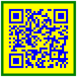

import ApiLink from 'docs-template/components/mdx/ApiLink.astro';

# Styling igQRCodeBarcode

## Topic Overview
### Purpose

This topic explains how to style the `igQRCodeBarcode`™ control.

### Required background

The following topics are prerequisites to understanding this topic:

- [igQRCodeBarcode Overview](/igqrcodebarcode-overview.mdx): This topic provides conceptual information about the `igQRCodeBarcode` control including its main features and minimum requirements.

- [Adding igQRCodeBarcode](/adding/igqrcodebarcode-adding.mdx): This is a group of topics demonstrating how to add the `igQRCodeBarcode` control to an HTML page and to an ASP.NET MVC application.


### In this topic

This topic contains the following sections:

-   [Introduction](#introduction)
    -   [igQRCodeBarcode appearance configuration summary](#summary)
    -   [igQRCodeBarcode appearance configuration summary chart](#summary-chart)
-   [Configuring the Appearance of the igQRCodeBarcode Control](#config-appearance)
    -   [Property settings](#property-settings)
    -   [Example](#example)
-   [Related Content](#related-content)
    -   [Topics](#topics)
    -   [Samples](#samples)


## Introduction
### igQRCodeBarcode appearance configuration summary

The `igQRCodeBarcode` exposes the API for adjusting its bars' color thus allowing for achieving a unique and trendy look which can be complemented by coloring the border of the control and specifying custom border thickness.

### igQRCodeBarcode appearance configuration summary chart

The following table lists the configurable appearance related aspects of the `igQRCodeBarcode` control.

Configurable aspect|Details|Properties
---|---|---
Color of the barcode bars|You can set the color of the barcode.|<ul><li><ApiLink type="igQRCodeBarcode" member="barBrush" section="options" label="barBrush" /></li></ul>
Background color|You can specify the color of the background area behind the bars of the barcode.|<ul><li><ApiLink type="igQRCodeBarcode" member="backingBrush" section="options" label="backingBrush" /></li></ul>
Border thickness and color|You can customize the barcode’s border thickness and color.|<ul><li><ApiLink type="igQRCodeBarcode" member="backingOutline" section="options" label="backingOutline" /></li><li><ApiLink type="igQRCodeBarcode" member="backingStrokeThickness" section="options" label="backingStrokeThickness" /></li></ul>


## Configuring the Appearance of the igQRCodeBarcode Control
### Property settings

The following table maps the desired behavior to property settings.

In order to:| Use this property: And set it to:
---|---|---
Configure the background color|<ApiLink type="igQRCodeBarcode" member="backingBrush" section="options" label="backingBrush" />|The desired color
Configure the color of the barcode bars|<ApiLink type="igQRCodeBarcode" member="barBrush" section="options" label="barBrush" />|The desired color
Configure the border thickness|<ApiLink type="igQRCodeBarcode" member="backingStrokeThickness" section="options" label="backingStrokeThickness" />|The desired value
Configure the border color|<ApiLink type="igQRCodeBarcode" member="backingOutline" section="options" label="backingOutline" />|The desired color


### Example

The screenshot below demonstrates how the `igQRCodeBarcode` looks as a result of the following settings:

Property|Value
---|---
<ApiLink type="igQRCodeBarcode" member="backingBrush" section="options" label="backingBrush" />|“yellow”
<ApiLink type="igQRCodeBarcode" member="barBrush" section="options" label="barBrush" />|“blue”
<ApiLink type="igQRCodeBarcode" member="backingStrokeThickness" section="options" label="backingStrokeThickness" />|“5”
<ApiLink type="igQRCodeBarcode" member="backingOutline" section="options" label="backingOutline" />|“green”




Following is the code that implements this example.

**In HTML:**

```html
<head>
...
    <script type="text/jscript">
        $(function () {                        
          $("#barcode").igQRCodeBarcode({
                width: "150px",
                height: "150px",
                data: "http://www.infragistics.com",
                backingBrush: "yellow",
                barBrush: "blue",
                backingStrokeThickness:"5",
                backingOutline: "green"
           });
       });
    </script>
</head>
<body>
	<div id="barcode">
	</div>
</body>
```


## Related Content
### Topics

The following topics provide additional information related to this topic.

- [Configuring igQRCodeBarcode](/configuring/igqrcodebarcode-configuring.mdx): This is a group of topics explaining how to configure the `igQRCodeBarcode` control’s dimensions, character encoding, and QR-code-specific settings.

- [Accessibility Compliance (igQRCodeBarcode)](/igqrcodebarcode-accessibility-compliance.mdx): This topic explains the accessibility features of the `igQRCodeBarcode` control and provides advice on how to achieve accessibility compliance for pages containing barcodes.

- [Known Issues and Limitations (igQRCodeBarcode)](/igqrcodebarcode-known-issues-and-limitations.mdx): This topic provides information on the known issues and limitations of the `igQRCodeBarcode` control.

- [jQuery and MVC API Links (igQRCodeBarcode)](/igqrcodebarcode-api-links.mdx): This topic provides links to the API documentation about the `igQRCodeBarcode` control and the ASP.NET MVC Helper for it.


### Samples

The following samples provide additional information related to this topic.

- [Configuring Colors](&#123;environment:SamplesUrl&#125;/barcode/configuring-colors):  This sample demonstrates styling the `igQRCodeBarcode` control by configuring the colors used in the barcode.


 

 


