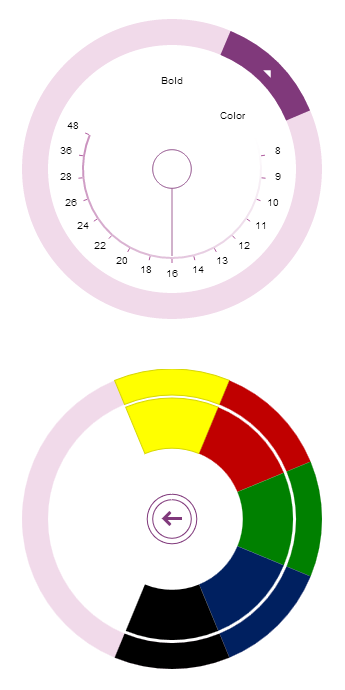

import ApiLink from 'docs-template/components/mdx/ApiLink.astro';

# Adding igRadialMenu to an ASP.NET MVC Application

## Topic Overview
### Purpose

This topic demonstrates, with code examples, how to add the <ApiLink type="igRadialMenu" label="igRadialMenu" />™ to an ASP.NET MVC application using &#123;environment:ProductNameMVC&#125;.

### Required background

The following table lists the concepts and topics required as a prerequisite to understanding this topic.

Concepts

-   jQuery
-   jQuery UI
-   ASP.NET MVC
-   ASP.NET MVC HTML Helpers


**Topics**

- [Adding Controls to an MVC Project](../../../01_General-and-Getting-Started/00_Adding IgniteUI Controls to an MVC Project.mdx): This topic explains how to get started with &#123;environment:ProductName&#125;™ components in an ASP.NET MVC application.

- [igRadialMenu Features](/overview/igradialmenu-features.mdx): This topic explains the features supported by the control from developer perspective.

- [igRadialMenu Visual Elements](/overview/igradialmenu-visual-elements.mdx): This topic provides an overview of the visual elements of the control.


### In this topic

This topic contains the following sections: 

-   [Adding igRadialMenu to an ASP.NET MVC Application – Conceptual Overview](#overview)
-   [Adding igRadialMenu to an ASP.NET MVC Application – Procedure](#procedure)
-   [Related Content](#related-content)


## Adding igRadialMenu to an ASP.NET MVC Application – Conceptual Overview
### Adding igRadialMenu summary

The `igRadialMenu` control can be added to an ASP.NET MVC view using the &#123;environment:ProductNameMVC&#125; HTML helper.

When instantiating the `igRadialMenu` control, there are several helper methods that should be set for basic renderings including the following:

Helper Method| Purpose
---|---
`Width()`| Sets the width of the `igRadialMenu`.
`Height()`| Sets the height of the `igRadialMenu`.
`Items()`|Used to add `igRadialMenu` items.


### Requirements

To complete the procedure, you need the following:

-   An ASP.NET MVC application
-   A reference to the `Infragistics.Web.Mvc.dll` assembly added to the application project. For details, refer to the Adding Control to an MVC Project topic.
-   The dependencies of the View:
-   -   The Infragistics.Web.Mvc namespace added to the ASP.NET MVC View

        **In ASPX:**

```csharp
        <%@ Import Namespace="Infragistics.Web.Mvc" %>
```

    -   Reference to the combined JavaScript files for all data visualization controls and to the required CSS files added to the &lt;head&gt; tag of the APS.NET MVC View

        **In ASPX:**

```csharp
        <%@ Import Namespace="Infragistics.Web.Mvc" %>
        <!DOCTYPE html>
        <html>
        <head>
        <title>BulletGraph</title>
        <link href="<%=Url.Content("~/Scripts/css/themes/infragistics/infragistics.theme.css")%>" rel="stylesheet"></link>
        <link href="<%=Url.Content("~/Scripts/css/structure/infragistics.css")%>" rel="stylesheet"></link>
        <script src="<%=Url.Content("~/Scripts/jquery.min.js")%>" type="text/javascript"></script>
        <script src="<%=Url.Content("~/Scripts/jquery-ui.min.js")%>" type="text/javascript"></script>
        <script src="<%=Url.Content("~/Scripts/js/infragistics.core.js")%>" type="text/javascript"></script>
        <script src="<%=Url.Content("~/Scripts/js/infragistics.dv.js")%>" type="text/javascript"></script>
```

Additionally there are a couple of other ways of adding `igRadialMenu`:

-   Using the Infragistics Loader (the igLoader component) or
-   Including all `igRadialMenu`-related files, explicitly, as explained in the [Adding igRadialMenu to an HTML Page](/igradialmenu-adding-html-page.mdx) topic

### Steps

Following are the general conceptual steps for adding `igRadialMenu` to an ASP.NET MVC Application.

1. Add the ASP.NET MVC Helper.

2. Instantiate the `igRadialMenu` control configuring its basic rendering options.

3. Add a button item (optional)

4. Add a color item (optional)

5. Add a numeric gauge item (optional)


## Adding igRadialMenu to an ASP.NET MVC Application – Procedure
### Introduction

This procedure uses the ASP.NET MVC helper to add an instance of `igRadialMenu` to an ASP.NET MVC application to control and configure its dimensions and include several menu items.

### Preview

The following screenshot is a preview of the result with all optional steps completed.



### Prerequisites

An ASP.NET MVC application configured with the required JavaScript files, CSS files and ASP.NET MVC assembly as defined in the Prerequisites of the Adding `igRadialMenu` to an ASP.NET MVC Application procedure.

### Steps

The following steps demonstrate how to instantiate `igRadialMenu` in an ASP.NET MVC application using the &#123;environment:ProductNameMVC&#125; HTML helper.

1. Add the ASP.NET MVC Helper

	Adds the helper to the body of your ASP.NET page.
	
	**In ASPX:**
	
```csharp
	<body>
	@(Html.Infragistics().RadialMenu()
		.Render()
	)
	</body>
```

2. Instantiate the `igRadialMenu` control configuring its basic rendering options.

	Instantiates the `igRadialMenu` control. As with all &#123;environment:ProductNameMVC&#125; controls, you must call the Render method to render the HTML and JavaScript to the View.
	
	**In ASPX:**
	
```csharp
	<body>
	@(
		Html.Infragistics().RadialMenu()
		.Width("300px")
		.Height("300px")
		.Render()
	)
	</body>
```

3. Add a button item (optional)

	Defines a button item in the `igRadialMenu`.
	
	**In ASPX:**
	
```csharp
	<body>
	@(Html.Infragistics().RadialMenu()
	…
		.Items(i =>
		{
			i.Item("button1")
			.Header("Bold")
			.ClientEvent(new Dictionary<string, string>() {
			  { "click", "function(evt, ui) { alert('Bold clicked'); }" }
			  });
		})
	.Render()
	)
	</body>
```

4. Add a color item (optional)

	Defines a color item with color well Sub-Items in the `igRadialMenu`.
	
	**In ASPX:**
	
```csharp
	<body>
	@(Html.Infragistics().RadialMenu()
		…
		.Items(i =>
		{
			i.ColorItem("colorItem1")
			.Header("Color")
			.Items(si =>
			{
				si.ColorWell().Color("#FFFF00");
				si.ColorWell().Color("#C00000");
				si.ColorWell().Color("#008000");
				si.ColorWell().Color("#002060");
				si.ColorWell().Color("#000000");
			});
		})
		.Render()
		)
	</body>
```

5. Add a numeric gauge item (optional)

	Define a numeric gauge item in the `igRadialMenu`.
	
	**In ASPX:**
	
```csharp
	<body>
	@(Html.Infragistics().RadialMenu()
	…
		.Items(i =>
		{
			i.NumericGauge("numGauge1")
			.WedgeSpan(5)
			.Ticks(new double[] {8,9,10,11,12,13,14,16,18,20,22,24,26,28,36,48})
			.Value(16);
		})
		.Render()
	)
	</body>
```


### Full code

Following is the full code for this procedure.

**In ASPX:**

```csharp
<%@ Import Namespace="Infragistics.Web.Mvc" %>
<!DOCTYPE html>
<html>
<head>
	<title>BulletGraph</title>
	<link href="<%=Url.Content("~/Scripts/css/themes/infragistics/infragistics.theme.css")%>" rel="stylesheet"></link>
	<link href="<%=Url.Content("~/Scripts/css/structure/infragistics.css")%>" rel="stylesheet"></link>
	<script src="<%=Url.Content("~/Scripts/jquery.min.js")%>" type="text/javascript"></script>
	<script src="<%=Url.Content("~/Scripts/jquery-ui.min.js")%>" type="text/javascript"></script>
	<script src="<%=Url.Content("~/Scripts/js/infragistics.core.js")%>" type="text/javascript"></script>
	<script src="<%=Url.Content("~/Scripts/js/infragistics.dv.js")%>" type="text/javascript"></script>
</head>
<body>
<%=
Html.Infragistics().RadialMenu()
.ID("rMenu")
.Width("300px")
.Height("300px")
.Items(i =>
{
  i.Item("button1")
    .Header("Bold")
    .ClientEvents(new Dictionary<string, string>() {
      { "click", "function(evt, ui) { alert('Bold clicked'); }" }
    });
          
  i.ColorItem("colorItem1")
    .Header("Color")
    .Items(si =>
    {
      si.ColorWell().Color("#FFFF00");
      si.ColorWell().Color("#C00000");
      si.ColorWell().Color("#008000");
      si.ColorWell().Color("#002060");
      si.ColorWell().Color("#000000");
    });
                    
  i.NumericGauge("numGauge1")
    .WedgeSpan(5)
    .Ticks(new double[] {8,9,10,11,12,13,14,16,18,20,22,24,26,28,36,48})
    .Value(16);
})
.Render()
%>
</body>
</html>
```


## Related Content
### Topics

The following topics provide additional information related to this topic.

- [Adding igRadialMenu to an HTML Page](/igradialmenu-adding-html-page.mdx): This topic demonstrates, with code examples, how to add the igRadialMenu control to an HTML page.

- [igRadialMenu Configuration Overview](/configuring/igradialmenu-configuration-overview.mdx): This topic explains how to configure the igRadialMenu control.


 

 


