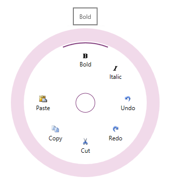

import ApiLink from 'docs-template/components/mdx/ApiLink.astro';

# igRadialMenu

## In This Group of Topics
### Introduction

The topics in this group explain the <ApiLink type="igRadialMenu" label="igRadialMenu" />™ control and its use.

The `igRadialMenu` control is essentially a context menu presenting its items in a circular arrangement around a center button. The circular arrangement of the items speeds up items selection, because each item is equally positioned in relation to the center. The `igRadialMenu` supports different item types for choosing numerical values, color values or performs actions. Sub-Items are also supported.

### Topics

- [igRadialMenu Overview](/overview/igradialmenu-overview.mdx): The topics in this group explain the `igRadialMenu` control's features, visual elements and user actions.

- [Adding igRadialMenu](/adding/igradialmenu-adding.mdx): This topic provides detailed instructions to help you get up and running as soon as possible with the `igRadialMenu`.

- [Configuring igRadialMenu](/configuring/igradialmenu-configuring.mdx): The topics in this section provide additional information about `igRadialMenu` configuring.

- [jQuery and MVC API Reference (igRadialMenu)](/igradialmenu-api-reference.mdx): This topic provides links to the API documentation about the `igRadialMenu` control and the ASP.NET MVC Helper for it.

 

 

