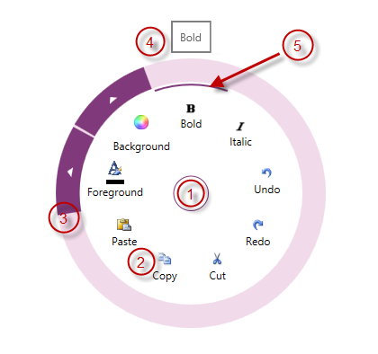

# igRadialMenu Visual Elements

## Topic Overview
### Purpose

This topic provides an overview of the visual elements of the [`igRadialMenu`](&#123;environment:jQueryApiUrl&#125;/ui.igRadialMenu#options)™ control.

### Required background

The following topic is a prerequisite to understanding this topic:

- [igRadialMenu Features](/igradialmenu-features.mdx): This topic explains the features supported by the control from developer perspective.

### In this topic

This topic contains the following sections:

-   [Visual Elements of igRadialMenu Control and Related Properties](#visual-elements)
-   [Related Content](#related-content)

## Visual Elements of igRadialMenu Control and Related Properties
### Visual elements summary

The following screenshot depicts the visual elements of the `igRadialMenu` control. Configurable elements are listed after the image.

**Configurable Visual Elements:**

1.  Center Button – either opens and closes the `igRadialMenu`, or allows access to menu items on the previous level.
2.  Items Area – displays the current level menu items in this area.
3.  Outer Ring – the outer most part of the `igRadialMenu`, may contain arrows for accessing sub-items
4.  Tooltip – indicates the currently selected menu item.
5.  Selection Arc – highlights the currently hovered menu item and its checked state.

### Visual elements and related properties

The following table maps the visual elements of the `igRadialMenu` control and the properties that configure them.

| Visual element | Main configurable aspects |
| --- | --- |
| Center button | `CenterButtonBackTemplate` `CenterButtonContent` `CenterButtonFill` `CenterButtonStroke` |
| Items area | `Items` `ItemsSource` `MinWedgeCount` `RotationInDegrees` `WedgeIndex` `WedgeSpan` |
| Outer ring | `OuterRingFill` `OuterRingStroke` `OuterRingThickness` `OuterRingStrokeThickness` |
| Tooltips | `IsToolTipEnabled` `ToolTip` `ToolTipTemplate` |
| Selection arc | `IsChecked` |

## Related Content
### Topics

The following topic provides additional information related to this topic.

- [User Interaction and Usability](/igradialmenu-user-interaction.mdx): This topic explains what actions can be performed by the user.

 

 

