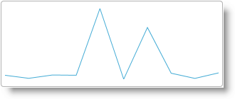

import ApiLink from 'docs-template/components/mdx/ApiLink.astro';

# Adding igSparkline to an HTML Document


## Topic Overview
### Purpose

This topic explains how to add the <ApiLink type="igSparkline.html" label="igSparkline" />™ to an HTML page and bind to a JavaScript array.

### Required background

The following table lists the concepts, topics, and articles required as a prerequisite to understanding this topic.


-   jQuery Selectors

**Topics**

- [igSparkline Overview](/igsparkline-overview.mdx): This topic provides an overview of the `igSparkline` control, its benefits, and the supported chart types.

- [Adding igSparkline Overview](/igsparkline-adding-igsparkline-overview.mdx): This topic provides an overview of the various ways of adding `igSparkline`™ to an application.

- [Adding Required Resources Manually](///general-and-getting-started/adding-the-required-resources-for-igniteui-for-jquery.mdx): This topic explains the organization of JavaScript resources in &#123;environment:ProductName&#125;®.

- [Using JavaScript Resources in &#123;environment:ProductName&#125;](///general-and-getting-started/deployment-guide-javascript-resources.mdx): This topic provides general guidance on adding required JavaScript resources to use controls from the &#123;environment:ProductName&#125; library.


**External Resources**

-   [jQuery UI Widget Factory](http://jqueryui.com/widget/)

### In this topic

This topic contains the following sections:

-   [Adding igSparkline to an HTML Document – Conceptual Overview](#overview)
    -   [Adding igSparkline summary](#summary)
    -   [Requirements](#requirements)
    -   [Steps](#steps)
-   [Adding igSparkline to an HTML Page](#adding-to-html-page)
    -   [Introduction](#html-page-introduction)
    -   [Preview](#html-page-preview)
    -   [Prerequisites](#html-page-prerequisites)
    -   [Overview](#html-page-overview)
    -   [Steps](#html-page-steps)
-   [Related Content](#related-content)
    -   [Topics](#topics)
    -   [Samples](#samples)


## Adding igSparkline to an HTML Document – Conceptual Overview
### Adding igSparkline summary

The `igSparkline` is a data-bound control requiring a set of data objects to render. The control requires an HTML element, a DIV, to serve as the base for instantiation.

The data source is specific through the `dataSource` option. This example defines the data in-line with the HTML. The array is obtainable through an AJAX call, an external JavaScript file, or any other means of retrieving JavaScript array data.

The `igSparkline` is configured in a function for document ready which fires once the document has finished loading resources.

### Requirements

The following table summarizes the requirements for using the `igSparkline` control.


| Requirement/Required Resources | Description | What you need to do… |
| --- | --- | --- |
| IG Theme | This theme contains the visual styles for the &#123;environment:ProductName&#125; library. The theme file is: css/themes/Infragistics/infragistics.theme.css |  |
| `igSparkline` CSS resource files | The styles from the following CSS file are used for rendering various elements of the control: CSS Resource | Description |
| `css/structure/modules/infragistics.ui.shared.css` | Shared CSS styles for all &#123;environment:ProductName&#125; controls. |  |
| `css/structure/modules/infragistics.ui.html5.css` | CSS related to browser support for HTML5 |  |
| `css/structure/modules/infragistics.ui.sparkline.css` | CSS styles specific to the `igSparkline` widget |  |

                <br/>
            &lt;/td&gt;
            &lt;td&gt;Add `style` reference to the file in your page.&lt;/td&gt;
        &lt;/tr&gt;

        &lt;tr&gt;
            &lt;td&gt;Modernizr library (Optional)&lt;/td&gt;
            &lt;td&gt;The Modernizr library is used by the igSparkline to detect browser and device capabilities. It is not mandatory and, if not included, the control will behave as if in a normal desktop environment with an HTML5 compatible browser. <ul> <li> [Modernizr](http://modernizr.com/) </li> </ul>&lt;/td&gt;
            &lt;td&gt;Add a script reference to the library in the `<head>` section of your page.&lt;/td&gt;
        &lt;/tr&gt;

        &lt;tr&gt;
            &lt;td&gt;jQuery and jQuery UI JavaScript resources&lt;/td&gt;
            &lt;td&gt;&#123;environment:ProductName&#125; is built on top of the following frameworks: <ul> <li> [jQuery](http://jquery.com/) </li> <li> [jQuery UI](http://jqueryui.com/) </li> </ul>&lt;/td&gt;
            &lt;td&gt;Add script references to both libraries in the `<head>` section of your page.&lt;/td&gt;
        &lt;/tr&gt;

        &lt;tr&gt;
            &lt;td&gt;General `igSparkline` JavaScript Resources&lt;/td&gt;
            &lt;td&gt;The igSparkline functionality of the &#123;environment:ProductName&#125; library is distributed across several files. You can load the required resources in one of the following ways: <ul> <li> Use the `Infragistics.core.js` and `Infragistics.dv.js` combined files to quickly reference the required JavaScript dependencies </li> <li> Use the Infragistics® Loader (`igLoader`™). You only need to include a script reference to `igLoader` on your page and specify the `igSparkline` as a parameter and the igLoader loads the required individual JavaScript files and CSS files. </li> <li> Load the required resources manually. You need to use the dependencies listed in the table below. </li> </ul> The following table lists the &#123;environment:ProductName&#125; library dependences related to the igSparkline control. These resources need to be referred to explicitly if you chose to load resources manually (i.e. not to use `igLoader`). | JS Resource | Description | | --- | --- | | `js/modules/infragistics.util.js` `js/modules/infragistics.util.jquery.js` | &#123;environment:ProductName&#125; utilities | | `js/modules/infragistics.ui.widget.js` | Common widget | | `js/modules/Infragistics.datasource.js` | Data source framework | | `js/modules/infragistics.templating.js` | `igTemplating` engine | | `js/modules/infragistics.ext_core.js`, `js/modules/infragistics.ext_collections.js`, `js/modules/infragistics.ext_ui.js`, `js/modules/infragistics.dv_jquerydom.js`, `js/modules/infragistics.dv_core.js`, `js/modules/infragistics.dv_geometry.js` | A shared library for all data visualization components | | `js/modules/infragistics.dv_interactivity.js` | Optional. Required for user interaction such as tooltips. | | `js/modules/infragistics.ui.basechart.js` | The base widget for all &#123;environment:ProductName&#125; chart components | | `js/modules/infragistics.sparkline.js` | The internal core logic of the `igSparkline` widget | | `js/modules/infragistics.ui.sparkline.js` | The `igSparkline` widget | <br/>&lt;/td&gt;
            &lt;td&gt;Add one of the following: <ul> <li> A reference to `igLoader` </li> <li> A reference to all the required JavaScript files (listed in the table on the left). </li> </ul>&lt;/td&gt;
        &lt;/tr&gt;
    &lt;/tbody&gt;
&lt;/table&gt;

### Steps

Following are the general conceptual steps for adding an `igSparkline` to an HTML document.

1. Reference the required JavaScript and CSS files.

2. Create a target element for the `igSparkline`.

3. Define the JavaScript array.

4. Instantiate the `igSparkline` in document ready.

5. Configure basic rendering options.


## Adding igSparkline to an HTML Page
### Introduction

This procedure adds a basic `igSparkline` to an HTML page and configures basic options to supply data and configure height and width. The `igSparkline` shows the total amount each order placed over a period of time.

The data structure contains an `ExtendedPrice` field containing the amount of the order and an `OrderDate` field containing the date of the order purchase. The `valueMemberPath` of the `igSparkline` is set to the `ExtendedPrice` and the `labelMemberPath` is set to the `OrderDate`.

### Preview

The following screenshot is a preview of the result.



### Prerequisites

A blank HTML document.

### Overview

1. Reference the required JavaScript and CSS files.

2. Create a target element for the `igSparkline`.

3. Define the JavaScript array.

4. Instantiate the `igSparkline` in document ready.

5. Configure basic rendering options.

### Steps

Follow these steps to add an `igSparkline` to an HTML document.

1. Referencing the required JavaScript and CSS files.

	Setup the HTML document with the JavaScript and CSS file dependencies.
	
	**In HTML:**
	
	
```html
	<!DOCTYPE html>
	<html>
	<head>
	    <title></title>
	    
	    <link href="../../igniteui/css/themes/infragistics/infragistics.theme.css" rel="stylesheet" />
	    <link href="../../igniteui/css/structure/infragistics.css" rel="stylesheet" />
	    <script src="../../js/modernizr.min.js"></script>
	    <script src="../../js/jquery.min.js"></script>
	    <script src="../../js/jquery-ui.min.js"></script>
	    
	    <script src="../../igniteui/js/infragistics.core.js"></script>
	    <script src="../../igniteui/js/infragistics.dv.js"></script>
	</head>
	<body>
	</body>
	</html>
```

2. Creating a target element for the `igSparkline`.

	Create a DIV element within the HTML body on which to instantiate the `igSparkline` widget.
	
	**In HTML:**
	
```html
	<body>
	    
	    <div id="sparkline"></div>
	…
```

3. Defining the JavaScript array.

	Define the JavaScript array.
	
	**In HTML:**
	
```html
	<body>
	<script>
	var invoices = [
	    {"OrderDate": "/Date(836452800000)/", "ExtendedPrice": 168.0000},
	    { "OrderDate": "/Date(836452800000)/", "ExtendedPrice": 98.0000},
	    { "OrderDate": "/Date(836452800000)/", "ExtendedPrice": 174.0000},
	    { "OrderDate": "/Date(836539200000)/", "ExtendedPrice": 167.4000},
	    { "OrderDate": "/Date(836539200000)/", "ExtendedPrice": 1696.0000},
	    { "OrderDate": "/Date(836798400000)/", "ExtendedPrice": 77.0000},
	    { "OrderDate": "/Date(836798400000)/", "ExtendedPrice": 1261.4000},
	    { "OrderDate": "/Date(836798400000)/", "ExtendedPrice": 214.2000},
	    { "OrderDate": "/Date(836798400000)/", "ExtendedPrice": 95.7600},
	    { "OrderDate": "/Date(836798400000)/","ExtendedPrice": 222.3000}
	];
	</script>
	</body>
```

4. Instantiate the `igSparkline` in document ready.

	Use the selector of the target element defined previously to instantiate the widget.
	
	**In HTML:**
	
```html
	<script>
	        $(function () {
	            $("#sparkline").igSparkline({
	            });
	        });
	</script>
```

5. Configuring basic rendering options.

	When instantiating the `igSparkline`, configure the dataSource, `valueMemberPath`, `labelMemberPath`, height, and width options.
	
	**In HTML:**
	
```html
	$("#sparkline").igSparkline({
	    dataSource: invoices,
	    height: "100px",
	    width: "300px",
	    valueMemberPath: 'ExtendedPrice',
	    labelMemberPath: 'OrderDate'
	});
```

Full Code:

**In HTML:**

```html
<!DOCTYPE html>
<html>
<head>
    <title></title>
    
    <link href="../../igniteui/css/themes/infragistics/infragistics.theme.css" rel="stylesheet" />
    <link href="../../igniteui/css/structure/infragistics.css" rel="stylesheet" />
    <script src="../../js/modernizr.min.js"></script>
    <script src="../../js/jquery.min.js"></script>
    <script src="../../js/jquery-ui.min.js"></script>
    
    <script src="../../igniteui/js/infragistics.core.js"></script>
    <script src="../../igniteui/js/infragistics.dv.js"></script>
</head>
<body>
    
    <div id="sparkline"></div>
    <script>
        var invoices = [
            {"OrderDate": "/Date(836452800000)/", "ExtendedPrice": 168.0000},
            { "OrderDate": "/Date(836452800000)/", "ExtendedPrice": 98.0000},
            { "OrderDate": "/Date(836452800000)/", "ExtendedPrice": 174.0000},
            { "OrderDate": "/Date(836539200000)/", "ExtendedPrice": 167.4000},
            { "OrderDate": "/Date(836539200000)/", "ExtendedPrice": 1696.0000},
            { "OrderDate": "/Date(836798400000)/", "ExtendedPrice": 77.0000},
            { "OrderDate": "/Date(836798400000)/", "ExtendedPrice": 1261.4000},
            { "OrderDate": "/Date(836798400000)/", "ExtendedPrice": 214.2000},
            { "OrderDate": "/Date(836798400000)/", "ExtendedPrice": 95.7600},
            { "OrderDate": "/Date(836798400000)/","ExtendedPrice": 222.3000}
        ];
    $(function () {
        $("#sparkline").igSparkline({
            dataSource: invoices,
            height: "100px",
            width: "300px",
            valueMemberPath: 'ExtendedPrice',
            labelMemberPath: 'OrderDate'
        });
    });
    </script>
</body>
</html>
```


## Related Content
### Topics

The following topics provide additional information related to this topic.

- [Adding igSparkline to an ASP.NET MVC View](/igsparkline-adding-igsparkline-to-an-aspnet-mvc-view.mdx): This topic walks through instantiating an `igSparkline` in an ASP.NET MVC view and bind to a .NET collection of objects.

- [jQuery and ASP.NET MVC Helper Links (igSparkline)](/igsparkline-jquery-and-aspnet-mvc-api.mdx): This topic provides links to the API documentation for jQuery and ASP.NET MVC helper class for the `igSparkline` control.

### Samples

The following sample provides additional information related to this topic.

- [Bind to JSON Data](&#123;environment:SamplesUrl&#125;/sparkline/bind-json): This sample binds to JSON data contained in an external script file. It also shows binding with the ASP.NET MVC helper.