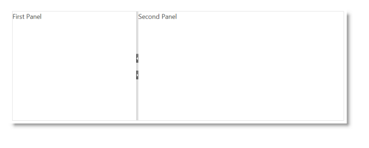

# igSplitter

## In This Group of Topics
### Introduction

The topics in this group explain the `igSplitter`™ control and its use.

The `igSplitter` is a container control for managing layouts in HTML5 Web applications and sites by dividing the layout into two separate panels.

### Topics

- [igSplitter Overview](/igsplitter-overview.mdx): This topic provides conceptual information about the `igSplitter` control including its features and user functionality.

- [Adding igSplitter](/adding-igsplitter.mdx): This topic demonstrates, with code examples, how to add the `igSplitter` control to an HTML page in either JavaScript and ASP.NET MVC.

- [Configuring igSplitter](/configuring-igsplitter.mdx):This topic explains, with code examples, how to configure the `igSplitter` control.

- [Handling Events (igSplitter)](/igsplitter-handling-events.mdx): This topic explains, with code examples, how to attach event handlers to the `igSplitter` control.

- [Accessibility Compliance (igSplitter)](/igsplitter-accessibility-compliance.mdx): This topic explains the accessibility features of the `igSplitter` control and provides advice on how to achieve accessibility compliance for pages containing this control.

- [Known Issues and Limitations (igSplitter)](/igsplitter-known-issues-and-limitations.mdx): This topic provides information about the known issues and limitations of the `igSplitter` control.

- [jQuery and MVC API Links (igSplitter)](/igsplitter-jquery-and-aspnet-mvc-helper-api-links.mdx): This topic provides links to the API documentation for the jQuery and its ASP.NET MVC helper class for the `igSplitter` control.

 

 

