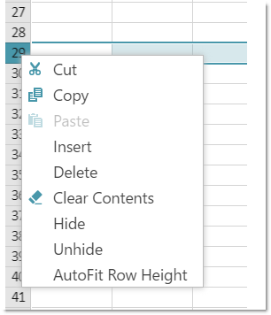
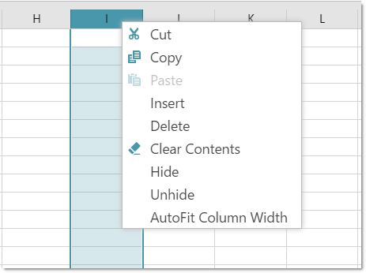
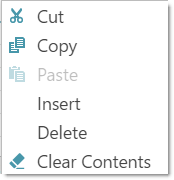
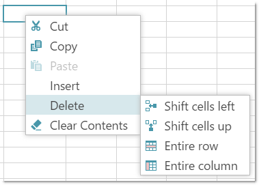
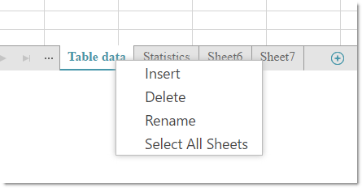

# igSpreadsheet Context Menu

import ApiLink from 'docs-template/components/mdx/ApiLink.astro';

# igSpreadsheet Context Menu
##Topic Overview
### Purpose
This topic provides an overview of the visual elements of the control.

### Required background
To understand this topic you need to be familiar with the concept and topics related to the [Infragistics JavaScript Excel Library](../../../09_JavaScript Excel Library/~JavaScript_Excel_Library.mdx).

## Context menu summary
The `igSpreadsheet` control provides a context menu, which is opened by right clicking on the control elements. The context menu allows the user to perform different operations depending on the elements on which the right click is performed.

The following `igSpreadsheet` elements have their specific context menus:

- Worksheet column(s) or rows(s)

- Worksheet cells

- Worksheet sheets

>**Note**: If the user has more than one worksheet selected and perform clipboard operation on cell(s) in the active worksheet, all selected worksheets will be affected. Cut operation will move cells' content from all selected worksheets to the clipboard, copy operation will duplicate cells' content from all selected worksheets and paste operation will copy clipboard content into the specified cells in all selected worksheets.

## Context Menu on Worksheet columns or rows

The worksheet column(s) or row(s) context menu allows the user to:

- Perform clipboard operations on the selected column(s) or row(s)

- Insert/delete column(s) or row(s) or their content

- Hide/unhide and auto-size column(s) and row(s)

The following screenshots show the worksheet column(s) and row(s) context menu:

## Context Menu on Worksheet cells

The worksheet cells context menu allows the user to:

- Perform clipboard operations over the cell(s)

- Insert new empty cells

- Delete cells or delete cells' content only

>**Note**: To render its items correctly, the Context menu requires jQuery UI version 1.12.0 or later to be loaded.

## Context Menu for worksheets

The context menu of the worksheets tabs area allows the user to:

- Insert new worksheet

- Delete existing worksheet

- Rename existing worksheet

- Select all worksheets

- Unselect all worksheets ("Ungroup Sheets" menu item)

The following screenshot shows the worksheets tab bar area context menu when one worksheet is selected:

The following screenshot shows the worksheets tab bar area context menu when several worksheets are selected:

## Related Links

 -   [igSpreadsheet Overview](/igspreadsheet-overview.mdx)
 -   [igSpreadsheet Activation and Navigation Interactions](/igspreadsheet-activation-and-navigation-interactions.mdx)
 -   [igSpreadsheet Selection](/igspreadsheet-selection.mdx)
 -   <ApiLink type="igspreadsheet" label="igSpreadsheet API" />