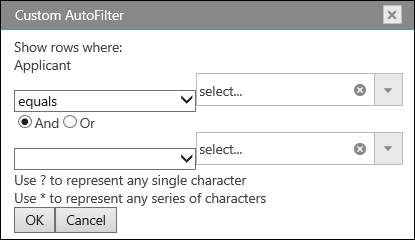

import ApiLink from 'docs-template/components/mdx/ApiLink.astro';

# igSpreadsheet Filter Dialog

## Topic Overview
### Purpose
This topic explains what operations can be performed by the user with the control’s filter dialog to create or modify complex filters in a column.

### Required background
To understand this topic you need to be familiar with the concept and topics related to the [Infragistics JavaScript Excel Library](../../../09_JavaScript Excel Library/~JavaScript_Excel_Library.mdx) and [igSpreadsheet](igSpreadsheet_Feature_Overview.html).

### In this topic
This topic contains the following sections:

-   [Introduction](#introduction)
- 	[Filter Dialog for Worksheet](#worksheet_dialog)
- 	[Filter Dialog for Table](#table_dialog)
- 	[Related Links](#related_links)

## Introduction



### Filter dialog summary

The &#123;SpreadsheetName&#125; control provides a filter dialog which is opened by clicking on the dropdown button in the header row of either a loaded worksheet or created table. The filter dialog will change based on the field that was interacted with.

## Filter Dialog for Worksheet

### Code Example
The following example code demonstrates how to show the filter dialog for the first relative column in a worksheet region's filter settings. A region can be assigned with the SetRegion method exposed from the Worksheet.FilterSettings. 

```js
var executed = $(".selector").igSpreadsheet("showFilterDialogForWorksheet", 0);
```
## Filter Dialog for Table

### Code Example
The following example code demonstrates how to show the filter dialog for the first column in a worksheet table, specified by it's index.

```js
var executed = $(".selector").igSpreadsheet("showFilterDialogForTable", table.columns(0));

```

## Related Links
-   [igSpreadsheet Overview](/igspreadsheet-overview.mdx)
-   [igSpreadsheet Activation And Navigation Interaction](/igspreadsheet-activation-and-navigation-interactions.mdx)
-   [igSpreadsheet Feature Overview](/igspreadsheet-feature-overview.mdx)
-   <ApiLink type="igspreadsheet" label="igSpreadsheet API" />