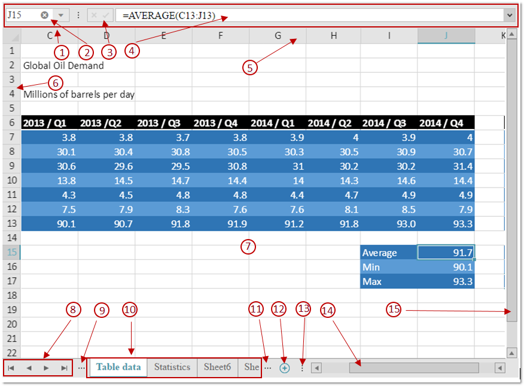

# igSpreadsheet Visual Elements

import ApiLink from 'docs-template/components/mdx/ApiLink.astro';

# igSpreadsheet Visual Elements

## Topic Overview
### Purpose
This topic provides an overview of the visual elements of the control.

### Required background
To understand this topic you need to be familiar with the concept and topics related to the [Infragistics JavaScript Excel Library](../../../09_JavaScript Excel Library/~JavaScript_Excel_Library.mdx).

## Visual Elements of igSpreadsheet control
The following screenshot depicts the visual elements of the `igSpreadsheet` control. The configurable elements are listed after the image.

1. Formula Bar
2. Name Box
3. Decline and confirm buttons of the Formula Editor
4. Formula Editor
5. Column headers
6. Row headers
7. Speadsheet data cells
8. Buttons for scrolling the worksheet tabs listed
9. Button for activating the previous worksheet
10. List of worksheets available in the opened workbook (the current worksheet is displayed with different color)
11. Button for activating the next worksheet
12. Button for adding worksheet to the opened workbook
13. Splitter used to divide the space between the worksheets tab bar area and the horizontal scrollbar
14. Horizontal scrollbar
15. Vertical scrollbar

>**Note**: Bullets from 8 to 12 are forming the worksheets tab bar area.

## Visual elements and related properties

The following table maps the visual elements of the `igSpreadsheet` control and the properties that configure them.

Visual Element|Property
---|---
Formula Bar| <ApiLink type="igspreadsheet" member="isFormulaBarVisible" section="options" label="isFormulaBarVisible" />
Column and row headers| <ApiLink type="igspreadsheet" member="areHeadersVisible" section="options" label="areHeadersVisible" />
Spreadsheet data cells| <ApiLink type="igspreadsheet" member="areGridlinesVisible" section="options" label="areGridlinesVisible" />

## Related Links

-	[igSpreadsheet Overview](/igspreadsheet-overview.mdx)
-   [Configuring igSpreadsheet](configuring-igspreadsheet.html)
-   <ApiLink type="igspreadsheet" label="igSpreadsheet API" />
