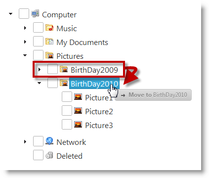
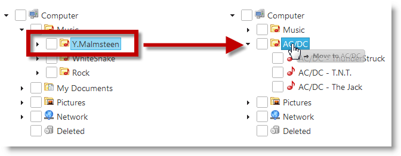

# Enabling Drag-and-Drop (igTree)

## Topic Overview
### Purpose

This topic explains, with code examples, how to enable the Drag-and-Drop feature in the `igTree`™ control.

### In this topic

This topic contains the following sections:

-   [Introduction](#introduction)
-   [Enabling the Drag-and-Drop Feature Summary](#feature-summary)
-   [Enabling Drag-and-Drop Within an igTree Control](#drag-drop-within-tree)
-   -   [Overview](#within-tree-overview)
    -   [Property settings](#within-tree-settings)
    -   [Code Example](#within-tree-code-example)
-   [Enabling Drag-and-Drop Between Different igTree Controls](#between-different-trees)
-   -   [Overview](#between-trees-overview)
    -   [Property settings](#between-trees-settings)
    -   [Code Example](#between-trees-code-example)
-   [Related Content](#related-content)


## Introduction
### The Drag-and-Drop feature

Dragging and dropping can be performed within the same `igTree` control or between different `igTree` controls. The latter is configured in addition to the “normal” (within the same tree) drag-and-drop.

## Enabling the Drag-and-Drop Feature Summary

### Enabling Drag-and-Drop summary chart

The following table lists the two ways to enable the Drag-and-drop feature of the `igTree` control.


| Type of enabling | Configuration Details | Properties |
| --- | --- | --- |
| Enabling drag-and-drop within an `igTree` | The `igTree` control must have the Drag-and-Drop feature enabled. | [dragAndDrop](./04_API Reference/01_igTree_Drag-and-Drop_Property_API_Reference.mdx) |
| Enabling the drag-and-drop between different `igTrees` | All participating `igTree` controls must have the Drag-and-Drop feature enabled. In addition to that, each the must be configured to accept drops from other `igTree` controls. | [dragAndDrop](./04_API Reference/01_igTree_Drag-and-Drop_Property_API_Reference.mdx) [dragAndDropSettings](./04_API Reference/01_igTree_Drag-and-Drop_Property_API_Reference.mdx) [allowDrop](./04_API Reference/01_igTree_Drag-and-Drop_Property_API_Reference.mdx) |


## Enabling Drag-and-Drop Within an igTree Control
### Overview

The `igTree` control must have the Drag-and-Drop feature enabled.



Enabling the dragging within same control is managed by the [dragAndDrop](./04_API Reference/01_igTree_Drag-and-Drop_Property_API_Reference.mdx) property.

### Property settings

The following table maps the desired configuration to property settings.

In order to: | Use this property: | And set it to:
---|---|---
Enable dragging in the igTree | [dragAndDrop](./04_API Reference/01_igTree_Drag-and-Drop_Property_API_Reference.mdx) |true


### Code Example

The following snippets demonstrate the [](#within-tree-settings)implemented in code.

**In JavaScript:**                                                                                                                                                
```js
$("#tree").igTree({                                                           
 dragAndDrop: true,                                                 
});                                                      
```

**In Razor:**                                                                                                                                            
```csharp
@(Html.                                                                               	Infragistics().                                                           	Tree().                                                                   	ID("tree").                                                               	DragAndDrop(true).                                                        	DataBind().                                                              	Render()                                                              
)                                                            
```


## Enabling Drag-and-Drop Between Different igTree Controls
### Overview

All participating `igTree` controls must have the Drag-and-Drop feature
enabled. In addition to that, each the must be configured to accept
drops from other `igTree` controls.



This means that you must set [dragAndDrop](./04_API Reference/~igTree_Drag-and-Drop_API_Reference.mdx) property of each participating `igTree` control.

to true to enable dragging. To enable dropping between these `igTree` controls, you must set two additional properties for each `igTree` that will be accepting drops from the other trees:

-   [dragAndDropSettings](./04_API Reference/01_igTree_Drag-and-Drop_Property_API_Reference.mdx) to allowDrop
-   [allowDrop](./04_API Reference/01_igTree_Drag-and-Drop_Property_API_Reference.mdx) property to true

### Property settings

The following table maps the desired configuration to property settings.

In order to: | Use this property: | And set it to:
---|---|---
Enable dragging in the igTree | [dragAndDrop](./04_API Reference/01_igTree_Drag-and-Drop_Property_API_Reference.mdx)|true
Enable Drag-and-Drop settings | [dragAndDropSettings](./04_API Reference/01_igTree_Drag-and-Drop_Property_API_Reference.mdx) |allowDrop
Enable dropping in the igTree | [allowDrop](./04_API Reference/01_igTree_Drag-and-Drop_Property_API_Reference.mdx)|true


### Code Example

The following snippets demonstrate the settings in Example block implemented in code.

 **In JavaScript:** 

```js 
$("#firstTree").igTree({                                                      
	dragAndDrop: true,
	dragAndDropSettings: {                                                       
		allowDrop: true                                                      
	}                                                                     
}); 


$("#secondTree").igTree({                                                     
	dragAndDrop: true,
	dragAndDropSettings: {                                                      
		allowDrop: true                                                       
	}                                                                   
});                                                       
```


**In Razor:**

```csharp
@(Html.Infragistics()
	.Tree()
	.ID("firstTree")
	.DragAndDrop(true)
	.DragAndDropSettings(settings =>{
		settings.AllowDrop(true);
	})
	.DataBind()
	.Render())
                                                                       
@(Html.Infragistics()
	.Tree()
	.ID("secondTree")
	.DragAndDrop(true)
	.DragAndDropSettings(settings =>{
		settings.AllowDrop(true);
	})
	.DataBind()
	.Render())
```

## Related Content
### Topics

The following topics provide additional information related to this topic.

- [Configuring Drag-and-Drop (igTree)](/configuring/igtree-drag-and-drop-configuring.mdx):  This topic explains, with code examples, how to configure the Drag-and-Drop of the `igTree` control, in both JavaScript and MVC.

- [Drag-and-Drop API Reference (igTree)](./04_API Reference/~igTree_Drag-and-Drop_API_Reference.mdx): The topics in this group provide reference information about the events and properties of the `igTree` control that are related to the Drag-and-Drop feature.


### Samples

The following samples provide additional information related to this topic.

- [Drag and Drop - Single Tree](&#123;environment:SamplesUrl&#125;/tree/drag-and-drop-single-tree): This sample demonstrates how to initialize the `igTree` control with the Drag-and-Drop feature enabled.

- [Drag and Drop - Multiple Trees](&#123;environment:SamplesUrl&#125;/tree/drag-and-drop-multiple-trees): This sample demonstrates how to drag-and-drop nodes between two `igTrees`.

- [API and Events](../15_igTree_Event_Reference.mdx#attaching-handlers-jquery): This sample demonstrates how to use `igTree` API.


 

 


