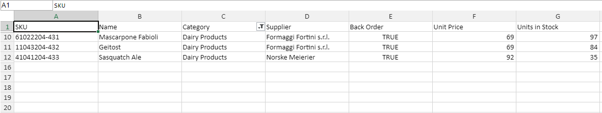

# Worksheet level Filtering

import ApiLink from 'docs-template/components/mdx/ApiLink.astro';

# Worksheet level Filtering

## Introduction

Before you can take advantage of the filter settings in the JavaScript Excel Library, you will need to create a <ApiLink pkg="ig" type="excel.Workbook" label="Workbook" /> object. You can do this by either reading an existing Microsoft® Excel® file, as explained in the How Do I... topic: [Read an Excel File into a Workbook](JavaScript-Excel-Library-Read-an-Excel-2007-XLSX-File-Into-a-Workbook.html "Explains how to read and excel file into a workbook.") or you can create a blank workbook. When you create a blank workbook, before writing it to a file, you must add at least one worksheet. After a worksheet is created you will be able to add filtering conditions and other related settings to the excel file, as explained by this topic.

Filtering is done by setting a filter condition on a worksheet's <ApiLink pkg="ig" type="excel.WorksheetFilterSettings" label="WorksheetFilterSettings" />. Filter conditions are only reapplied when they're are added, removed, modified, or when the <ApiLink pkg="ig" type="excel.WorksheetFilterSettings" member="reapplyFilters" section="methods" label="reapplyFilters" /> method is called on the sheet. Filters are not constantly evaluated as data within the region changes. Filters are applied to the region only when they are added or removed or when the ReapplyFilters method is called.

If no filters are applied this method will not do anything to the data.

### Property settings

The following table maps the desired Methods managed by the  <ApiLink pkg="ig" type="excel.WorksheetFilterSettings" label="WorksheetFilterSettings" />.

| Method			| Description     																	|
| ------------- 	|:-------------:																	
|<ApiLink pkg="ig" type="excel.WorksheetSortSettings" member="setRegion" section="methods" label="SetRegion" />|This is used to specify the region which will be filtered.
|<ApiLink pkg="ig" type="excel.WorksheetSortSettings" member="getFilter" section="methods" label="GetFilter" /> |Gets the filter that is applied to a specific column.

### The following sort condition types are available to set on columns:

| Method			| Description     																	|
| ------------- 	|:-------------:																	|
|<ApiLink pkg="ig" type="excel.AverageFilter" member="ig.excel.AverageFilter" section="methods" label="ApplyAverageFilter" /> |Represents a filter which can filter data based on whether the data is below or above the average of the entire data range.|
|<ApiLink pkg="ig" type="excel.DatePeriodFilter" member="ig.excel.DatePeriodFilter" section="methods" label="ApplyDatePeriodFilter" /> |Represents a filter which can filter dates in a Month, or quarter of any year.|
|<ApiLink pkg="ig" type="excel.FillFilter" member="ig.excel.FillFilter" section="methods" label="ApplyFillFilter" /> |Represents a filter which will filter cells based on their background fills. This filter specifies a single CellFill. Cells of with this fill will be visible in the data range. All other cells will be hidden.|
|<ApiLink pkg="ig" type="excel.FixedValuesFilter" member="ig.excel.FixedValuesFilter" section="methods" label="ApplyFixedValuesFilter" /> |Represents a filter which can filter cells based on specific, fixed values, which are allowed to display.|
|<ApiLink pkg="ig" type="excel.FontColorFilter" member="ig.excel.FontColorFilter" section="methods" label="ApplyFontColorFilter" /> |Represents a filter which will filter cells based on their font colors. This filter specifies a single color. Cells with this color font will be visible in the data range. All other cells will be hidden.|
|<ApiLink pkg="ig" type="excel.IconFilter" member="ig.excel.IconFilter" section="methods" label="ApplyIconFilter" /> |Represents a filter which can filter cells based on their conditional formatting icon.|
|<ApiLink pkg="ig" type="excel.IconFilter" member="ig.excel.RelativeDateRangeFilter" section="methods" label="ApplyRelativeDateRangeFilter" /> |Represents a filter which can filter date cells based on dates relative to the when the filter was applied.|
|<ApiLink pkg="ig" type="excel.IconFilter" member="ig.excel.TopOrBottomFilter" section="methods" label="ApplyTopOrBottomFilter" /> |Represents a filter which can filter in cells in the upper or lower portion of the sorted values.|
|<ApiLink pkg="ig" type="excel.YearToDateFilter" member="ig.excel.YearToDateFilter" section="methods" label="ApplyYearToDateFilter" /> |Represents a filter which can filter in date cells if the dates occur between the start of the current year and the time when the filter is evaluated.|
|<ApiLink pkg="ig" type="excel.AverageFilter" member="ig.excel.CustomFilter" section="methods" label="ApplyCustomFilter" /> |Represents a filter which can filter data based on one or two custom conditions. These two filter conditions can be combined with a logical "and" or a logical "or" operation.|

### Code Snippet: ApplyAverageFilter

This code shows how to filter cells above the average value of all cells in the column. Filtering below average values is done in a similar manner.

The code in this example creates a workbook, and worksheet to modify the specified region through the <ApiLink pkg="ig" type="excel.WorksheetFilterSettings" label="WorksheetFilterSettings" />. After that, a filter is applied on a column of the region. In the end, the workbook is saved so the filtered region can be seen.

Following is the code that implements this example.


**In JavaScript:**

```js
// Create a new workbook

var workbook = new $.ig.excel.Workbook($.ig.excel.WorkbookFormat.excel2007);
var sheet = workbook.worksheets().add('Sheet1');

// Filter the worksheet object

sheet.filterSettings().setRegion("C1:C15");	
sheet.filterSettings().applyCustomFilter(0, new $.ig.excel.CustomFilterCondition($.ig.excel.ExcelComparisonOperator.equals, "Dairy Products")); 
			
```



### Related Topics


- [JavaScript Excel Library Overview](/understanding/javascript-excel-library-overview.mdx)


### Related Samples


- [Excel Table](\{environment:NewSamplesUrl\}/javascript-excel-library/excel-table)

- [Excel Formatting](\{environment:NewSamplesUrl\}/javascript-excel-library/excel-formatting)

- [Excel Formulas](\{environment:NewSamplesUrl\}/javascript-excel-library/excel-formulas)

- [Import Data From Excel ](\{environment:NewSamplesUrl\}/javascript-excel-library/excel-import-data)