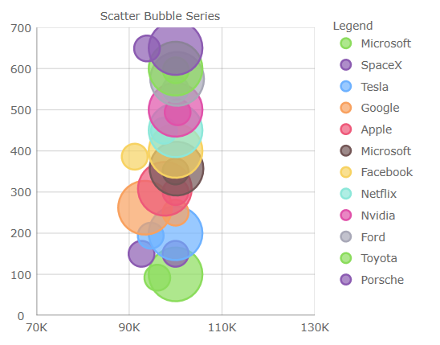
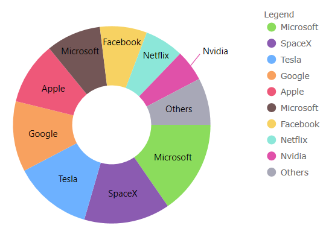

# What's New in 2021 Volume 1

This topic presents the new features for the &#123;environment:ProductFamilyName&#125;™ 2021 Volume 1 release.

## Chart Features

This release introduces several new and improved visual design and configuration options for all of the chart components. e.g. Data Chart, Category Chart, and Financial Chart.

### Redesigned Chart Defaults:

* New color palette for series/markers in all charts

  | 
------------- | -------------
  | 

* Changed Bar/Column/Waterfall series to have square corners instead of rounded corners 

* Changed Scatter High Density series’ colors for min/max heat properties  

* Changed Financial/Waterfall series’ colors for negative fill of their visuals

* Changed marker's thickness to 2px from 1px

* Changed marker's fill to match the marker's outline for PointSeries, BubbleSeries, ScatterSeries, PolarScatterSeries 

Note, you can use set [`MarkerFillMode`](&#123;environment:jQueryApiUrl&#125;/ui.igDataChart#options:markerFillMode) property to Normal to undo this change

* Compressed labelling for the TimeXAxis and OrdinalTimeXAxis 

* New Marker Properties:

    - [`MarkerFillMode`](&#123;environment:jQueryApiUrl&#125;/ui.igDataChart#options:markerFillMode) - Can be set to 'MatchMarkerOutline' so the marker depends on the outline
    - [`MarkerFillOpacity`](&#123;environment:jQueryApiUrl&#125;/ui.igDataChart#options:markerFillOpacity) - Can be set to a value 0 to 1
    - [`MarkerOutlineMode`](&#123;environment:jQueryApiUrl&#125;/ui.igDataChart#options:markerOutlineMode) - Can be set to 'MatchMarkerBrush' so the marker's outline depends on the fill brush color

* New Series [`OutlineMode`](&#123;environment:jQueryApiUrl&#125;/ui.igDataChart#options:series.outlineMode) Property:

Can be set to toggle the series outline visibility. Note, for Data Chart, the property is on the series

* New Plot Area Margin Properties:

    The plot area margin properties define the bleed over area introduced into the viewport when the chart is at the default zoom level. A common use case is to provide space between the axes and first/last data points. Note, the [`ComputedPlotAreaMarginMode`](&#123;environment:jQueryApiUrl&#125;/ui.igDataChart#options:computedPlotAreaMarginMode), listed below, will automatically set the margin when markers are enabled. The others are designed to specify a `Number` to represent the thickness, where PlotAreaMarginLeft etc. adjusts the space to all four sides of the chart. These new properties were added:

    - [`PlotAreaMarginLeft`](&#123;environment:jQueryApiUrl&#125;/ui.igDataChart#options:plotAreaMarginLeft)
    - [`PlotAreaMarginTop`](&#123;environment:jQueryApiUrl&#125;/ui.igDataChart#options:plotAreaMarginTop)
    - [`PlotAreaMarginRight`](&#123;environment:jQueryApiUrl&#125;/ui.igDataChart#options:plotAreaMarginRight)
    - [`PlotAreaMarginBottom`](&#123;environment:jQueryApiUrl&#125;/ui.igDataChart#options:plotAreaMarginBottom)
    - [`ComputedPlotAreaMarginMode`](&#123;environment:jQueryApiUrl&#125;/ui.igDataChart#options:computedPlotAreaMarginMode)

* New Highlighting Properties

    Several configurations to the series highlighting as been added. In previous releases the highlighting was limited to fade on hover. These new properties were added:

    - [`HighlightingMode`](&#123;environment:jQueryApiUrl&#125;/ui.igDataChart#options:highlightingMode) - Sets whether hovered or non-hovered series to fade, brighten
    - [`HighlightingBehavior`](&#123;environment:jQueryApiUrl&#125;/ui.igDataChart#options:highlightingBehavior) - Sets whether the series highlights depending on mouse position eg. directly over or nearest item

* Added Highlighting for the following series:

    - Stacked
    - Scatter
    - Polar
    - Radial 
    - Shape

* Added Annotation layers to the following series:

    - Stacked
    - Scatter
    - Polar
    - Radial
    - Shape

* Added support for overriding the data source of individual stack fragments within a stacked series 

* Added custom style events to Stacked, Scatter, Range, Polar, Radial, and Shape series

* Added support to automatically expanding the horizontal margins of the chart based on the initial labels displayed 

### Chart Legend Features:

* [`LegendHighlightingMode`](&#123;environment:jQueryApiUrl&#125;/ui.igDataChart#options:legendHighlightingMode) - Enables series highlighting when hovering over legend items

### Geographic Map Features (CTP):

* Added support for wrap around display of the map (scroll infinitely horizontally)  

* Added support for shifting display of some map series while wrapping around the coordinate origin  

* Added support for highlighting of the shape series 

* Added support for some annotation layers for the shape series 

