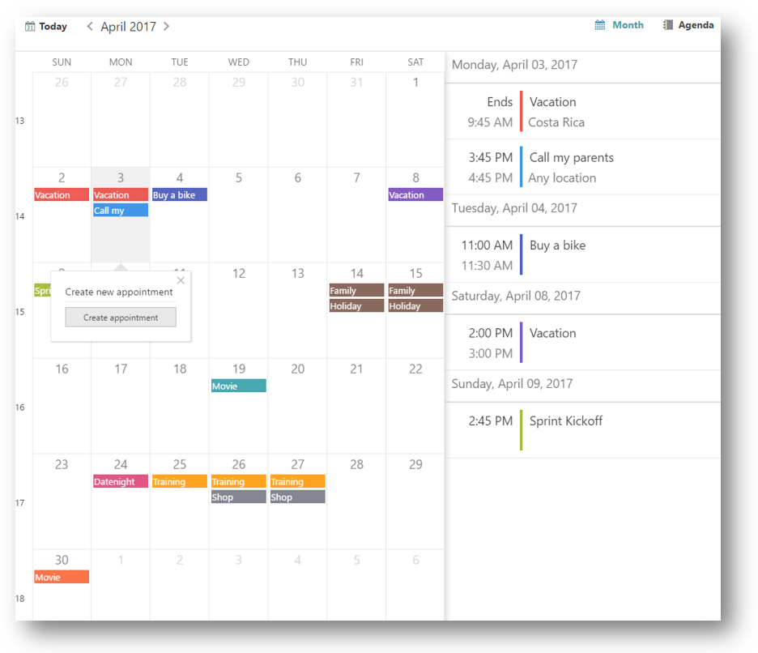
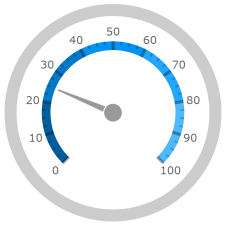

# What's New in 2017 Volume 1

import ApiLink from 'docs-template/components/mdx/ApiLink.astro';

# What's New in 2017 Volume 1

This topic presents the controls and the new and enhanced features for the \{environment:ProductFamilyName\}™ 2017 Volume 1 release.


## What’s New Summary

The following summarizes what’s new in 2017 Volume 1. Additional details follow.

### igSpreadsheet

Feature | Description
---|---
[New control igSpreadsheet](#spreadsheet)| The igSpreadsheet is a jQuery widget that visualize excel documents in all modern browsers.

### igScheduler

Feature | Description
---|---
[New control igScheduler](#scheduler)| The igScheduler is a jQuery widget that provides a common scheduling solution for presenting and managing time periods and the associated activities.

### igDataSource

Feature | Description
---|---
[Filter By Text](#filterbytext)| The igDataSource component provides a way to search for a specific words or phrases in all of its fields.

### igGrid

Feature | Description
---|---
[Date Handling](#griddatehandling)| The igGrid provides a way to control the display and edit of date values for clients in different time zones.
[More Flexible Caption](#gridcaption)| igGrid's new caption is designed to be more flexible and customizable.
[GroupBy Summaries](#groupSummaries)| The GroupBy feature now allows a summary row to be displayed below and/or above each group data island.

### igCombo

Feature | Description
---|---
[Knockout Disable Handler](#comboKnockoutDisable)| Knockout Disable binding handler has been implemented for the combo.

### Editors

Feature | Description
---|---
[Knockout Disable Handler](#editorsKnockoutDisable)| Knockout Disable binding handler has been implemented for the editors.


### igNumericEditor

Feature | Description
---|---
[Round Decimals](#roundDecimals)| The numeric editor introduces new option <ApiLink type="ignumericeditor" member="roundDecimals" section="options" label="roundDecimals" /> that allows to round values with decimal point.

### igDateEditor/igDatePicker

Feature | Description
---|---
[Date Handling](#dateHandling)| New editors' settings are needed when handling date transfers.

### igDatePicker

Feature | Description
---|---
[Date Picker Options MVC wrapper](#pickerOptionsWrapper) | When using DatePicker MVC wrapper, now additional wrapper for the date picker options is available.

### igDataChart

Feature | Description
---|---
[Zoom Enabling Options](#zoomEnablingProperties) | New options called <ApiLink type="igDataChart" member="isHorizontalZoomEnabled" section="options" label="isHorizontalZoomEnabled" /> and <ApiLink type="igDataChart" member="isHorizontalZoomEnabled" section="options" label="isVerticalZoomEnabled" /> have been added which control whether zooming is allowed on either the horizontal or vertical axis.

### igMap

Feature | Description
---|---
[OpenStreet Tile Path](#tilePathProperty) | The option called <ApiLink type="igMap" member="backgroundContent.tilePath" section="options" label="tilePath" /> has been added to the <ApiLink type="igMap" member="backgroundContent" section="options" label="backgroundContent" /> option for the OpenStreet tile source.

### igRadialGauge, igLinearGauge, igBulletGraph
Feature | Description
---|---
[Design Changes](#gaugeDesignChanges) | The visuals for the gauges have been updated.


## <a id="spreadsheet"></a>igSpreadsheet

In version 2017.1 we introduce the igSpreadsheet control. It is a jQuery widget that visualize excel documents in all modern browsers. For MVP version, the control has the following areas and features available:

-   Configurable component areas
    -   Formula Bar
    -   Context Menu
    -   Tab Bar Area
    -   Headers

-   Control manipulations

    -   Selection
    -   Resizing
    -   Hiding
    -   Freezing Panes
    -   Splitting Panes
    -   Zooming

-   Data manipulations
    -   Inserting and Deleting Cells, Columns and Rows
    -   Undo and Redo
    -   Copy and Paste
    -   Data Validation
    -   Worksheets
    -   Hyperlinks

-   Visual configurations
    -   Gridlines
    -   Cell Alignment
    -   Cell Borders
    -   Font Styles


#### Related Topics
-   [igSpreadsheet Overview](//controls/igspreadsheet/igspreadsheet-overview/overview.mdx)
-   [Adding igSpreadsheet](//controls/igspreadsheet/adding-igspreadsheet.mdx)
-   [Configuring igSpreadsheet](//controls/igspreadsheet/configuring-igspreadsheet.mdx)


#### Related Samples
-   [Overview](\{environment:SamplesUrl\}/spreadsheet/overview)
-   [View Configuration](\{environment:SamplesUrl\}/spreadsheet/create-view-save)
-   [Import Data From Excel File](\{environment:SamplesUrl\}/spreadsheet/loading-data)

## <a id="scheduler"></a> igScheduler
### New Control

The `igScheduler`™ control provides a common scheduling solution for presenting and managing time periods and the associated activities.

### Supported features:
-   Creating, editing and deleting of appointment.
    -   Configurable appointments display mode in the month view calendar (indicator or event subject).
    -   Assigning appointments to color themed resources.
-   Using different views (month and agenda view).
    -   Month and agenda views switching support
    -   Agenda view in month view support.
    -   Configurable agenda view days display range.
-   All day events supported.
-   Desktop, tablet and phone layout.
-   Responsive design.
    -   Desktop environment optimized UI.
-   Resources color scheme support.
-   Keyboard navigation support.
-   Localization support.



#### Related Topics
-   [igScheduler Overview](//controls/igscheduler/overview.mdx)
-   [Configuring igScheduler](//controls/igscheduler/configuring/configuring.mdx)
-	[Adding igScheduler](//controls/igscheduler/adding-igscheduler.mdx)
-	[Configuring igScheduler](//controls/igscheduler/configuring/configuring.mdx)
-	[Styling igScheduler](//controls/igscheduler/using-themes.mdx)
-	[Accessibility Compliance (igScheduler)](//controls/igscheduler/accessibility-compliance.mdx)
-	[Known Issues and Limitations (igScheduler)](//controls/igscheduler/known-limitations.mdx)

#### Related Samples

-   [igScheduler Agenda View](\{environment:SamplesUrl\}/scheduler/agenda-view)
-   [igScheduler Appointment Indicators](\{environment:SamplesUrl\}/scheduler/appointment-indicators)

## igDataSource

### <a id="filterbytext"></a> Filter By Text

The igDataSource component provides a way to search for a specific words or phrases in all of its fields via the <ApiLink pkg="ig" type="datasource" member="filterByText" section="methods" label="filterByText" /> method.

#### Related Topics
-   [igDataSource Overview](//data-sources/igdatasource/igdatasource-overview.mdx)


#### Related Samples
-   [Simple Filtering](\{environment:SamplesUrl\}/grid/simple-filtering)

## igGrid

### <a id="griddatehandling"></a> Date Handling

The <ApiLink type="iggrid" member="enableUTCDates" section="options" label="enableUTCDates" /> now have new function. It affects only the dates serialization. Dates are now serialized as [UTC ISO 8061](https://en.wikipedia.org/wiki/ISO_8601#UTC) string instead of using the local time and zone values.

In order to handle the displaying of the dates a new option <ApiLink type="iggrid" member="columns.dateDisplayType" section="options" label="dateDisplayType" /> is introduced in the grid column's definition and it works only for columns of type `date`. 

#### Related Topics
-   [Migrating enableUTCDates option after 17.1](//controls/iggrid/migrating-enableutcdates-option-in-17-1.mdx)


### <a id="gridcaption"></a> Grid's Caption

The igGrid's caption now provides the ability to render HTML elements in it in order to give the user more customizability and flexibility. It also comes with useful events for full control of its initialization.

### <a id="groupSummaries"></a> GroupBy Summaries

The GroupBy Summaries feature allows an additional summary row to be displayed below and/or above each group data island that displays summary information for the data columns in that island. The summary row is visible only when the related group is expanded.


#### Related Topics
-   [GroupBy Summaries Feature Overview (igGrid)](//controls/iggrid/features/columns/grouping/groupby-summaries.mdx)

#### Related Samples
-   [Grouping with summaries](\{environment:SamplesUrl\}/grid/grouping)


## igCombo

### <a id="comboKnockoutDisable"></a> Knockout Disable Handler

If a developer wants to apply the Knockout [`disabled`](http://knockoutjs.com/documentation/disable-binding.html) binding handler to the combo control, it will not work and will not automatically enables/disables it. This is because combo has a special logic that handles enabling/disabling of the control. For that purpose additional `igComboDisable` binding handler is created, which implements the behavior, expected, when using the Knockout `disabled` handler.

#### Related Topics
-   [Configuring Knockout Support (igCombo)](../../02_Controls/igCombo/04_Configuring/04_igCombo_KnockoutJS_Support.mdx#)

## Editors

### <a id="editorsKnockoutDisable"></a> Knockout Disable Handler

If a developer wants to apply the Knockout [`disabled`](http://knockoutjs.com/documentation/disable-binding.html) binding handler to the editors, it will not work and will not automatically enables/disables them. This is because editors have a special logic that handles enabling/disabling of the control. For that purpose additional `igEditorDisable` binding handler is created, which implements the behavior, expected, when using the Knockout `disabled` handler.

#### Related Topics
-   [Configuring Knockout Support (Editors)](../../02_Controls/igEditors/Config/02_Configuring Knockout Support (Editors).mdx)


## igNumericEditor

### <a id="roundDecimals"></a> Round Decimals

In previous versions of the product, if user sets or enters a value in a numeric editor that has more decimal places than the one defined in the `maxDecimals` option, then the value was truncated. E.g. If an editor with defined 'maxDecimals' to `3`, receives a value `123.4567`, then it will be truncated to `123.456`. With version 17.1 of the product, a new option <ApiLink type="ignumericeditor" member="roundDecimals" section="options" label="roundDecimals" /> is introduced, which is enabled by default and rounds the numeric values, using the JavaScript `Math.round()` function. This means that the value of `123.4567` will be rounded and displayed in the editor as `123.457`. If the <ApiLink type="ignumericeditor" member="roundDecimals" section="options" label="roundDecimals" /> is disabled, then it will truncate the value and will show it as `123.456`, like in the old versions.

## igDateEditor/igDatePicker

### <a id="dateHandling"></a> Date Handling

When the dates in the editors are transferred from the client to the server аnd vice versa, the options <ApiLink type="igdateeditor" member="enableUTCDates" section="options" label="enableUTCDates" /> and <ApiLink type="igdateeditor" member="displayTimeOffset" section="options" label="displayTimeOffset" /> can be used to configure the editоrs and to properly handle date transfer.

#### Related Topics
-   [Migrating date handling in 17.1](//controls/igeditors/igdateeditor/migrating-date-handling-in-17-1.mdx)
-   [\{environment:ProductName\} controls in different time zones](//general-and-getting-started/using-igniteui-controls-in-different-time-zones.mdx)

## igDatePicker

### <a id="pickerOptionsWrapper"></a> Date Picker Options MVC wrapper

The DatePicker MVC wrapper is extended to allow the definition of the date picker options, using additional MVC wrapper. The new wrapper contains all the jQuery UI datepicker options that can be applied to our igDatePicker. Here is an example of how it can be configured in MVC:

```
@(Html.Infragistics()
	.DatePicker()
	.DropDownAnimationDuration(1000)
	.DatePickerOptions(options => {
		 options.DefaultDate("+8");
		 options.MinDate("-5d");
		 options.MaxDate("+10d");

		 options.FirstDay(FirstWeekDay.Monday);
		 options.ShowWeek(true);

		 options.ShowOtherMonths(true);
		 options.SelectOtherMonths(true);

		 options.ChangeMonth(true);
		 options.ChangeYear(true);
		 options.AddClientEvent("onChangeMonthYear", "onChangeMonthYearHandler");

		 options.ShowButtonPanel(true);
		 options.GoToCurrent(true);

		 options.ShowAnim(AnimationEffect.Show);

		 options.AddClientEvent("onSelect", "onSelectHandler");
		 options.AddClientEvent("onClose", "onCloseHandler");
	})
	.Render())
```

## igDataChart
### <a id="zoomEnablingProperties"></a> Zoom Enabling Options

New options called <ApiLink type="igDataChart" member="isHorizontalZoomEnabled" section="options" label="isHorizontalZoomEnabled" /> and <ApiLink type="igDataChart" member="isVerticalZoomEnabled" section="options" label="isVerticalZoomEnabled" /> were added, deprecating the existing <ApiLink type="igDataChart" member="horizontalZoomable" section="options" label="horizontalZoomable" /> and <ApiLink type="igDataChart" member="verticalZoomable" section="options" label="verticalZoomable" /> options respectively.  The older options are being left as-is in this release for backwards compatibility with existing applications.

## igMap
### <a id="tilePathProperty"></a> OpenStreet Tile Path

Open Street Map can now accept custom tile source by re-purposing the <ApiLink type="igMap" member="backgroundContent.tilePath" section="options" label="tilePath" /> option off of the <ApiLink type="igMap" member="backgroundContent" section="options" label="backgroundContent" /> object.

**In JavaScript**

	$(function () &#123;
            $("#map").igMap(&#123;
                width: "700px",
                height: "500px",
                windowRect: &#123; left: 0.1, top: 0.1, height: 0.7, width: 0.7 &#125;,
                // specifies imagery tiles from OpenStreetMap
                backgroundContent: &#123;
                    type: "openStreet",
                    tilePath: "tile.openstreetmap.org/&#123;Z&#125;/&#123;X&#125;/&#123;Y&#125;.png"
                &#125;
            &#125;);
        &#125;);

Before this change <ApiLink type="igMap" member="backgroundContent.tilePath" section="options" label="tilePath" /> was only relevant to the Bing Map. After the change it is applicable to the Open Street Map as well.

Omitting the protocol specifier (*http:* or *https:*) in the URL allows for the control to detect and use the protocol of the hosting web site. It is also possible to force the control into desired protocol by explicitely setting it in the *tilePath* option:

**In JavaScript**

    tilePath: "https://tile.openstreetmap.org/&#123;Z&#125;/&#123;X&#125;/&#123;Y&#125;.png"

*&#123;Z&#125;*, *&#123;X&#125;*, and *&#123;Y&#125;* tokens are replaced during tile rendering by Zoom, Horizontal location, and Vertical location of each tile respectively.


## igRadialGauge, igLinearGauge, igBulletGraph
### <a id="gaugeDesignChanges"></a> Design Changes

The igRadialGauge, igLinearGauge and igBulletGraph have new styling provided when you include `infragistics.theme.css`.  The new styling looks as follows:

#### igRadialGauge:


#### igLinearGauge:


#### igBulletGraph:
