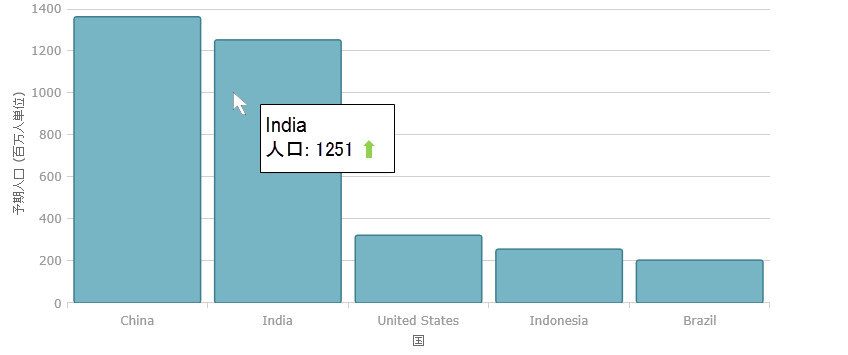
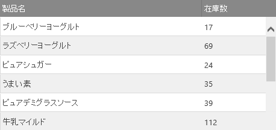

---
title: "AngularJS を使用した条件付きテンプレート化および高度なテンプレート化"
slug: conditional-and-advanced-templating-with-angularjs
---

#AngularJS を使用した条件付きテンプレート化および高度なテンプレート化

##トピックの概要

このトピックでは、条件付きテンプレートの使用方法と、AngularJS の &#123;environment:ProductName&#125; ディレクティブを使用して作成されたコントロールをカイタマイズするための高度なテンプレート化の方法について説明します。

### 前提条件

以下の表は、このトピックを理解するための前提条件として必要な概念、トピック、および記事の一覧です。

-   トピック
    -   [AngularJS での &#123;environment:ProductName&#125; の使用](/angularjs-directives/using-ignite-ui-with-angularjs)
    -   [Infragistics テンプレート エンジン](../06_Infragistics-Templating-Engine/01_igTemplating Overview.mdx)

-   概念
    -   [Angular の式](https://docs.angularjs.org/guide/expression)

### このトピックの内容

このトピックは、以下のセクションで構成されます。

-   [**概要**](#introduction)
    -   [コンテキストとスコープ](#context-and-scope)
-   [**宣言による条件付き、および反復テンプレート**](#declarative-templates)
    -   [ディレクティブ内のテンプレート](#templates-within-directive)
    -   [外部テンプレート](#external-templates)
        -   [スコープ メソッドの使用](#scope-method)
        -   [バインド不可なディレクティブ](#non-bindable-directive)
-   [**異なるテンプレート エンジンの使用**](#different-templating-engines)
    -   [igGrid を使用した jsRender](#jsrender-grid)
    -   [テンプレート関数のオーバーライド](#overriding-templating)
-   [**関連コンテンツ**](#related-content)
    -   [トピック](#topics)
    -   [サンプル](#samples)

## <a id="introduction"></a>概要

&#123;environment:ProductName&#125; コントロールは、テンプレート化の処理にデフォルトで [Infragistics テンプレート エンジン](../06_Infragistics-Templating-Engine/01_igTemplating Overview.mdx) を使用するため、特に宣言によってAngular アプリケーション内に &#123;environment:ProductName&#125; コントロールを作成する際に考慮が必要ないくつかの特徴があります。テンプレート エンジンは、`${property}` 表記を使用した一般的な置換と、二重の波括弧を使用した **条件付き演算と反復演算** (例: `{{condition / loop}}` ) の両方をサポートします。しかし後者は、バインディングと同じ構文を使用するため Angular の [式](https://docs.angularjs.org/guide/expression) の評価と直接競合ため、そのようなテンプレートを認識し、解析しようとします。これは、構文とコンテキストとの違いによって例外が発生する場合もあり、ほとんど予想される効果がありません。エラーにならない場合でも、コントロールのレンダリング処理実行時の評価で使用するテンプレートのマークアップを変更する可能性があります。このトピックでは、宣言に複合テンプレートを使用する別な方法と、異なるエンジン間でテンプレート処理全体をカスタマイズする方法を紹介します。

### <a id="context-and-scope"></a>コンテキストとスコープ

エンジンで処理されたテンプレートは、グローバル `ウィンドウ` スコープでも評価されます。したがって、`parseInt()` または `Math` などのグローバル関数とオブジェクトを、条件節で算術演算に追加して使用できます。同様に、`$scope` プロパティはそのままでは評価に使用できません。

またコントロール テンプレートは、頻繁にドキュメントまたは Angular のスコープ以外のコンテキストも対象にします。たとえば、`igGrid` 列テンプレートは、描画される現在のデータ レコードのコンテキストで評価され、通常データ ソースに対して直接評価することができません。各コントロールは、データ項目を対象のテンプレートに一致させ、それらをテンプレート関数に渡す必要があります。

## <a id="declarative-templates"></a>宣言による条件付き、および反復テンプレート

スコープが定義されたオプションによるコントロールの初期化で、テンプレート化構文を使用することはできますが、宣言によって定義されたテンプレートの場合は常にできるとは限りません。

### <a id="templates-within-directive"></a>ディレクティブ内のテンプレート

テンプレート プロパティが定義されたディレクティブ内の場所によって異なります。たとえば、`igCombo` の [`itemTemplate`](&#123;environment:jQueryApiUrl&#125;/ui.igcombo#options:itemTemplate) のように、多くの場合テンプレートはコントロールの最上位オプションになります。

**HTML の場合:**
```html
<ig-combo id="combo1"
          item-template='${ProductName} {{if ${UnitsInStock} > 0 }} ${UnitsInStock} {{/if}}' 
          data-source="northwind"
          text-key="ProductName"
          value-key="ProductID">
ig-combo>
```

この構成では、Angular によりテンプレートが解析され、**例外をスロー**しようとします。これは、カスタムタグでさえも、コントロールが使用する実際の有効な HTML タグで置換された後も、親 (例: `<ig-combo>`) 要素からの属性が引き継がれるためです。しかし、`igDataChart` の [`series.tooltipTemplate`](&#123;environment:jQueryApiUrl&#125;/ui.igDataChart#options:series.tooltipTemplate) または `igGrid` 上の [`columns.template`](&#123;environment:jQueryApiUrl&#125;/ui.iggrid#options:columns.template) は**正しく動作します。**

**HTML の場合:**
```html
<ig-data-chart id="datachart1" data-source="dataChart">
    
    <series>
        <series name="2015Population" type="column" value-member-path="Pop2015"
                x-axis="NameAxis" y-axis="PopulationAxis"
                show-tooltip="true"
                tooltip-template="${item.CountryName} <br> Population: <strong>${item.Pop2015}</strong>
                        {{if ${item.Pop2015} > ${item.Pop2005} }}   
                        {{else}}  {{/if}}">
        </series>
    </series>
</ig-data-chart>
```



**HTML の場合:**
```html
<ig-grid id="grid1" data-source="northwind" primary-key="ProductID">
    <columns>
        
        <column key="UnitsInStock" header-text="In Stock"  width="100px" data-type="number" 
                template=" ${UnitsInStock} {{if ${UnitsOnOrder} >= ${UnitsInStock} }}  {{/if}}>
        </column>
    </columns>
</ig-grid>
```



[ブート処理](https://docs.angularjs.org/guide/bootstrap)中のディレクティブ テンプレート化のフェーズで、親の下のネストされた要素が削除されるため、テンプレートは正しく動作し問題なく使用できます。

### <a id="external-templates"></a>外部テンプレート

競合に対処する最も簡単な方法は、`ng-app` ディレクティブの外側にテンプレートを定義することですが、その場合テンプレートを &#123;environment:ProductName&#125; ディレクティブ オプションの一部とすることができません。それでも、外部テンプレートの使用から適切な効果を得ることができます。たとえば、コードを読みやすくする、またはコントロール間でテンプレートを共有できるようになります。どちらの場合も必要なのは、コントロールの初期化に使用するテンプレートをディレクティブが認識できることと、スコープ メソッドを使用できることです。

### <a id="scope-method"></a>スコープ メソッドの使用

Angular のスコープ内に定義された関数は、オプションの評価を通してテンプレート値の提供に使用できます。初期化のための複合タスクの実行もドキュメント内に定義されたテンプレートへのアクセスも提供することができます。コントロールによっては、テンプレート自体の提供、またはテンプレート (`igDataChart` など) を確認できるID の提供のいずれかを選択できる場合もありますが、&#123;environment:ProductName&#125; ディレクティブは、後の処理のために `getHtml()` 関数をスコープに登録します。

**JavaScript の場合:**
```js
function getHtml(selector){
      return $(selector).html();
};
```

これにより、スコープに jQuery 選択プロキシを提供します。カスタム実装が既に存在する場合、関数はオーバーライドしません。さらに、オプション評価 `getHtml()` を使用すると、テンプレートなどの任意のオプションを HTML に提供することができます。

**HTML の場合:**
```html
<ig-grid id="grid1" data-source="northwind" auto-generate-columns="false">
    <columns>
        <column key="UnitPrice" header-text="Unit Price" width="100px" data-type="string" 
                    template="{{getHtml('#colTemplate')}}">
    </columns>
</ig-grid>
```

colTemplate の ID を持つ要素が Angular アプリケーションの外側に定義されたテンプレートのコンテナーの場合:

**HTML の場合:**
```html
<script id="colTemplate" type="text/template">
      $ ${UnitPrice} 
      {{if parseInt(${UnitPrice}) >= 20 }} 
      
      {{else}}
      
      {{/if}}
</script>
```
### <a id="non-bindable-directive"></a>バインド不可なディレクティブ

Angular アプリケーションのスコープ内の配置が必要な外部テンプレートを定義する場合は、[`ng-non-bindable`](https://docs.angularjs.org/api/ng/directive/ngNonBindable) ディレクティブによってテンプレート コンテナーを指定するオプションで、AngularJS に解析をスキップし、要素のコンテンツをコンパイルするように指示できます。

**HTML の場合:**
```html
<script id=" colTemplate " type="text/template" ng-non-bindable>
	…
script>
```

このようなテンプレートは、すでに説明した `getHtml()` 関数を使用して再度オプションに割り当てることができます。

**関連サンプル:**[igGrid のサンプル](http://igniteui.github.io/igniteui-angularjs/samples/igGrid.html)

## <a id="different-templating-engines"></a>異なるテンプレート エンジンの使用


デフォルトでは、Infragistics テンプレート エンジンを使用しますが、他のエンジンも使用できます。たとえば、`igGrid` には [jsRender](http://www.jsviews.com/) サポートが組み込まれています。1 つの関数をオーバーライドすることで異なるエンジンを簡単にプラグインできます。

### <a id="jsrender-grid"></a>igGrid を使用した jsRender

[jsRender](http://www.jsviews.com/) は強力で高速なテンプレート エンジンです。複合テンプレートを処理することができ、カスタム タグやヘルパー関数を拡張してカスタマイズ可能な高度なテンプレートを作成できます。グリッド内の [jsRender Integration](/controls/iggrid/features/jsrender-integration) は [`templatingEngine`](&#123;environment:jQueryApiUrl&#125;/ui.iggrid#options:templatingEngine) オプションによって制御されます。

**HTML の場合:**

```html
<ig-grid data-source="northwind" auto-generate-columns="false" templating-engine="jsRender" >
    <columns>
        <column key="UnitPrice" header-text="Unit Price"  width="100px" data-type="string" template="$ {{>UnitPrice}}"></column>
    </columns>
</ig-grid>
```

この機能を使用するには、ページ上で jsRender スクリプトを参照する必要があります。これは、**その他のコントロールに影響がない**という点に注意してください。その他のコントロールのテンプレートはデフォルトで &#123;environment:ProductName&#125; によって処理され、デフォルトの構文に従います。jsRender は二重の波括弧を多く使用するため、Angular との競合を避けるために前述した同じ手法を適用します。さらに、ディレクティブ内のネストされたオプションであっても、追加のマークアップや書式設定のない単一のプロパティ (`template="{{>UnitPrice}}"` など) の代入として評価する式と認識されます。

**関連サンプル:**[jsRender の結合](&#123;environment:NewSamplesUrl&#125;/grid/jsrender-integration)

### <a id="overriding-templating"></a>テンプレート関数のオーバーライド

その他のカスタマイズ オプションが使用できない高度なシナリオでは、メインのテンプレート関数をオーバーライドすることもできます。この機能は **&#123;environment:ProductName&#125; 14.1 以降のバージョン**でのみ可能です。`tmpl` は Infragistics テンプレート エンジンのメイン関数です。`$.ig` 名前空間オブジェクトの下でグローバルに定義されています。この関数は関連するすべての &#123;environment:ProductName&#125; コントロールによって呼び出され、テンプレートとデータ オブジェクトの両方を受け取ります。

**JavaScript の場合:**
```js
$.ig.tmpl = function (template, data) {
    /* handle the templating process */
    return template;
};
```

>**注:** テンプレート関数は結果を文字列で返します (HTML 文字列を DOM に挿入する前に HTML 全体を作成する方が実行ごとにオブジェクトを作成する方法よりも優れています)。返される結果のタイプとパラメーターはコントロールによって処理されるため、変更しないでください。

この時点でのテンプレート化は様々な方法で処理されます。完全なカスタム実装や、パラメーターを使用して[Handlebars](http://handlebarsjs.com/) や [Mustache](https://github.com/janl/mustache.js) などの他のエンジンにテンプレート関数を渡す方法もあります。構文によって、デフォルトのテンプレートのすべての制約が有効になる場合があります。

Angular の構文を使用する場合、html で式を評価する方法として、コンパイルおよびサービスの補完の 2 つの方法があります。テンプレート関数の文字列出力要件によって、実質的に [`$compile`](https://docs.angularjs.org/api/ng/service//$compile) サービスをカスタム テンプレートのオプションから除外します (コンパイルされたテンプレートやリンクされたテンプレートをアクティブ化する時間がないため)。また、[`$interpolate`](https://docs.angularjs.org/api/ng/service//$interpolate) サービスはマークアップ内の式を即座に評価し、値を直接置換します。そのようなテンプレート ソリューションを作成するには、グローバル関数からアクセスできる `$scope` リファレンスが必要です。また、渡されたデータ項目を Angular アプリケーションのスコープ内で一致させ評価できるようにする必要がありますが、描画するごとにスコープ メソッドからロジックを実行することはできます。

>**注:** テンプレート関数のオーバーライドは、アプリケーション内のすべてのアクティブな &#123;environment:ProductName&#125; コントロールに適用されるため、新しい関数が &#123;environment:ProductName&#125; コントロール以外のコントロールのテンプレートも処理できなければならないことに注意してください。テンプレート エンジンの変更は、すべてのコントロールのテンプレートを変更し、新しい構文に一致させる必要があることを意味します。

## <a id="related-content"></a>関連コンテンツ

### <a id="topics"></a>トピック

このトピックの追加情報については、以下のトピックも合わせてご参照ください。

-   [異なるテンプレート エンジンの &#123;environment:ProductName&#125; での使用](http://www.infragistics.com/community/blogs/marina_stoyanova/archive/2014/05/30/using-different-template-engines-with-ignite-ui-controls.aspx)
-   [jsRender の結合](/controls/iggrid/features/jsrender-integration)

### <a id="samples"></a>サンプル

このトピックについては、以下のサンプルも参照してください。

-   [igGrid のサンプル](http://igniteui.github.io/igniteui-angularjs/samples/igGrid.html)

