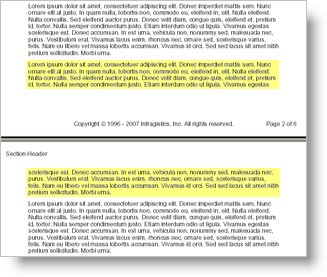
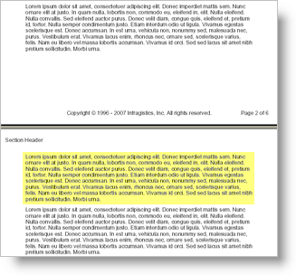

# チェーン

Chain 要素は、1 ページにすべてを表示するための十分なスペースがないものの、コンテンツを分割したくない場合に非常に役に立ちます。通常、Text 要素を使用する時に、コンテンツを収めるために十分なスペースがページにない場合、以下の図に表示されるように次のページに流し込まれます。



ところが、Chain 要素を使用することによって、そのコンテンツを一緒にすることができます。ページの区切りで要素のコンテンツが分割される代わりに、以下のスクリーンショットに示されるように要素全体を次ページに移動します。



これは、1 ページにテキストの段落を収めたい場合や 1 ページに画像とテキスト キャプションを一緒に収めたい場合に役に立ちます。Chain 要素は分割できないチェーンの中にすべてのコンテンツをリンクします。唯一の例外は、1 ページに収めることができるコンテンツよりも多くのコンテンツがチェーンの中にある場合です。この場合、Chain 要素はすべてのコンテンツを 1 ページに一緒に収めることができないため、コンテンツ 要素を一緒にグループ化しようとします。

------

以下のコードを使用して、[Chain](Infragistics.Web.Documents.Reports~Infragistics.Documents.Reports.Report.IChain.html) 要素を Section 要素に追加し、テキストを追加します。

1.  **レポートを定義して、Section 要素を追加します。**

	**Visual Basic の場合:**

```vb
	'
	' Create the report and add a Section element.
	'
	Dim report As Infragistics.Documents.Reports.Report.Report = _
	  New Infragistics.Documents.Reports.Report.Report()

	Dim section1 As Infragistics.Documents.Reports.Report.Section.ISection = _
	  report.AddSection()

	section1.PageMargins = _
	  New Infragistics.Documents.Reports.Report.Margins(50)
```

	**C# の場合:**

```csharp
	//
	// Create the report and add a section.
	//
	Infragistics.Documents.Reports.Report.Report report =
	  new Infragistics.Documents.Reports.Report.Report();

	Infragistics.Documents.Reports.Report.Section.ISection section1 =
	  report.AddSection();

	section1.PageMargins = 
	  new Infragistics.Documents.Reports.Report.Margins(50);
```

2.  **分割できないコンテンツを Section 要素に追加します。**

	以下のテキストを使用して、`string1` 変数を設定します。

	> Lorem ipsum dolor sit amet, consectetuer adipiscing elit.Donec imperdiet mattis sem.Nunc ornare elit at justo.In quam nulla, lobortis non, commodo eu, eleifend in, elit.Nulla eleifend.Nulla convallis.Sed eleifend auctor purus.Donec velit diam, congue quis, eleifend et, pretium id, tortor.Nulla semper condimentum justo.Etiam interdum odio ut ligula.Vivamus egestas scelerisque est. Donec accumsan.In est urna, vehicula non, nonummy sed, malesuada nec, purus.Vestibulum erat.Vivamus lacus enim, rhoncus nec, ornare sed, scelerisque varius, felis.Nam eu libero vel massa lobortis accumsan.Vivamus id orci.Sed sed lacus sit amet nibh pretium sollicitudin.Morbi urna.

	**Visual Basic の場合:**

```vb
	'
	' Add a Chain element and a Text element to the chain.
	' This content will be unbreakable.
	'

	Dim string1 As String = "Lorem ipsum..."

	For i As Integer = 0 To 7
	  ' Add a Chain element to the Band element.
	  Dim chain1 As Infragistics.Documents.Reports.Report.IChain = _
		section1.AddChain()

	  ' Add a Text element to the Chain element.
	  Dim chainText As Infragistics.Documents.Reports.Report.Text.IText = _
		chain1.AddText()

	  ' Set some styles on the text so we can see where the 
	  ' element begins and ends. This way, we can be sure
	  ' that the content is not being separated.
	  chainText.Background = _
		New Infragistics.Documents.Reports.Report.Background _
		(Infragistics.Documents.Reports.Graphics.Brushes.SteelBlue)
	  chainText.Borders = _
		New Infragistics.Documents.Reports.Report.Borders _
		(Infragistics.Documents.Reports.Graphics.Pens.Black)
	  chainText.Paddings = _
		New Infragistics.Documents.Reports.Report.Paddings(5)
	  chainText.Margins = _
		New Infragistics.Documents.Reports.Report.Margins(5)

	  ' Add content to the Text element.
	  chainText.AddContent(string1)
	  chainText.AddLineBreak()
	  chainText.AddLineBreak()
	  chainText.AddContent(string1)
	Next i
```

	**C# の場合:**

```csharp
	//
	// Add a Chain element and a Text element to the chain.
	// This content will be unbreakable.
	//

	string string1 = "Lorem ipsum...";

	for (int i = 0; i < 8; i++)
	{
		// Add a Chain element to the Band element.
		Infragistics.Documents.Reports.Report.IChain chain1 =
				section1.AddChain();

		// Add a Text element to the Chain element.
		Infragistics.Documents.Reports.Report.Text.IText chainText = 
				chain1.AddText();

		// Set some styles on the text so we can see where the 
		// element begins and ends. This way, we can be sure
		// that the content is not being separated.
		chainText.Background = 
				new Infragistics.Documents.Reports.Report.Background
				(Infragistics.Documents.Reports.Graphics.Brushes.SteelBlue);
		chainText.Borders = 
				new Infragistics.Documents.Reports.Report.Borders
				(Infragistics.Documents.Reports.Graphics.Pens.Black);
		chainText.Paddings = 
				new Infragistics.Documents.Reports.Report.Paddings(5);
		chainText.Margins = 
				new Infragistics.Documents.Reports.Report.Margins(5);

		// Add content to the Text element.
		chainText.AddContent(string1);
		chainText.AddLineBreak();
		chainText.AddLineBreak();
		chainText.AddContent(string1);
	}
```
