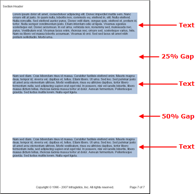

# ギャップ

Gap 要素は、まさにその名前が示すとおり、ギャップをコンテンツに追加します。異なるレイアウト 要素があるがページで要素を特定のスペースだけ垂直に離したい場合に、使用しなければならないのが Gap 要素です。



以下のコードを使用して、上記の画像のように 2 つの Gap 要素によって分割された 3 つの Text 要素を追加します。このトピックは、`section1` と呼ばれる少なくともひとつの [Section](Infragistics.Web.Documents.Reports~Infragistics.Documents.Reports.Report.Report.html) 要素だけでなく、[Report](Infragistics.Web.Documents.Reports~Infragistics.Documents.Reports.Report.Section.ISection.html) 要素が定義済みであることを前提としています。

Gap 要素は、ひとつのプロパティ、[`Height`](Infragistics.Web.Documents.Reports~Infragistics.Documents.Reports.Report.IGap~Height.html) プロパティしか公開しません。Height プロパティによって、Gap の高さを固定のポイント数で指定するか、使用可能なスペースの残りのパーセントで指定することができます。

## 固定の高さ
Gap 要素の高さを固定の高さに設定する時には、Height プロパティを [`FixedHeight`](Infragistics.Web.Documents.Reports~Infragistics.Documents.Reports.Report.FixedHeight.html) クラスの新しいインスタンスに設定する必要があります。ギャップを開けたいポイント数を `FixedHeight` クラスのコンストラクターに渡します。

## 相対的な高さ
Gap 要素の相対的な高さを使用するには、Height プロパティを [`RelativeHeight`](Infragistics.Web.Documents.Reports~Infragistics.Documents.Reports.Report.RelativeHeight.html) クラスのインスタンスに設定する必要があります。これによって、使用可能な残りスペースのパーセンテージでギャップの高さを指定できます。そのため、ページの最後に追加された Gap 要素と同じ値を持つページの最初に追加された Gap 要素は、より大きなギャップになります。これは、最初の Gap 要素はその後に残されるページの量が多いためにパーセントで指定すると数字が大きくなってしまうからです。右の画像を参照すると、この概念をよく理解できます。最初の Gap 要素は、追加された時点のページの 25% を使用しています。2 番目の Gap 要素は追加された時点のページの 50% を使用していますが、最初の Gap 要素とほぼ同じサイズになっています。

**Visual Basic の場合:**

```vb
Imports Infragistics.Documents.Reports.Report
...

Dim gapText As Infragistics.Documents.Reports.Report.Text.IText = section1.AddText()
gapText.Background = New Background(Brushes.LightSteelBlue)
gapText.AddContent("Paragraph one text...")

Dim gap As Infragistics.Documents.Reports.Report.IGap = section1.AddGap()
gap.Height = New RelativeHeight(25)

gapText = section1.AddText()
gapText.Background = New Background(Brushes.LightSteelBlue)
gapText.AddContent("Paragraph two text...")

gap = section1.AddGap()
gap.Height = New RelativeHeight(50)

gapText = section1.AddText()
gapText.Background = New Background(Brushes.LightSteelBlue)
gapText.AddContent("Paragraph three text...")
```

**C# の場合:**

```csharp
using Infragistics.Documents.Reports.Report;
...

Infragistics.Documents.Reports.Report.Text.IText gapText = section1.AddText();
gapText.Background = new Background(Brushes.LightSteelBlue);
gapText.AddContent("Paragraph one text...");
                        
Infragistics.Documents.Reports.Report.IGap gap = section1.AddGap();
gap.Height = new RelativeHeight(25);

gapText = section1.AddText();
gapText.Background = new Background(Brushes.LightSteelBlue);
gapText.AddContent("Paragraph two text...");

gap = section1.AddGap();
gap.Height = new RelativeHeight(50);

gapText = section1.AddText();
gapText.Background = new Background(Brushes.LightSteelBlue);
gapText.AddContent("Paragraph three text...");
```
