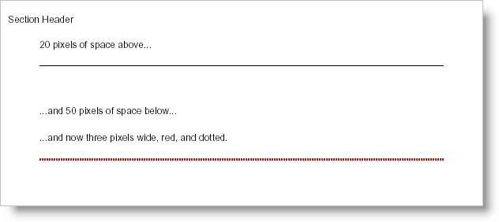

# 規則

Rule 要素は、デザイン、目的の両方において HTML の Horizontal Rule タグに非常に似ています。Rule 要素は、実線の黒の 1 ピクセル幅などのデフォルト設定を使用した、親要素の幅全体に引かれるシンプルな線です。Rule 要素はただのシンプルな線でなければならないというわけではありませんが、いくつかのプロパティを変更して強力なコンテンツ分割ツールとすることができます。

Rule 要素の幅は線が水平にどこまで引かれるかを定義するものではありません。線は常に親コンテナーの幅全体に引かれます。Rule 要素の幅は線の太さです。したがって、Width プロパティは要素の高さと考えた方がいいかもしれません (通常高さは垂直方向の距離と考えるからです)。




以下のコードを使用して、上記の画像のようなページをセクションに作成します。以下のコードは、[Report](Infragistics.Web.Documents.Reports~Infragistics.Documents.Reports.Report.Report.html) 要素が定義済みであり、少なくともひとつの [ISection](Infragistics.Web.Documents.Reports~Infragistics.Documents.Reports.Report.Section.ISection.html) 要素が追加されて section1 と名前を指定されていることを前提とします。

**C# の場合:**

```csharp
using Infragistics.Documents.Reports.Report;
.
.
.
section1.AddQuickText("20 pixels of space above...");

// Define a Rule element and provide an extra 20 pixels
// of space above and 50 pixels of space below.
Infragistics.Documents.Reports.Report.IRule rule = section1.AddRule();
rule.Margins.Top = 20;
rule.Margins.Bottom = 50;

section1.AddQuickText("...and 50 pixels of space below...");

// The Gap element helps space content out. This gap 
// is specifically set to provide 20 pixels of space.
Infragistics.Documents.Reports.Report.IGap ruleGap = section1.AddGap();
ruleGap.Height = new FixedHeight(20);

section1.AddQuickText("...and now three pixels wide, red, and dotted.");

// Add another Rule element to the section.
rule = section1.AddRule();
// The Rule's color will be Red.
rule.Pen = new Pen(new Color(255, 0, 0));
// The Rule will be 3 pixels wide.
rule.Pen.Width = 3;
// The Rule will be a dotted line.
rule.Pen.Style = DashStyle.Dot;
// The Rule will have 20 pixels of space above it and
// 50 pixels of space below.
rule.Margins.Top = 20;
rule.Margins.Bottom = 50;
```
